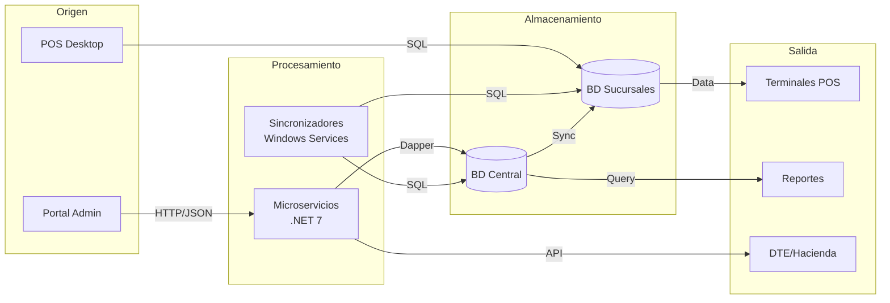

# Arquitectura General - Plataforma Po1nt

## Vision General

La plataforma Po1nt implementa una arquitectura hibrida que combina microservicios modernos (.NET 7.0) con aplicaciones de escritorio legacy (.NET Framework 4.x). Esta arquitectura permite modernizacion incremental mientras mantiene compatibilidad con infraestructura existente.

### Principios Arquitectonicos

1. **Separacion de responsabilidades**: Cada microservicio gestiona un dominio especifico
2. **Sincronizacion distribuida**: Datos replicados entre central y sucursales
3. **Tolerancia a fallos**: Servicios desacoplados con reintentos automaticos
4. **Observabilidad**: Metricas, logs y trazas centralizadas

## Diagrama de Componentes con Tecnologias

```mermaid
flowchart TB
    subgraph "Frontend"
        style Frontend fill:#e1f5fe
        A[nuxt-front-admin<br/>Nuxt 3 + Vue 3 + TypeScript]
        B[po1nt-pos<br/>VB.NET + WinForms]
        C[portaladministrativo-desktop<br/>C# + WinForms]
    end

    subgraph "API Gateway / Microservicios"
        style API fill:#fff3e0
        D[MS-Autn<br/>.NET 7 + JWT + BCrypt]
        E[MS-configs<br/>.NET 7 + Dapper]
        F[MS-Products<br/>.NET 7 + Dapper]
        G[MS-Sync<br/>.NET 7 + RestSharp]
        H[MS-Logger<br/>.NET 7 + Dapper]
        I[ms-procesos-locales<br/>.NET 7 + BitWork]
        J[ms-corresponsales<br/>.NET 7 + RestSharp]
    end

    subgraph "Libreria Compartida"
        style Libreria fill:#f3e5f5
        K[shared-libs<br/>.NET 7 + Dapper + Prometheus]
    end

    subgraph "Sincronizadores Windows"
        style Sincronizadores fill:#fff3e0
        L[epdPo1nt_Syncronizador<br/>VB.NET + SQL Server]
        M[WS-SincronizadorSalas<br/>VB.NET + Timers]
        N[WS-SincronizacionBascula<br/>VB.NET + SQL Server]
        O[sincronizacion-sala<br/>VB.NET + HTTP]
        P[ws-reenviodte<br/>VB.NET + DTE API]
    end

    subgraph "Jobs y Migraciones"
        style Jobs fill:#fff3e0
        Q[cron-jobs<br/>.NET 7 + SQL Server]
        R[JOB-Migrations<br/>.NET 7 + EF Core]
        S[job-corresponsales-migrations<br/>.NET 7 + EF Core]
    end

    subgraph "Monitoreo"
        style Monitoreo fill:#e8f5e9
        T[po1nt-monitoring<br/>Prometheus + Grafana + Tempo]
    end

    subgraph "Base de Datos"
        style Base fill:#e8f5e9
        U[(SQL Server Central<br/>po1nt_pos / selectos3)]
        V[(SQL Server Sucursales<br/>SatellitePOS_MH)]
    end

    subgraph "Integraciones Externas"
        style Integraciones fill:#fce4ec
        W[Ministerio Hacienda<br/>API DTE]
        X[PuntoXpress<br/>Colectores]
        Y[Cuscatlan/Airpak<br/>Remesas]
        Z[TigoMoney<br/>Dinero Movil]
    end

    A --> D & E & F
    B --> V
    B --> I
    C --> U

    D --> K
    E --> K
    F --> K
    G --> K
    H --> K
    I --> K
    J --> K

    K --> U

    L --> U & V
    M --> U & V
    N --> U
    O --> U & V
    P --> U

    Q --> U
    R --> U
    S --> U

    T --> U

    I --> W
    J --> X & Y & Z
```

## Diagrama de Flujo de Datos Principal

## Patrones Arquitectonicos Utilizados

| Patron | Uso en Po1nt | Componentes |
|--------|--------------|-------------|
| **Microservicios** | Backend moderno con servicios independientes | MS-Autn, MS-configs, MS-Products, etc. |
| **Repository Pattern** | Acceso a datos desacoplado | Todos los microservicios via Dapper |
| **Event-Driven** | Sincronizacion de cambios entre componentes | SyncEvent en shared-libs |
| **Gateway Pattern** | Agregacion de servicios de pago | ms-corresponsales-no-bancarios |
| **Service Layer** | Logica de negocio encapsulada | Controllers + Repositories |
| **Middleware Pipeline** | Autenticacion y autorizacion | AuthMiddleware en shared-libs |

## Decisiones de Diseno Importantes

### 1. Arquitectura Hibrida
- **Decision**: Mantener aplicaciones legacy VB.NET junto a microservicios .NET 7
- **Razon**: Continuidad operativa sin interrumpir puntos de venta existentes
- **Impacto**: Mayor complejidad de deployment, pero menor riesgo de migracion

### 2. SQL Server como Unica Base de Datos
- **Decision**: Usar SQL Server para todas las capas (central, sucursales, logs)
- **Razon**: Expertise existente del equipo, licenciamiento ya adquirido
- **Impacto**: Consistencia en queries, stored procedures reutilizables

### 3. Sincronizacion via Timers
- **Decision**: Windows Services con Timers para sincronizacion periodica
- **Razon**: Confiabilidad en ambientes Windows, facil de monitorear
- **Impacto**: Latencia de sincronizacion (minutos), no tiempo real

### 4. Token JWT Encriptado
- **Decision**: Tokens JWT encriptados con AES-256
- **Razon**: Seguridad adicional sobre JWT estandar
- **Impacto**: Mayor seguridad, pero requiere clave compartida

## Stack Tecnologico Consolidado

| Capa | Tecnologia | Version |
|------|------------|---------|
| **Frontend Web** | Nuxt 3 + Vue 3 + TypeScript | 3.6.5 |
| **UI Components** | Quasar Framework | 2.12.4 |
| **Frontend Desktop** | Windows Forms + VB.NET/C# | .NET 4.5.2 - 4.7 |
| **Backend API** | ASP.NET Core | 7.0 |
| **ORM** | Dapper | 2.0.143 |
| **Migraciones** | Entity Framework Core | 7.0.9 |
| **Base de Datos** | SQL Server | 2019+ |
| **Autenticacion** | JWT + BCrypt | Custom |
| **HTTP Client** | RestSharp | 110.2.0 |
| **JSON** | Newtonsoft.Json | 13.0.3 |
| **Metricas** | Prometheus | 8.0.1 |
| **Error Tracking** | Sentry | 2.1.8 |
| **Contenedores** | Docker | bitnami/aspnet-core:7 |
| **CI/CD** | GitLab CI | - |
| **Orquestacion** | Azure Kubernetes Service | 1.30 |

## Matriz de Comunicacion entre Componentes

| Origen | Destino | Protocolo | Tipo |
|--------|---------|-----------|------|
| nuxt-front-admin | MS-Autn | HTTP/REST | Sincrono |
| nuxt-front-admin | MS-configs | HTTP/REST | Sincrono |
| nuxt-front-admin | MS-Products | HTTP/REST | Sincrono |
| po1nt-pos | ms-procesos-locales | HTTP/REST | Sincrono |
| po1nt-pos | BD Sucursal | SQL | Sincrono |
| MS-* | shared-libs | Referencia .NET | In-Process |
| MS-* | SQL Server | SQL/Dapper | Sincrono |
| Sincronizadores | BD Central | SQL | Sincrono |
| Sincronizadores | BD Sucursales | SQL | Sincrono |
| Sincronizadores | MS-Sync | HTTP/REST | Sincrono |
| ms-procesos-locales | Ministerio Hacienda | HTTP/REST | Sincrono |
| ms-corresponsales | Proveedores Pago | HTTP/REST | Sincrono |

---

