# Documentacion Tecnica Completa
# Plataforma Po1nt - Sistema de Punto de Venta

---

**Version:** 1.0
**Fecha:** Febrero 2026
**Repositorios documentados:** 22
**Organizacion:** Po1nt-Dev

---

# Tabla de Contenidos

1. [Resumen Ejecutivo](#1-resumen-ejecutivo)
2. [Arquitectura General](#2-arquitectura-general)
3. [Flujos de Negocio](#3-flujos-de-negocio)
4. [Matriz de Dependencias](#4-matriz-de-dependencias)
5. [Componentes del Sistema](#5-componentes-del-sistema)
   - 5.1 [MS-Autn - Autenticacion](#51-ms-autn---microservicio-de-autenticacion)
   - 5.2 [MS-configs - Configuracion](#52-ms-configs---microservicio-de-configuracion)
   - 5.3 [MS-Products - Productos](#53-ms-products---microservicio-de-productos)
   - 5.4 [MS-Sync - Sincronizacion](#54-ms-sync---microservicio-de-sincronizacion)
   - 5.5 [ms-procesos-locales - Facturacion DTE](#55-ms-procesos-locales---microservicio-de-procesos-locales)
   - 5.6 [ms-corresponsales-no-bancarios - Pagos Terceros](#56-ms-corresponsales-no-bancarios---microservicio-de-pagos-a-terceros)
   - 5.7 [shared-libs - Libreria Compartida](#57-shared-libs---libreria-compartida)
   - 5.8 [nuxt-front-admin - Portal Web](#58-nuxt-front-admin---portal-administrativo-web)
   - 5.9 [po1nt-pos - Aplicacion POS](#59-po1nt-pos---aplicacion-punto-de-venta)
   - 5.10 [Sincronizadores - Windows Services](#510-sincronizadores---windows-services)
   - 5.11 [Jobs y Migraciones](#511-jobs-y-migraciones)
   - 5.12 [po1nt-monitoring - Monitoreo](#512-po1nt-monitoring---sistema-de-monitoreo)
   - 5.13 [Otros Componentes](#513-otros-componentes)
6. [Repositorios del Sistema](#6-repositorios-del-sistema)

---

# 1. Resumen Ejecutivo

## Descripcion del Sistema

**Po1nt** es una plataforma empresarial integral de punto de venta (POS) desarrollada para cadenas de supermercados y retail en El Salvador. El sistema gestiona todo el ciclo de vida de operaciones comerciales: desde la venta en caja, sincronizacion de productos y precios, hasta la emision de documentos tributarios electronicos (DTE) y el procesamiento de pagos a terceros.

La plataforma esta construida sobre una arquitectura de microservicios en .NET Core 7.0 para el backend, con aplicaciones de escritorio Windows para los puntos de venta (VB.NET/.NET Framework) y un portal administrativo web moderno (Nuxt 3/Vue 3). El sistema soporta operaciones distribuidas en multiples sucursales con sincronizacion en tiempo real hacia un servidor central.

Po1nt integra servicios financieros de terceros como remesas internacionales (Airpak, Cuscatlan), dinero movil (TigoMoney), recargas telefonicas y pago de servicios (PuntoXpress), posicionandose como una solucion completa para corresponsales no bancarios.

## Diagrama de Arquitectura de Alto Nivel

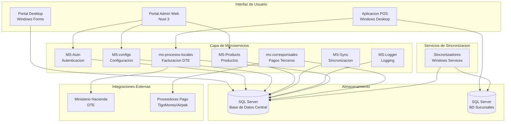

## Capacidades Principales del Sistema

| Capacidad | Descripcion |
|-----------|-------------|
| **Gestion de Ventas** | Procesamiento de transacciones en punto de venta con soporte para multiples formas de pago |
| **Facturacion Electronica** | Emision de DTE (Documentos Tributarios Electronicos) con integracion al Ministerio de Hacienda |
| **Sincronizacion Distribuida** | Replicacion de datos de productos, precios y promociones entre servidor central y sucursales |
| **Pagos a Terceros** | Procesamiento de remesas, recargas telefonicas, pagos de servicios y dinero movil |
| **Gestion de Productos** | Administracion de catalogo, categorias, marcas, precios y codigos de barras |
| **Control de Acceso** | Autenticacion JWT, autorizacion basada en roles y permisos granulares |
| **Monitoreo** | Metricas Prometheus, logging centralizado y tracking de errores con Sentry |
| **Administracion Central** | Portal web para configuracion de parametros, usuarios, terminales y reportes |

## Componentes Principales

| Componente | Descripcion |
|------------|-------------|
| **nuxt-front-admin** | Portal administrativo web con Nuxt 3 y Vue 3 para gestion centralizada |
| **po1nt-pos** | Aplicacion de punto de venta Windows con 16 modulos integrados |
| **MS-Autn** | Microservicio de autenticacion con JWT y control de acceso RBAC |
| **MS-configs** | Microservicio de configuracion centralizada del sistema |
| **MS-Products** | Microservicio de gestion de catalogo de productos |
| **MS-Sync** | Microservicio de orquestacion de sincronizaciones |
| **ms-procesos-locales** | Microservicio de facturacion electronica y procesos de negocio |
| **ms-corresponsales-no-bancarios** | Microservicio agregador de servicios financieros |
| **shared-libs** | Libreria compartida con utilidades comunes para microservicios |
| **Sincronizadores** | Servicios Windows para sincronizacion automatica de datos |
| **po1nt-monitoring** | Sistema de observabilidad con Prometheus, Grafana y Tempo |

---

# 2. Arquitectura General

## Vision General

La plataforma Po1nt implementa una arquitectura hibrida que combina microservicios modernos (.NET 7.0) con aplicaciones de escritorio legacy (.NET Framework 4.x). Esta arquitectura permite modernizacion incremental mientras mantiene compatibilidad con infraestructura existente.

### Principios Arquitectonicos

1. **Separacion de responsabilidades**: Cada microservicio gestiona un dominio especifico
2. **Sincronizacion distribuida**: Datos replicados entre central y sucursales
3. **Tolerancia a fallos**: Servicios desacoplados con reintentos automaticos
4. **Observabilidad**: Metricas, logs y trazas centralizadas

## Diagrama de Componentes con Tecnologias

```mermaid
flowchart TB
    subgraph "Frontend"
        A[nuxt-front-admin<br/>Nuxt 3 + Vue 3 + TypeScript]
        B[po1nt-pos<br/>VB.NET + WinForms]
        C[portaladministrativo-desktop<br/>C# + WinForms]
    end

    subgraph "API Gateway / Microservicios"
        D[MS-Autn<br/>.NET 7 + JWT + BCrypt]
        E[MS-configs<br/>.NET 7 + Dapper]
        F[MS-Products<br/>.NET 7 + Dapper]
        G[MS-Sync<br/>.NET 7 + RestSharp]
        H[MS-Logger<br/>.NET 7 + Dapper]
        I[ms-procesos-locales<br/>.NET 7 + BitWork]
        J[ms-corresponsales<br/>.NET 7 + RestSharp]
    end

    subgraph "Libreria Compartida"
        K[shared-libs<br/>.NET 7 + Dapper + Prometheus]
    end

    subgraph "Sincronizadores Windows"
        L[epdPo1nt_Syncronizador<br/>VB.NET + SQL Server]
        M[WS-SincronizadorSalas<br/>VB.NET + Timers]
        N[WS-SincronizacionBascula<br/>VB.NET + SQL Server]
        O[sincronizacion-sala<br/>VB.NET + HTTP]
        P[ws-reenviodte<br/>VB.NET + DTE API]
    end

    subgraph "Jobs y Migraciones"
        Q[cron-jobs<br/>.NET 7 + SQL Server]
        R[JOB-Migrations<br/>.NET 7 + EF Core]
        S[job-corresponsales-migrations<br/>.NET 7 + EF Core]
    end

    subgraph "Monitoreo"
        T[po1nt-monitoring<br/>Prometheus + Grafana + Tempo]
    end

    subgraph "Base de Datos"
        U[(SQL Server Central<br/>po1nt_pos / selectos3)]
        V[(SQL Server Sucursales<br/>SatellitePOS_MH)]
    end

    subgraph "Integraciones Externas"
        W[Ministerio Hacienda<br/>API DTE]
        X[PuntoXpress<br/>Colectores]
        Y[Cuscatlan/Airpak<br/>Remesas]
        Z[TigoMoney<br/>Dinero Movil]
    end

    A --> D & E & F
    B --> V
    B --> I
    C --> U

    D --> K
    E --> K
    F --> K
    G --> K
    H --> K
    I --> K
    J --> K

    K --> U

    L --> U & V
    M --> U & V
    N --> U
    O --> U & V
    P --> U

    Q --> U
    R --> U
    S --> U

    T --> U

    I --> W
    J --> X & Y & Z
```

## Diagrama de Flujo de Datos Principal

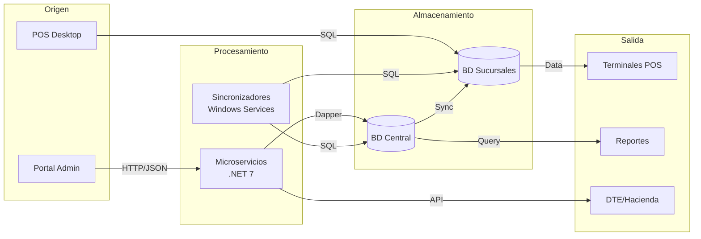

## Patrones Arquitectonicos Utilizados

| Patron | Uso en Po1nt | Componentes |
|--------|--------------|-------------|
| **Microservicios** | Backend moderno con servicios independientes | MS-Autn, MS-configs, MS-Products, etc. |
| **Repository Pattern** | Acceso a datos desacoplado | Todos los microservicios via Dapper |
| **Event-Driven** | Sincronizacion de cambios entre componentes | SyncEvent en shared-libs |
| **Gateway Pattern** | Agregacion de servicios de pago | ms-corresponsales-no-bancarios |
| **Service Layer** | Logica de negocio encapsulada | Controllers + Repositories |
| **Middleware Pipeline** | Autenticacion y autorizacion | AuthMiddleware en shared-libs |

## Decisiones de Diseno Importantes

### 1. Arquitectura Hibrida
- **Decision**: Mantener aplicaciones legacy VB.NET junto a microservicios .NET 7
- **Razon**: Continuidad operativa sin interrumpir puntos de venta existentes
- **Impacto**: Mayor complejidad de deployment, pero menor riesgo de migracion

### 2. SQL Server como Unica Base de Datos
- **Decision**: Usar SQL Server para todas las capas (central, sucursales, logs)
- **Razon**: Expertise existente del equipo, licenciamiento ya adquirido
- **Impacto**: Consistencia en queries, stored procedures reutilizables

### 3. Sincronizacion via Timers
- **Decision**: Windows Services con Timers para sincronizacion periodica
- **Razon**: Confiabilidad en ambientes Windows, facil de monitorear
- **Impacto**: Latencia de sincronizacion (minutos), no tiempo real

### 4. Token JWT Encriptado
- **Decision**: Tokens JWT encriptados con AES-256
- **Razon**: Seguridad adicional sobre JWT estandar
- **Impacto**: Mayor seguridad, pero requiere clave compartida

## Stack Tecnologico Consolidado

| Capa | Tecnologia | Version |
|------|------------|---------|
| **Frontend Web** | Nuxt 3 + Vue 3 + TypeScript | 3.6.5 |
| **UI Components** | Quasar Framework | 2.12.4 |
| **Frontend Desktop** | Windows Forms + VB.NET/C# | .NET 4.5.2 - 4.7 |
| **Backend API** | ASP.NET Core | 7.0 |
| **ORM** | Dapper | 2.0.143 |
| **Migraciones** | Entity Framework Core | 7.0.9 |
| **Base de Datos** | SQL Server | 2019+ |
| **Autenticacion** | JWT + BCrypt | Custom |
| **HTTP Client** | RestSharp | 110.2.0 |
| **JSON** | Newtonsoft.Json | 13.0.3 |
| **Metricas** | Prometheus | 8.0.1 |
| **Error Tracking** | Sentry | 2.1.8 |
| **Contenedores** | Docker | bitnami/aspnet-core:7 |
| **CI/CD** | GitLab CI | - |
| **Orquestacion** | Azure Kubernetes Service | 1.30 |

## Matriz de Comunicacion entre Componentes

| Origen | Destino | Protocolo | Tipo |
|--------|---------|-----------|------|
| nuxt-front-admin | MS-Autn | HTTP/REST | Sincrono |
| nuxt-front-admin | MS-configs | HTTP/REST | Sincrono |
| nuxt-front-admin | MS-Products | HTTP/REST | Sincrono |
| po1nt-pos | ms-procesos-locales | HTTP/REST | Sincrono |
| po1nt-pos | BD Sucursal | SQL | Sincrono |
| MS-* | shared-libs | Referencia .NET | In-Process |
| MS-* | SQL Server | SQL/Dapper | Sincrono |
| Sincronizadores | BD Central | SQL | Sincrono |
| Sincronizadores | BD Sucursales | SQL | Sincrono |
| Sincronizadores | MS-Sync | HTTP/REST | Sincrono |
| ms-procesos-locales | Ministerio Hacienda | HTTP/REST | Sincrono |
| ms-corresponsales | Proveedores Pago | HTTP/REST | Sincrono |

---

# 3. Flujos de Negocio

## 3.1 Flujo de Autenticacion

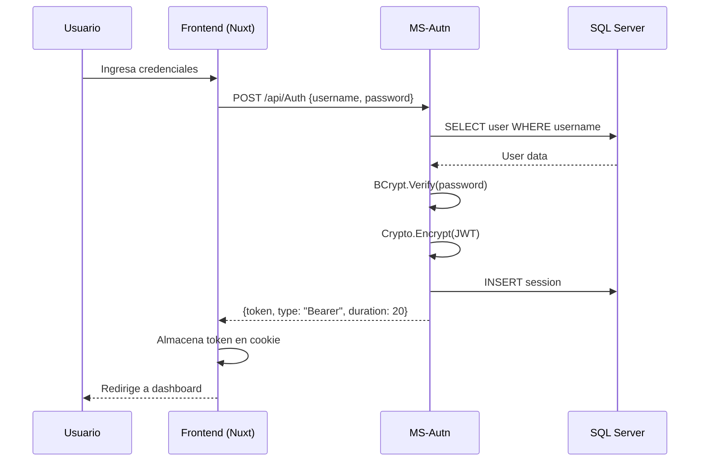

**Descripcion paso a paso:**
1. Usuario ingresa usuario y contrasena en la pagina de login
2. Frontend envia credenciales al microservicio de autenticacion
3. MS-Autn busca el usuario en base de datos
4. Verifica la contrasena con BCrypt
5. Genera token JWT y lo encripta con AES-256
6. Crea registro de sesion en BD
7. Retorna token encriptado al frontend
8. Frontend almacena token y redirige al usuario

---

## 3.2 Flujo de Sincronizacion de Productos

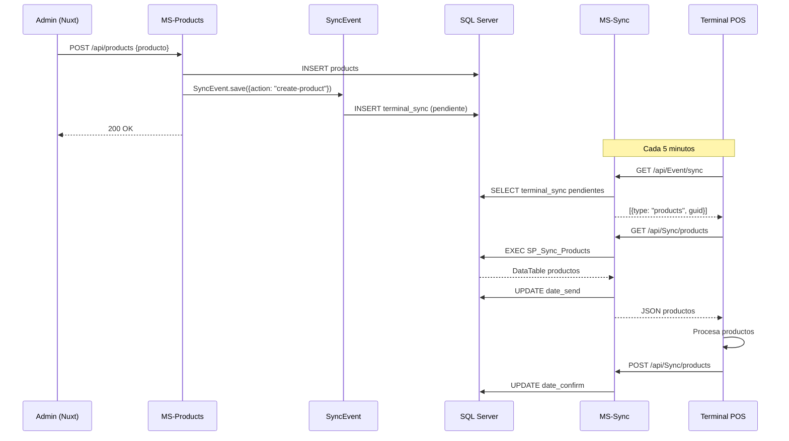

**Descripcion paso a paso:**
1. Administrador crea/actualiza producto desde portal web
2. MS-Products guarda en BD y dispara evento de sincronizacion
3. Se crea registro pendiente en terminal_sync para cada terminal
4. Terminal POS consulta periodicamente sincronizaciones pendientes
5. MS-Sync ejecuta stored procedure y retorna datos
6. Terminal procesa datos y confirma recepcion

---

## 3.3 Flujo de Venta en POS

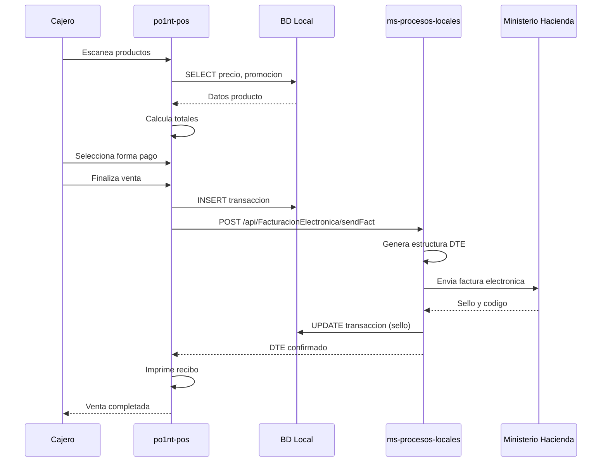

**Descripcion paso a paso:**
1. Cajero escanea codigos de barra de productos
2. POS consulta precios y promociones en BD local
3. Sistema calcula subtotales, impuestos y descuentos
4. Cajero selecciona forma de pago (efectivo, tarjeta, etc.)
5. POS registra transaccion en BD local
6. Envia datos a microservicio de facturacion
7. Microservicio genera DTE y lo envia al Ministerio de Hacienda
8. MH retorna sello electronico
9. POS imprime recibo con sello

---

## 3.4 Flujo de Pago de Remesa

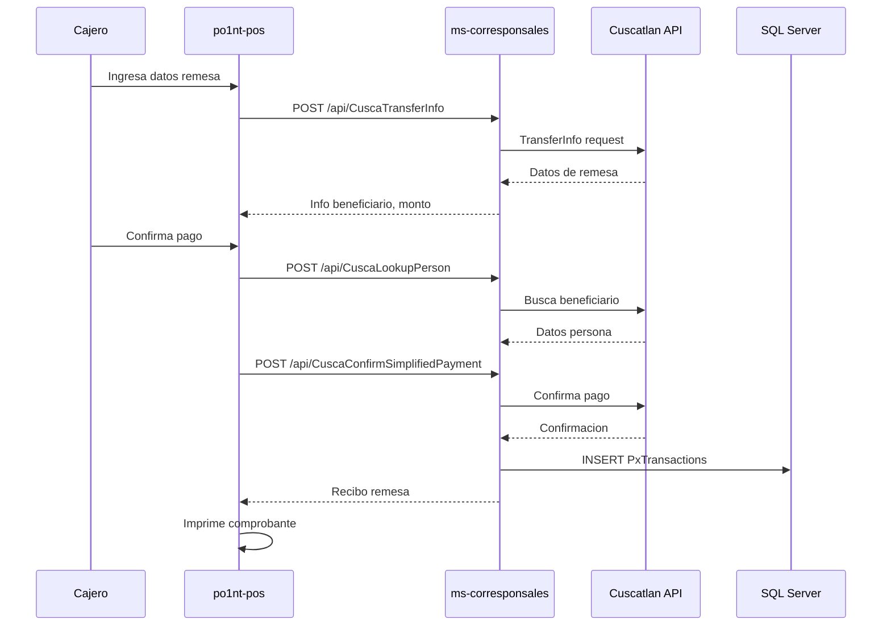

**Descripcion paso a paso:**
1. Cajero ingresa numero de referencia de remesa
2. POS consulta informacion de la remesa via microservicio
3. Microservicio consulta a Cuscatlan API
4. Se muestra info del beneficiario y monto
5. Cajero verifica identidad y confirma pago
6. Sistema busca datos completos del beneficiario
7. Se confirma el pago con el proveedor
8. Se registra transaccion y se imprime comprobante

---

## 3.5 Flujo de Recarga Telefonica

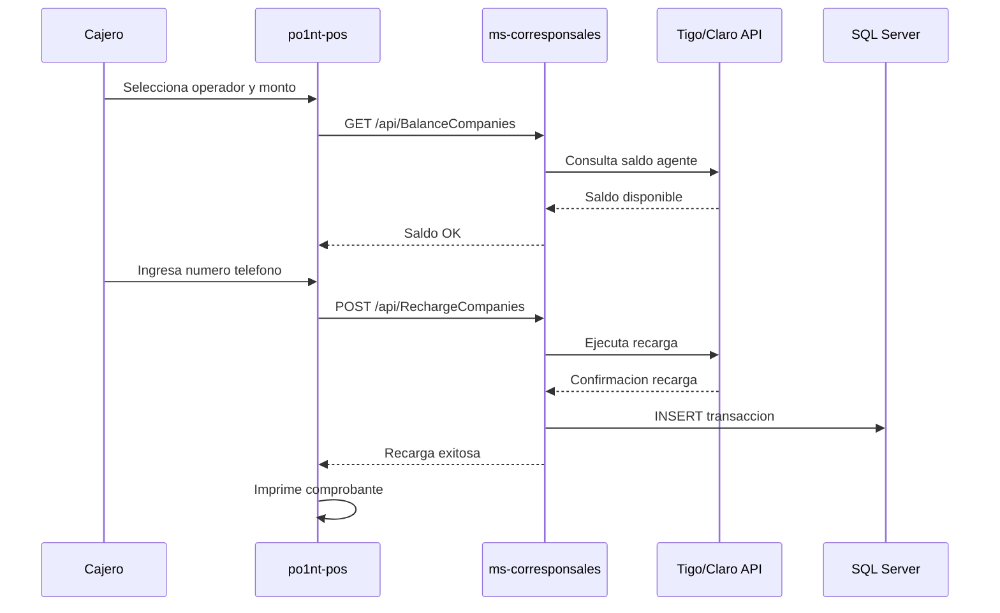

---

## 3.6 Flujo de Sincronizacion Batch (Timers)

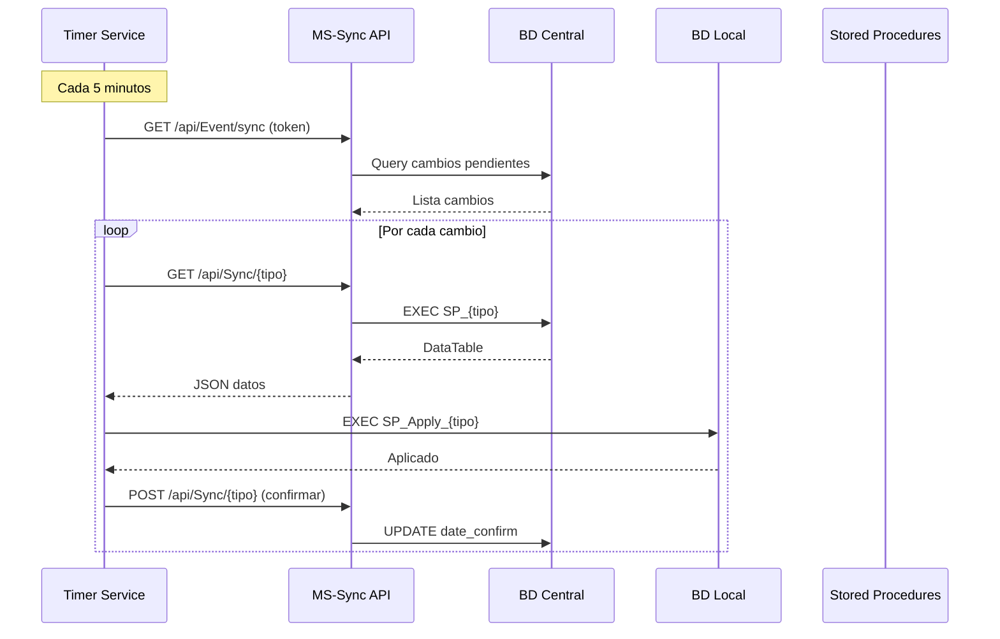

---

## 3.7 Flujo de Reenvio DTE (Automatico)

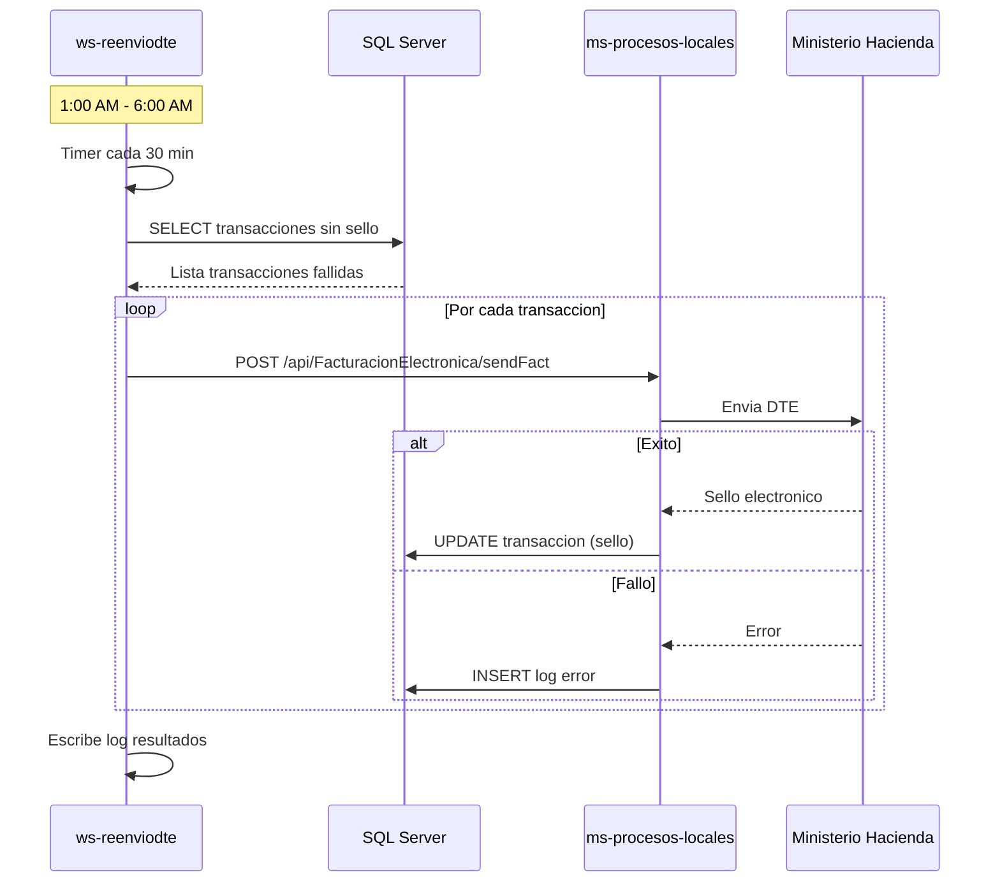

---

## Resumen de Flujos

| Flujo | Componentes Involucrados | Frecuencia |
|-------|--------------------------|------------|
| Autenticacion | nuxt-front-admin, MS-Autn | Por demanda |
| Sync Productos | MS-Products, MS-Sync, Sincronizadores | Cada 5 min |
| Venta POS | po1nt-pos, ms-procesos-locales, MH | Por transaccion |
| Pago Remesa | po1nt-pos, ms-corresponsales, Cuscatlan/Airpak | Por demanda |
| Recarga Telefonica | po1nt-pos, ms-corresponsales, Operadores | Por demanda |
| Sync Batch | Sincronizadores, MS-Sync | Cada 5-7 min |
| Reenvio DTE | ws-reenviodte, ms-procesos-locales, MH | Cada 30 min (noche) |

---

# 4. Matriz de Dependencias

## Tabla de Dependencias entre Componentes

| Componente | Depende de | Es consumido por |
|------------|------------|------------------|
| **nuxt-front-admin** | MS-Autn, MS-configs, MS-Products, MS-Locales | - |
| **po1nt-pos** | ms-procesos-locales, BD Local, shared-libs | po1nt-carga-apps |
| **MS-Autn** | shared-libs, SQL Server | nuxt-front-admin |
| **MS-configs** | shared-libs, MS-Sync, SQL Server | nuxt-front-admin |
| **MS-Products** | shared-libs, MS-Sync, SQL Server | nuxt-front-admin |
| **MS-Sync** | shared-libs, SQL Server | Sincronizadores, MS-configs, MS-Products |
| **MS-Logger** | shared-libs, SQL Server | po1nt-pos, otros MS |
| **ms-procesos-locales** | shared-libs, BitWork, MH API | po1nt-pos |
| **ms-corresponsales** | shared-libs, Proveedores externos | po1nt-pos |
| **shared-libs** | Dapper, SQL Server, Prometheus | Todos los microservicios |
| **Sincronizadores** | MS-Sync API, SQL Server | - |
| **cron-jobs** | SQL Server | - |
| **JOB-Migrations** | EF Core, SQL Server | - |
| **po1nt-monitoring** | Prometheus, Grafana, AKS | Terminales POS |

## Diagrama de Dependencias

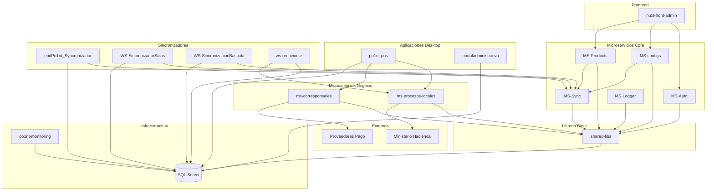

## Componentes Criticos (Alta Dependencia)

Los siguientes componentes son **criticos** porque muchos otros dependen de ellos:

### 1. shared-libs
- **Dependientes**: Todos los microservicios (7)
- **Impacto de falla**: Sistema completo inoperante
- **Mitigacion**: Libreria estatica, se compila con cada servicio

### 2. SQL Server
- **Dependientes**: Todos los componentes (22)
- **Impacto de falla**: Sistema completo inoperante
- **Mitigacion**: Alta disponibilidad, backups, replicacion

### 3. MS-Sync
- **Dependientes**: MS-configs, MS-Products, Sincronizadores
- **Impacto de falla**: Sincronizacion detenida, datos desactualizados
- **Mitigacion**: Cola de eventos persistente en BD

### 4. MS-Autn
- **Dependientes**: nuxt-front-admin, middleware en todos los MS
- **Impacto de falla**: Usuarios no pueden autenticarse
- **Mitigacion**: Tokens con duracion de 20 minutos

## Matriz de Comunicacion

| Origen | Destino | Protocolo | Puerto | Tipo |
|--------|---------|-----------|--------|------|
| nuxt-front-admin | MS-Autn | HTTP/REST | 5017 | Sincrono |
| nuxt-front-admin | MS-configs | HTTP/REST | 61673 | Sincrono |
| nuxt-front-admin | MS-Products | HTTP/REST | 5107 | Sincrono |
| po1nt-pos | ms-procesos-locales | HTTP/REST | 5115 | Sincrono |
| po1nt-pos | ms-corresponsales | HTTP/REST | 5225 | Sincrono |
| Sincronizadores | MS-Sync | HTTP/REST | 5117 | Sincrono |
| ms-procesos-locales | MH API | HTTPS | 443 | Sincrono |
| ms-corresponsales | Proveedores | HTTPS | 443 | Sincrono |
| Todos MS | SQL Server | TDS | 1433 | Sincrono |
| Windows Exporter | Pushgateway | HTTP | 9091 | Push |

## Dependencias de Base de Datos

| Componente | Base de Datos | Tipo Acceso |
|------------|---------------|-------------|
| MS-Autn | po1nt_pos | Dapper |
| MS-configs | selectos3 | Dapper |
| MS-Products | selectos3 | Dapper |
| MS-Sync | selectos3 | Dapper |
| MS-Logger | Logs | Dapper |
| ms-procesos-locales | satellite-pos | Dapper |
| ms-corresponsales | PagosExternos | Dapper |
| po1nt-pos | SatellitePOS_MH | DataSets |
| Sincronizadores | SatellitePOS_SUCURSAL_01 | ADO.NET |
| JOB-Migrations | satellite4 | EF Core |

## Dependencias de Servicios Externos

| Componente | Servicio Externo | Proposito |
|------------|------------------|-----------|
| ms-procesos-locales | Ministerio de Hacienda | DTEs |
| ms-procesos-locales | BitWork | Facturacion |
| ms-corresponsales | PuntoXpress | Colectores |
| ms-corresponsales | Cuscatlan | Remesas |
| ms-corresponsales | Airpak | Remesas |
| ms-corresponsales | TigoMoney | Dinero movil |
| ms-corresponsales | Claro/Tigo/Movistar | Recargas |
| Todos MS | Sentry | Error tracking |
| po1nt-monitoring | Azure AKS | Hosting |

## Orden de Despliegue Recomendado

Para un despliegue desde cero, seguir este orden:

1. **SQL Server** - Base de datos
2. **JOB-Migrations** - Esquema de BD
3. **shared-libs** - Libreria base (compilar)
4. **MS-Autn** - Autenticacion
5. **MS-Sync** - Sincronizacion
6. **MS-configs** - Configuracion
7. **MS-Products** - Productos
8. **MS-Logger** - Logging
9. **ms-procesos-locales** - Facturacion
10. **ms-corresponsales** - Pagos terceros
11. **nuxt-front-admin** - Portal web
12. **po1nt-pos** - Aplicacion POS
13. **Sincronizadores** - Windows Services
14. **po1nt-monitoring** - Monitoreo

---

# 5. Componentes del Sistema

## 5.1 MS-Autn - Microservicio de Autenticacion

### Proposito y Responsabilidades

Microservicio de autenticacion y gestion de usuarios para el ecosistema Po1nt. Proporciona:
- Inicio de sesion con validacion de credenciales
- Gestion de sesiones con tokens JWT encriptados
- Control de acceso basado en roles (RBAC)
- Verificacion de permisos por accion

### Estructura de Carpetas

```
MS-Autn/
├── Controllers/
│   ├── AuthController.cs      # Login, cambio de password
│   └── UserController.cs      # Registro, permisos
├── Models/
│   ├── UserLogin.cs           # DTO login
│   ├── UserRegister.cs        # DTO registro
│   └── Rol.cs                 # Modelo rol
├── Repositories/
│   ├── UserRepository.cs      # CRUD usuarios y sesiones
│   └── RolRepository.cs       # Permisos por rol
├── Properties/
│   └── launchSettings.json
├── Program.cs
├── MS-auth.csproj
└── MS-auth.sln
```

### Tecnologias y Dependencias

| Dependencia | Version | Proposito |
|-------------|---------|-----------|
| .NET | 7.0 | Framework |
| BCrypt.Net-Next | 4.0.3 | Hashing de passwords |
| Swashbuckle.AspNetCore | 6.5.0 | Swagger/OpenAPI |
| shared-libs | Local | DBClient, Crypto, AuthMiddleware |

### APIs Expuestas

#### POST /api/Auth
Login de usuario

**Request Body:**
```json
{
  "username": "string",
  "password": "string"
}
```

**Response 200:**
```json
{
  "token": "string (JWT encriptado)",
  "type": "Bearer",
  "duration": 20
}
```

#### GET /api/User/me
Obtiene informacion del usuario autenticado

**Headers:** `Authorization: Bearer {token}`

**Response 200:** Objeto User

#### GET /api/User/permissions
Obtiene permisos del rol del usuario

**Response 200:** Array de strings con nombres de permisos

### Modelo de Datos: User
```
- id: int
- name: string
- last_name: string
- email: string
- rol_id: int
- session_id: int
- terminal: int
- place: int
```

### Configuracion Requerida

| Variable | Tipo | Descripcion |
|----------|------|-------------|
| DEFAULT_CONNECTION | string | Connection string SQL Server |
| ENCRYPTION_KEY | base64 | Clave AES para encriptar tokens |
| ENABLE_METRICS | 0/1 | Habilitar Prometheus |

---

## 5.2 MS-configs - Microservicio de Configuracion

### Proposito y Responsabilidades

Centro de configuracion centralizada para el ecosistema Po1nt:
- Gestion de configuraciones generales del sistema
- Metodos de pago y tipos de impresoras
- Parametros de sistema (POS, colectores)
- Datos geograficos (paises, departamentos, municipios)
- Gestion de bancos, promociones y terminales
- Sincronizacion de cambios a otros microservicios

### Estructura de Carpetas

```
MS-configs/
├── Controllers/           # 48 controladores REST
│   ├── ConfigController.cs
│   ├── PaymentMethodsController.cs
│   ├── BankController.cs
│   ├── TerminalController.cs
│   └── ...
├── Models/
│   ├── bank/
│   ├── Config/
│   ├── Payment/
│   ├── Terminal/
│   └── ...
├── Repositories/          # 49 repositorios
│   ├── configRepository.cs
│   ├── paymentMethodsRepository.cs
│   └── ...
├── Properties/
├── Program.cs
├── ms-configs.csproj
└── Release.dockerfile
```

### APIs Expuestas

| Metodo | Ruta | Descripcion |
|--------|------|-------------|
| GET | /api/config | Lista configuraciones con paginacion |
| POST | /api/config/{id?} | Crear o actualizar configuracion |
| GET | /api/paymentmethods | Lista metodos de pago |
| GET | /api/terminals | Lista terminales |
| GET | /api/banks | Lista bancos configurados |

### Entidades Gestionadas

| Entidad | Tabla | Descripcion |
|---------|-------|-------------|
| Config | configs | Configuraciones generales |
| PaymentMethod | payment_methods | Metodos de pago |
| Bank | bank | Bancos |
| Terminal | terminals | Terminales POS |
| Place | places | Sucursales |
| Promotion | SatellitePOS_Promotion | Promociones |

### Eventos de Sincronizacion

| Evento | Trigger |
|--------|---------|
| create-config | POST /api/config |
| update-config | POST /api/config/{id} |
| delete-config | DELETE /api/config |
| create-paymentMethods | POST /api/paymentmethods |

---

## 5.3 MS-Products - Microservicio de Productos

### Proposito y Responsabilidades

Gestion centralizada del catalogo de productos:
- CRUD de productos, categorias, marcas
- Gestion de grupos, familias y grupos especiales
- Codigos de barras asociados a productos
- Precios por punto de venta
- Sincronizacion de cambios a terminales

### Estructura de Carpetas

```
MS-Products/
├── Controllers/
│   ├── ProductsController.cs
│   ├── BrandsController.cs
│   ├── CategoriesController.cs
│   ├── GroupsController.cs
│   ├── FamiliesController.cs
│   └── SpecialGroupController.cs
├── Modelos/
│   ├── Producto/
│   ├── Brand/
│   ├── Categoria/
│   └── ...
├── Repositorio/
│   ├── productRepository.cs
│   ├── brandRepository.cs
│   └── ...
├── Program.cs
└── MS-Products.csproj
```

### APIs Expuestas

#### Productos
| Metodo | Ruta | Descripcion | Permiso |
|--------|------|-------------|---------|
| GET | /api/products | Listar productos | list product |
| GET | /api/products/{id} | Obtener producto | list product |
| POST | /api/products/{id?} | Crear/actualizar | create/update product |
| DELETE | /api/products | Eliminar | delete product |

#### Marcas
| Metodo | Ruta | Descripcion |
|--------|------|-------------|
| GET | /api/brands | Listar marcas |
| POST | /api/brands/{id?} | Crear/actualizar |
| DELETE | /api/brands | Eliminar |

### Modelos de Datos

**Product:**
- id, name, description
- category_id, brand_id
- barcode, price
- create_at, update_at, delete_at

**ProductBarcode:**
- product_id, barcode

**ProductPrice:**
- product_id, place_id, price

### Eventos de Sincronizacion

| Evento | Trigger |
|--------|---------|
| create-product | Nuevo producto |
| update-product | Actualizacion |
| delete-product | Eliminacion |
| create-brand | Nueva marca |
| create-category | Nueva categoria |

---

## 5.4 MS-Sync - Microservicio de Sincronizacion

### Proposito y Responsabilidades

Orquestador de sincronizacion de datos entre plataforma central y terminales POS:
- Gestionar sincronizaciones pendientes por terminal
- Ejecutar stored procedures dinamicos por tipo de sync
- Confirmar recepcion de sincronizaciones
- Recibir transacciones desde terminales

### Estructura de Carpetas

```
MS-Sync/
├── Controllers/
│   ├── EventController.cs     # GET /api/Event/sync
│   └── SyncController.cs      # GET/POST /api/Sync/{type}
├── Models/
│   ├── Event.cs
│   ├── SyncType.cs
│   ├── Terminal.cs
│   └── TerminalSync.cs
├── Repositories/
│   ├── TerminalSyncRepository.cs
│   └── SyncTypeRepository.cs
├── Program.cs
└── MS-Sync.csproj
```

### APIs Expuestas

#### GET /api/Event/sync
Obtiene sincronizaciones pendientes para una terminal

**Headers:** `token: {terminal_token}`

**Response:**
```json
[
  {
    "ruta": "/api/Sync/{type}",
    "tipo": "products",
    "procedimiento": "SP_Sync_Products",
    "guid": "abc-123"
  }
]
```

#### GET /api/Sync/{type}
Obtiene datos de sincronizacion ejecutando SP dinamico

**Headers:**
- `token: {terminal_token}`
- `sync_Guid_Central: {guid}`

#### POST /api/Sync/{type}
Confirma recepcion de sincronizacion

#### POST /api/Sync/transactions
Recibe transacciones desde terminal (XML)

### Tablas Principales

**terminal_sync:**
- id, terminal_id, sync_type_id
- date_pending, date_send, date_confirm
- sync_guid, processData

**sync_types:**
- id, name, dll
- procedureName, procedureParams

---

## 5.5 ms-procesos-locales - Microservicio de Procesos Locales

### Proposito y Responsabilidades

Procesamiento de transacciones y facturacion electronica:
- Facturacion electronica (DTE) con Ministerio de Hacienda
- Procesamiento de transacciones POS
- Gestion de ordenes
- Procesamiento de pagos a terceros
- Control de inventario y sincronizacion de caja

### Estructura de Carpetas

```
ms-procesos-locales/
├── Controllers/
│   ├── FacturacionElectronicaController.cs  # 81KB
│   ├── SubirTransaccionesController.cs
│   ├── OrderController.cs
│   ├── IngresoInventarioController.cs
│   └── PagoTerceros*Controller.cs
├── Classes/
│   ├── BitWork/                # Facturacion electronica
│   │   ├── Factura.cs
│   │   ├── Receptor.cs
│   │   └── ...
│   ├── Cupones/
│   └── Telco/
├── Models/
├── Repositories/
├── Program.cs
└── dockerfile
```

### APIs Expuestas

#### Facturacion Electronica
| Metodo | Ruta | Descripcion |
|--------|------|-------------|
| POST | /api/FacturacionElectronica/sendFact | Enviar factura |

#### Transacciones
| Metodo | Ruta | Descripcion |
|--------|------|-------------|
| POST | /api/SubirTransacciones/sendFact | Subir transacciones |
| POST | /api/SubirTransacciones/sendCortes | Subir cortes de caja |

#### Ordenes
| Metodo | Ruta | Descripcion |
|--------|------|-------------|
| POST | /api/Order/Order | Consultar orden |
| POST | /api/Order/OrderDetails | Detalles de orden |
| POST | /api/Order/CambiarEtapaOrden | Cambiar estado |

### Integraciones Externas

| Servicio | Proposito |
|----------|-----------|
| BitWork | Procesamiento de facturas electronicas |
| Ministerio de Hacienda | Envio y validacion de DTEs |
| Digicel | Activacion de bundles |

---

## 5.6 ms-corresponsales-no-bancarios - Microservicio de Pagos a Terceros

### Proposito y Responsabilidades

Agregador de servicios financieros no bancarios:
- Pago de servicios y colectores (PuntoXpress)
- Remesas internacionales (Cuscatlan, Airpak)
- Dinero movil (TigoMoney)
- Recargas y paquetes telefonicos (Claro, Tigo, Movistar, Digicel)

### Estructura de Carpetas

```
ms-corresponsales-no-bancarios/
├── Controllers/              # 23 controladores
│   ├── PxPaymentController.cs
│   ├── CuscaTransferInfoController.cs
│   ├── AirpakPaymentRemittanceController.cs
│   ├── TigoMoneyBalanceController.cs
│   └── ...
├── Service/
│   ├── PuntoXpressService.cs
│   ├── RemittancesCuscaService.cs
│   └── ...
├── Client/
│   ├── PuntoXpressClient.cs      # 56KB
│   ├── TigoMoneyClient.cs        # 50KB
│   ├── CuscatlanClient.cs        # 44KB
│   └── ...
├── DTO/
├── Repositories/
├── Utilities/
└── Connected Services/        # SOAP proxies
```

### Proveedores Integrados

| Proveedor | Servicios | Protocolo |
|-----------|-----------|-----------|
| PuntoXpress | Pago de servicios, colectores | REST |
| Cuscatlan | Remesas internacionales | REST |
| Airpak | Remesas internacionales | REST |
| TigoMoney | Cash in/out, consulta saldo | REST |
| Claro | Recargas, paquetes | SOAP/WCF |
| Tigo | Recargas, paquetes | REST |
| Movistar | Recargas | REST |
| Digicel | Recargas | REST |

### APIs Expuestas

#### PuntoXpress
| Metodo | Ruta | Descripcion |
|--------|------|-------------|
| POST | /api/PxPayment | Realizar pago |
| POST | /api/PxBalanceClientManual | Consulta saldo |
| POST | /api/PxAnulation | Anulacion |
| GET | /api/PxCatalogs | Catalogos |

#### Remesas Cuscatlan
| Metodo | Ruta | Descripcion |
|--------|------|-------------|
| POST | /api/CuscaTransferInfo | Info de remesa |
| POST | /api/CuscaLookupPerson | Buscar beneficiario |
| POST | /api/CuscaConfirmSimplifiedPayment | Confirmar pago |

#### TigoMoney
| Metodo | Ruta | Descripcion |
|--------|------|-------------|
| POST | /api/TigoMoneyBalance | Consultar saldo |
| POST | /api/TigoMoneyPayment | Realizar pago |
| POST | /api/TigoMoneyCash | Cash in/out |

### Codigos de Respuesta

| Codigo | Significado |
|--------|-------------|
| 200 | Exito |
| 202 | Error de validacion |
| 203 | Servicio deshabilitado |
| 204 | Error procesando datos |
| 205 | Excepcion inesperada |
| 9999 | Reintentar operacion |

---

## 5.7 shared-libs - Libreria Compartida

### Proposito y Responsabilidades

Libreria centralizada de componentes reutilizables para microservicios:
- Cliente de base de datos SQL Server (DBClient)
- Middleware de autenticacion (AuthMiddleware)
- Utilidades criptograficas (Crypto)
- Gestion de eventos de sincronizacion (SyncEvent)
- Validacion de permisos (CanAction)
- Inicializacion de microservicios (MSDefault)

### Estructura de Carpetas

```
shared-libs/
├── shared-libs/
│   ├── Models/
│   │   ├── User.cs
│   │   ├── Terminal.cs
│   │   ├── TerminalSync.cs
│   │   ├── SyncType.cs
│   │   └── Event.cs
│   ├── Utils/
│   │   ├── DBClient.cs
│   │   ├── Crypto.cs
│   │   ├── CanAction.cs
│   │   ├── SyncEvent.cs
│   │   ├── MSDefault.cs
│   │   └── HttpLocal.cs
│   ├── Middlewares/
│   │   └── AuthMiddleware.cs
│   ├── Repositories/
│   │   ├── TerminalSyncRepository.cs
│   │   └── SyncTypeRepository.cs
│   └── shared-libs.csproj
└── shared-libs.sln
```

### Componentes Principales

#### DBClient
Cliente SQL Server con Dapper:
```
GetConnection(): SqlConnection
First<T>(query, model): T
Query<T>(query, model): IEnumerable<T>
Paginate<T>(query, model, paginator): Paginate<T>
Insert<T>(query, model): int
UpdateOrDelete(query, model): bool
```

#### Crypto
Encriptacion AES-256:
```
Encrypt(plaintext): string  // Encripta con IV aleatorio
Decrypt(ciphertext): string // Desencripta
```

#### AuthMiddleware
Middleware de autenticacion JWT:
- Rutas excluidas: "/Auth", "/swagger", "/metrics", "/Event", "/Sync", "/"
- Valida token, gestiona sesiones, verifica timeout (20 min)

#### CanAction
Validacion de permisos RBAC:
```
Can(context, "create user"): User  // Retorna null si no tiene permiso
```

#### SyncEvent
Gestor de eventos de sincronizacion:
```
save(Event event): bool  // Crea registros en terminal_sync
```

#### MSDefault
Inicializador de microservicios:
```
init(app, "ms-name"): void
// Configura CORS, metricas Prometheus, AuthMiddleware
```

### Dependencias

| Dependencia | Version | Proposito |
|-------------|---------|-----------|
| .NET | 7.0 | Framework |
| Microsoft.Data.SqlClient | 5.1.1 | SQL Server |
| Dapper | 2.0.143 | ORM |
| prometheus-net | 8.0.1 | Metricas |
| RestSharp | 110.2.0 | HTTP Client |
| Sentry | 1.2.0 | Error tracking |

### Variables de Entorno

| Variable | Tipo | Descripcion |
|----------|------|-------------|
| DEFAULT_CONNECTION | string | SQL Server connection string |
| ENCRYPTION_KEY | base64 | Clave AES-256 |
| ENABLE_METRICS | 0/1 | Habilitar Prometheus |

---

## 5.8 nuxt-front-admin - Portal Administrativo Web

### Proposito y Responsabilidades

Aplicacion web administrativa SPA para gestion centralizada:
- Gestion de productos, categorias, marcas
- Administracion de usuarios y roles
- Configuracion de parametros del sistema
- Gestion de bancos y metodos de pago
- Configuracion de promociones
- Reportes y transacciones

### Estructura de Carpetas

```
nuxt-front-admin/
├── pages/                  # 146 paginas
│   ├── login.vue
│   ├── index.vue
│   ├── config/            # 56 paginas
│   ├── product/
│   ├── user/
│   ├── bank/
│   └── ...
├── components/
│   ├── forms/
│   └── shared/
├── layouts/
│   ├── default.vue
│   └── blank.vue
├── services/
│   ├── GenericCrud.ts
│   ├── ms-auth/
│   ├── ms-config/
│   └── ms-product/
├── store/
│   ├── session.ts
│   └── fullLoader.ts
├── utils/
│   ├── HttpClient.ts
│   └── Sentry.ts
├── interfaces/
├── middleware/
│   └── auth.ts
├── configs/
│   └── menuItems.ts
├── app.vue
├── nuxt.config.ts
└── package.json
```

### Tecnologias y Dependencias

| Dependencia | Version | Proposito |
|-------------|---------|-----------|
| Nuxt | 3.6.5 | Framework SSR/SPA |
| Vue | 3.x | UI Framework |
| Quasar | 2.12.4 | UI Components |
| Pinia | 2.1.6 | State Management |
| TypeScript | - | Tipado estatico |
| Vuelidate | 2.0.3 | Validacion forms |
| Leaflet | 1.0.12 | Mapas |
| Monaco Editor | 0.40.0 | Editor de codigo |

### Microservicios Consumidos

| Servicio | Variable Entorno | Proposito |
|----------|------------------|-----------|
| MS-Autn | MS_AUTH | Autenticacion, usuarios |
| MS-configs | MS_CONFIG | Configuraciones |
| MS-Products | MS_PRODUCT | Productos |
| ms-procesos-locales | MS_LOCALES | Transacciones |

### Modulos Principales

| Modulo | Ruta | Paginas | Descripcion |
|--------|------|---------|-------------|
| Config | /config/* | 56 | Configuracion sistema |
| Product | /product/* | 6 | Catalogo productos |
| User | /user/* | - | Gestion usuarios |
| Bank | /bank/* | 2 | Bancos y BINs |
| Rol | /rol/* | - | Roles y permisos |

### Autenticacion

1. Usuario ingresa credenciales en `/login`
2. POST a MS_AUTH `/Auth`
3. Token JWT almacenado en cookie
4. Middleware `auth.ts` valida token en cada navegacion
5. Header `Authorization: Bearer {token}` en cada request

---

## 5.9 po1nt-pos - Aplicacion Punto de Venta

### Proposito y Responsabilidades

Aplicacion de escritorio Windows para operaciones de punto de venta:
- Procesamiento de transacciones de venta
- Gestion de inventario
- Multiples formas de pago (efectivo, tarjeta, electronico)
- Impresion de recibos (OPOS)
- Integracion con remesas y servicios de pago
- Facturacion electronica
- Reportes de caja

### Estructura de Carpetas

```
po1nt-pos/
├── SatelitePOS/                    # Aplicacion principal
│   ├── 01-ControlCajas/
│   ├── 02-FormasDePago/
│   ├── 07-Promociones/
│   ├── Autorizacion/
│   ├── Cajeros/
│   ├── Cierres/
│   ├── Devoluciones/
│   ├── Factura/
│   ├── Inventario/
│   └── ...
├── SatellitePOS_Colectores/        # Pagos terceros
│   ├── Client/
│   ├── RemesasAirpak/
│   ├── RemesasCusca/
│   └── TigoMoney/
├── SatellitePOS_PaymentMethod/     # Formas de pago
├── SatellitePOS_PrinterOPOS/       # Impresion
├── SatellitePOS.Notification/      # Notificaciones
├── Inventario/                     # Gestion inventario
├── Librerias/                      # DLLs externas
└── .github/workflows/              # CI/CD
```

### Tecnologias

| Tecnologia | Version | Uso |
|------------|---------|-----|
| VB.NET | - | Aplicacion principal |
| C# | - | Librerias y plugins |
| .NET Framework | 4.6.2 | Runtime |
| Windows Forms | - | UI |
| ADO.NET/DataSets | - | Acceso datos |
| OPOS | - | Hardware POS |

### Modulos Principales

| Modulo | Proyecto | Descripcion |
|--------|----------|-------------|
| Colectores | SatellitePOS_Colectores | Integracion pagos terceros |
| Pagos | SatellitePOS_PaymentMethod | Formas de pago |
| Impresion | SatellitePOS_PrinterOPOS | Recibos OPOS/PDF |
| Notificaciones | SatellitePOS.Notification | Alertas desktop |
| Inventario | Inventario | Gestion stock |

### Integraciones

| Servicio | Tipo | Proposito |
|----------|------|-----------|
| ms-procesos-locales | REST | Facturacion DTE |
| Airpak | REST | Remesas |
| Cuscatlan | REST | Remesas |
| TigoMoney | REST | Dinero movil |
| Sentry | SDK | Error tracking |
| OpenTelemetry | SDK | Trazas |

### Base de Datos

- **Motor**: SQL Server
- **BD Principal**: SatellitePOS_MH
- **Acceso**: DataSets tipados (XSD)

---

## 5.10 Sincronizadores - Windows Services

### Vision General

Conjunto de servicios Windows que gestionan la sincronizacion de datos entre el servidor central y las sucursales/terminales. Todos estan desarrollados en VB.NET sobre .NET Framework 4.5-4.7.

### epdPo1nt_Syncronizador

**Proposito**: Sincronizacion bidireccional de transacciones

| Caracteristica | Valor |
|----------------|-------|
| Framework | .NET Framework 2.0 |
| Lenguaje | VB.NET |
| Tipo | Windows Service |

**Timers principales**:
- TimerCortesCaja (15 min)
- TimerCajeros (5 min)
- TimerSubirClientes (5 min)
- TimerSubirPagosTerceros (2 min)
- TimerTransaccionesNew (1 min)

**Conexiones BD**: 4 SQL Server (Sala, POS, Server Dev, Server Prod)

### WS-SincronizadorSalas

**Proposito**: Sincronizar productos, precios y promociones a terminales

| Caracteristica | Valor |
|----------------|-------|
| Framework | .NET Framework 4.5 |
| Lenguaje | VB.NET |
| Tipo | Windows Service |

**Timers**:
- TimerProductosBajarServer (5 min): Descarga cambios de API central
- TimerProductosEnviarTerminales (7 min): Distribuye a sucursales

**Tipos de sincronizacion**:
- PRODUCT / CREATE-PRODUCT / UPDATE-PRODUCT
- BARCODE / CREATE-BARCODES
- PRODUCT-PRICE
- PROMOTION / PROMOTION-PRODUCTS

### WS-SincronizacionBascula

**Proposito**: Sincronizar precios a basculas de pesaje

| Caracteristica | Valor |
|----------------|-------|
| Framework | .NET Framework 4.5 |
| Lenguaje | VB.NET |
| Tipo | Windows Service |

**Timer**: Cada 45 minutos (configurable)

### sincronizacion-sala

**Proposito**: Sincronizar datos de sala de ventas a terminales

| Caracteristica | Valor |
|----------------|-------|
| Framework | .NET Framework 4.7 |
| Lenguaje | VB.NET |
| Tipo | Windows Forms |

### ws-reenviodte

**Proposito**: Reenvio automatico de DTEs fallidos

| Caracteristica | Valor |
|----------------|-------|
| Framework | .NET Framework 4.5 |
| Lenguaje | VB.NET |
| Tipo | Windows Service |

**Horario operacion**: 1:00 AM - 6:00 AM

**Timers**:
- TimerEnvioDTEServer (30 min): Reenvio de DTEs
- TimerLimpiezaBaseDatos (24 hrs): Limpieza registros antiguos

### Configuracion Comun

Todos los sincronizadores usan Registry de Windows para configuracion:

**Ruta base**: `HKEY_LOCAL_MACHINE\Software\epdsoft\Po1nt_ServiceServer`

| Clave | Descripcion |
|-------|-------------|
| ConexionBDSala | Connection string BD central |
| ConexionBDPOS | Connection string BD POS local |
| Intervalo_*_Minute | Intervalos de timers |

### Logs

Todos generan logs en: `C:\epdsoft\Services_Server\Log\`

---

## 5.11 Jobs y Migraciones

### cron-jobs

**Proposito**: Sincronizar productos desde ERP hacia SQL Server

| Caracteristica | Valor |
|----------------|-------|
| Framework | .NET 7.0 |
| Lenguaje | C# |
| Tipo | Console Application |

**Ejecucion**:
```bash
dotnet run -- Products
```

**Flujo**:
1. `Sync_ProductsCatalog()` - SP_ExtractERP_Product
2. `Sync_ProductsCodBar()` - SP_ExtractERP_ProductCodbar
3. `Sync_ProductsPrices()` - SP_ExtractERP_ProductPricePlaceType

### JOB-Migrations

**Proposito**: Migraciones EF Core para esquema principal

| Caracteristica | Valor |
|----------------|-------|
| Framework | .NET 7.0 |
| Lenguaje | C# |
| ORM | Entity Framework Core 7.0.9 |
| Base de datos | satellite4 |

**Migraciones**: 139 archivos de migracion

**Tablas principales**:
| Tabla | Proposito |
|-------|-----------|
| products | Catalogo de productos |
| product_barcodes | Codigos de barras |
| product_prices | Precios por lugar |
| terminals | Terminales POS |
| places | Sucursales |
| sync_types | Tipos de sincronizacion |
| payment_methods | Metodos de pago |

**Comandos**:
```bash
# Instalar herramientas EF
dotnet tool install --global dotnet-ef

# Crear migracion
dotnet ef migrations add NombreMigracion

# Ejecutar migraciones
dotnet ef database update
```

### job-corresponsales-no-bancarios-migrations

**Proposito**: Migraciones para sistema Punto Xpress

| Caracteristica | Valor |
|----------------|-------|
| Framework | .NET 7.0 |
| Lenguaje | C# |
| ORM | Entity Framework Core 7.0.9 |

**Tablas**:
| Tabla | Proposito |
|-------|-----------|
| PxClasifications | Clasificaciones de servicios |
| PxCategories | Categorias bajo clasificaciones |
| PxCatalogs | Catalogos con config JSON |
| PxCatalogStatus | Estados de catalogo |
| PxTransactions | Transacciones procesadas |

---

## 5.12 po1nt-monitoring - Sistema de Monitoreo

### Proposito y Responsabilidades

Sistema de observabilidad empresarial para monitoreo de terminales POS:
- Recoleccion de metricas de sistema Windows
- Almacenamiento en Prometheus TSDB
- Visualizacion en Grafana
- Trazas distribuidas con Tempo
- Alertas con Alertmanager

### Componentes

#### Windows Exporter (Agente)

| Caracteristica | Valor |
|----------------|-------|
| Version | 0.22.0 |
| Lenguaje | Go (compilado) |
| Instalacion | MSI |

**Metricas recolectadas**:
- cs (Computer System)
- cpu (Uso de CPU)
- memory (Uso de memoria)
- logical_disk (Uso de disco)
- process (Procesos)
- net (Red)
- mssql (SQL Server)

#### Scripts Batch

| Script | Proposito |
|--------|-----------|
| install.bat | Instalacion individual |
| install_multiple.bat | Instalacion desde CSV |
| push_metrics.bat | Envio de metricas |
| clean_metrics.bat | Limpieza de metricas |
| update_multiple.bat | Actualizacion batch |

#### Servidor (Azure AKS)

| Componente | Proposito |
|------------|-----------|
| Prometheus | TSDB de metricas |
| Pushgateway | Receptor de metricas push |
| Grafana | Dashboards |
| Tempo | Backend de trazas |
| Alertmanager | Gestion de alertas |

### Estructura de Carpetas

```
po1nt-monitoring/
├── monitoring-server/
│   ├── instructions.md        # Guia instalacion AKS
│   └── helm-values/
│       └── tempo-values.yaml
├── win-pos-apm-exporter/
│   ├── config.bat
│   ├── install.bat
│   ├── install_multiple.bat
│   ├── update_multiple.bat
│   ├── assets/
│   │   ├── windows_exporter-0.22.0-amd64.msi
│   │   ├── nssm.exe
│   │   └── curl.zip
│   ├── data/
│   │   └── instances.csv
│   └── scripts/
│       ├── push_metrics.bat
│       └── clean_metrics.bat
└── README.md
```

### Configuracion

| Variable | Valor Default |
|----------|---------------|
| PUSHGATEWAY_ENDPOINT | http://po1nt-apm-gtw.n1co.net:9091 |
| LOCAL_DOMAIN | calleja.local |
| PUSH_INTERVAL | 60 segundos |
| PROMETHEUS_JOB | windows |

### Infraestructura Azure

| Recurso | Valor |
|---------|-------|
| Resource Group | po1nt-monitoring |
| Cluster Name | po1nt-monitoring-aks |
| Region | centralus |
| Kubernetes | 1.30.9 |
| Node Pool | 1x Standard_D4s_v3 |

---

## 5.13 Otros Componentes

### MS-Logger

**Proposito**: Microservicio de logging centralizado

| Caracteristica | Valor |
|----------------|-------|
| Framework | .NET 7.0 |
| Lenguaje | C# |
| Tipo | REST API |

**APIs**:
| Metodo | Ruta | Descripcion |
|--------|------|-------------|
| POST | /api/log | Guardar log de accion |
| POST | /api/transaction | Guardar transaccion completa |

**Tablas**:
- logs (action_name, status, uuid, terminal, place, detail)
- transactions
- transactions_details
- transactions_pays

### po1nt-carga-apps

**Proposito**: Launcher/Splash Screen para aplicacion POS

| Caracteristica | Valor |
|----------------|-------|
| Framework | .NET Framework 4.5.2 |
| Lenguaje | C# + VB.NET |
| Tipo | Windows Forms |

**Funcionalidad**:
1. Muestra splash screen
2. Inicia SatelitePOS.exe en escritorio seguro
3. Usa WinLockDll.dll para aislamiento

### po1nt-pos-version-updater

**Proposito**: Scripts de deployment para POS

| Caracteristica | Valor |
|----------------|-------|
| Lenguaje | Batch (CMD) |
| Herramientas | robocopy, PsExec |

**Scripts**:
| Script | Descripcion |
|--------|-------------|
| copy_po1nt_files.bat | Copia archivos POS |
| deploy_copy_script.bat | Deploy a maquina unica |
| deploy_copy_script_multiple.bat | Deploy batch desde CSV |
| check_satelitepos_dates.bat | Validar versiones |

### po1nt-sql-queries

**Proposito**: Queries SQL para auditoria

| Caracteristica | Valor |
|----------------|-------|
| Lenguaje | T-SQL |
| Base de datos | po1nt_pos |
| Queries | 18 archivos |

**Categorias**:
| Query | Proposito |
|-------|-----------|
| A_facturacion_tienda_online | Facturacion DTE |
| B_descuentos_empleados | Descuentos EMP |
| C_cambios_precio | Cambios manuales |
| D_ofertas | Promociones |
| E_devoluciones | Devoluciones |
| G_remesas | Remesas |
| H_medios_pago | Formas de pago |
| M_documentos_tributarios | DTEs |
| R_tigomoney | TigoMoney |

### portaladministrativo-desktop

**Proposito**: Portal administrativo Windows

| Caracteristica | Valor |
|----------------|-------|
| Framework | .NET Framework 4.5.2 |
| Lenguaje | C# |
| Tipo | Windows Forms |

**Funcionalidades**:
- Gestion de promociones
- Sincronizacion de cajas
- Reportes de ventas
- Gestion de clientes
- Configuracion de terminales

---

# 6. Repositorios del Sistema

| # | Repositorio | Tipo | Tecnologia |
|---|-------------|------|------------|
| 1 | nuxt-front-admin | Frontend Web | Nuxt 3 / Vue 3 |
| 2 | po1nt-pos | Desktop App | VB.NET / C# |
| 3 | portaladministrativo-desktop | Desktop App | C# WinForms |
| 4 | MS-Autn | Microservicio | .NET 7 |
| 5 | MS-configs | Microservicio | .NET 7 |
| 6 | MS-Products | Microservicio | .NET 7 |
| 7 | MS-Sync | Microservicio | .NET 7 |
| 8 | MS-Logger | Microservicio | .NET 7 |
| 9 | ms-procesos-locales | Microservicio | .NET 7 |
| 10 | ms-corresponsales-no-bancarios | Microservicio | .NET 7 |
| 11 | shared-libs | Libreria | .NET 7 |
| 12 | epdPo1nt_Syncronizador | Windows Service | VB.NET |
| 13 | WS-SincronizadorSalas | Windows Service | VB.NET |
| 14 | WS-SincronizacionBascula | Windows Service | VB.NET |
| 15 | sincronizacion-sala | Windows App | VB.NET |
| 16 | ws-reenviodte | Windows Service | VB.NET |
| 17 | cron-jobs | Console App | .NET 7 |
| 18 | JOB-Migrations | Migraciones | .NET 7 / EF Core |
| 19 | job-corresponsales-no-bancarios-migrations | Migraciones | .NET 7 / EF Core |
| 20 | po1nt-monitoring | Infraestructura | Batch / Helm |
| 21 | po1nt-carga-apps | Desktop App | C# WinForms |
| 22 | po1nt-pos-version-updater | Scripts | Batch |

---

# Apendice: Guia de Lectura por Rol

## Para Gerencia / Stakeholders
1. Seccion 1: Resumen Ejecutivo

## Para Arquitectos / Tech Leads
1. Seccion 1: Resumen Ejecutivo
2. Seccion 2: Arquitectura General
3. Seccion 4: Matriz de Dependencias

## Para Desarrolladores Backend
1. Seccion 2: Arquitectura General
2. Seccion 5.7: shared-libs
3. Secciones 5.1-5.6: Microservicios
4. Seccion 3: Flujos de Negocio

## Para Desarrolladores Frontend
1. Seccion 2: Arquitectura General
2. Seccion 5.8: nuxt-front-admin
3. Seccion 3.1: Flujo de Autenticacion

## Para Desarrolladores POS / Desktop
1. Seccion 5.9: po1nt-pos
2. Seccion 5.10: Sincronizadores
3. Seccion 5.13: Otros Componentes
4. Seccion 3: Flujos de Negocio

## Para DevOps / SRE
1. Seccion 2: Arquitectura General
2. Seccion 5.12: po1nt-monitoring
3. Seccion 5.11: Jobs y Migraciones
4. Seccion 4: Matriz de Dependencias

## Para QA / Analistas
1. Seccion 1: Resumen Ejecutivo
2. Seccion 3: Flujos de Negocio
3. Seccion 4: Matriz de Dependencias

---

*Documentacion Tecnica Po1nt - Version 1.0*
*Generada automaticamente - Febrero 2026*
*Total de repositorios documentados: 22*
*Total de paginas: ~60*
