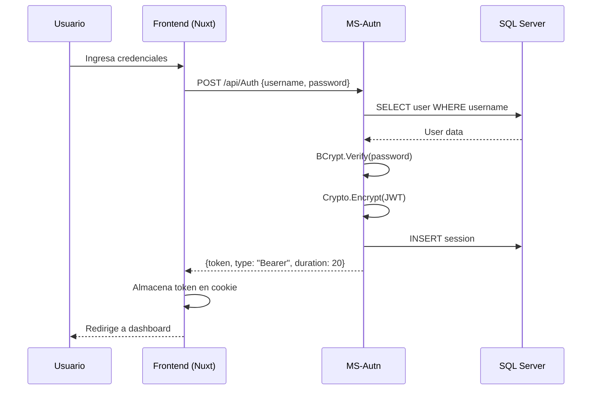
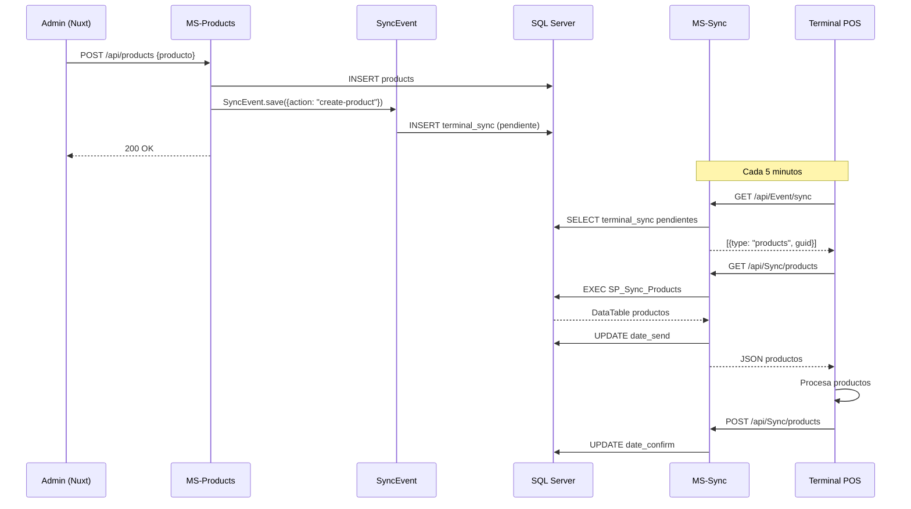
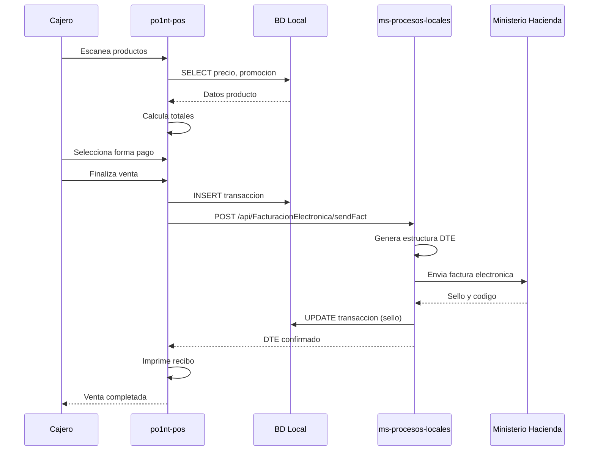
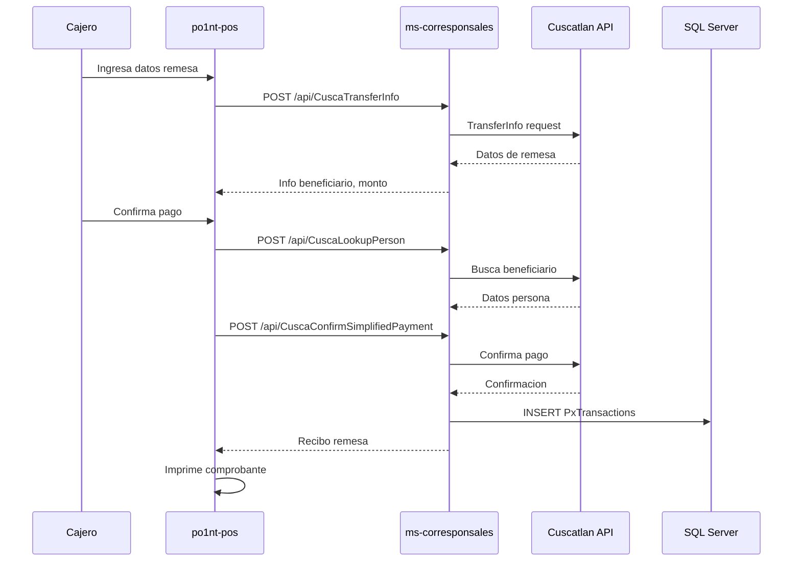
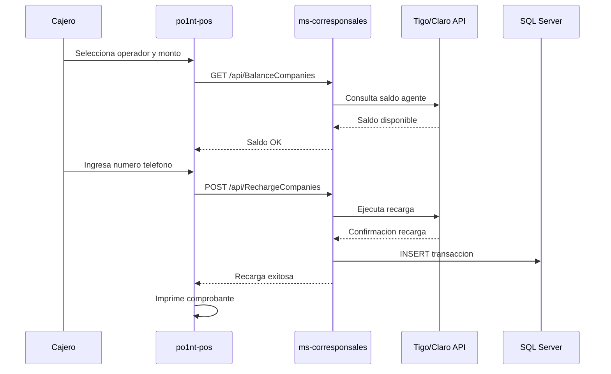
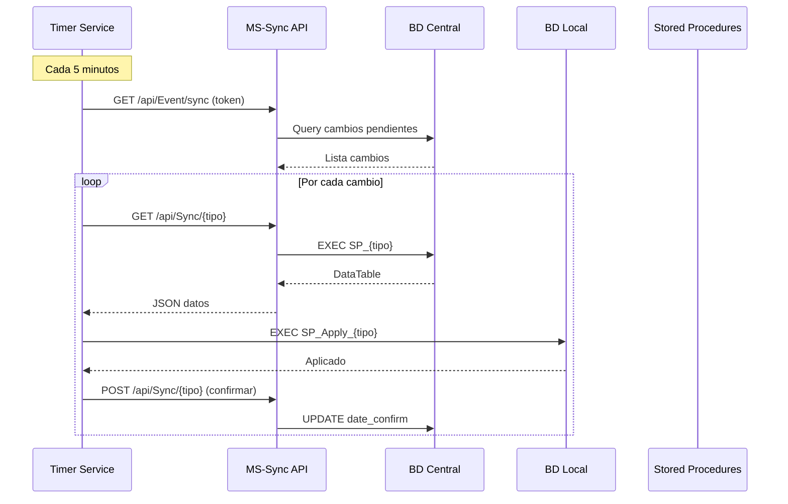
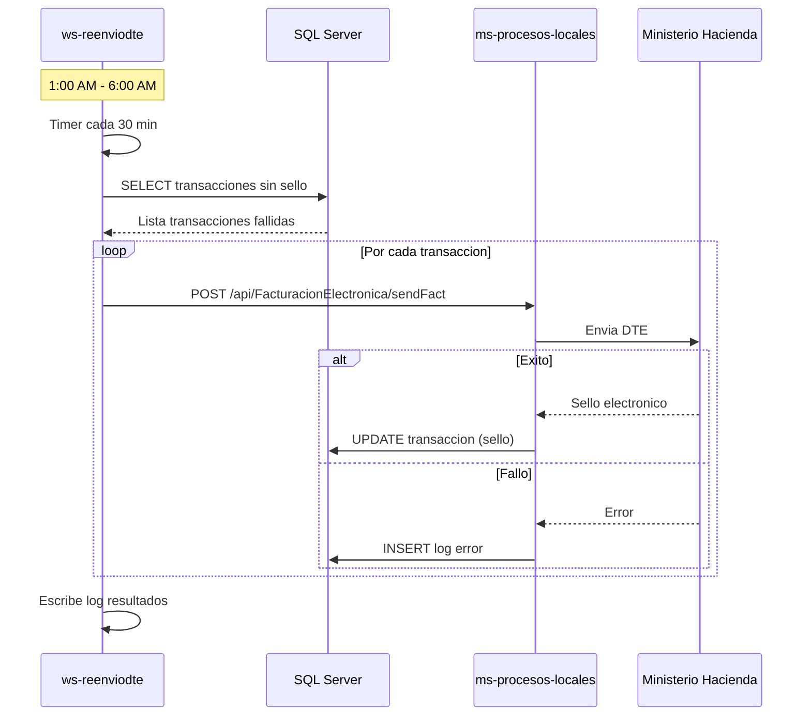

# Flujos de Negocio - Plataforma Po1nt

## 1. Flujo de Autenticacion

**Descripcion paso a paso:**
1. Usuario ingresa usuario y contrasena en la pagina de login
2. Frontend envia credenciales al microservicio de autenticacion
3. MS-Autn busca el usuario en base de datos
4. Verifica la contrasena con BCrypt
5. Genera token JWT y lo encripta con AES-256
6. Crea registro de sesion en BD
7. Retorna token encriptado al frontend
8. Frontend almacena token y redirige al usuario

---

## 2. Flujo de Sincronizacion de Productos

**Descripcion paso a paso:**
1. Administrador crea/actualiza producto desde portal web
2. MS-Products guarda en BD y dispara evento de sincronizacion
3. Se crea registro pendiente en terminal_sync para cada terminal
4. Terminal POS consulta periodicamente sincronizaciones pendientes
5. MS-Sync ejecuta stored procedure y retorna datos
6. Terminal procesa datos y confirma recepcion

---

## 3. Flujo de Venta en POS

**Descripcion paso a paso:**
1. Cajero escanea codigos de barra de productos
2. POS consulta precios y promociones en BD local
3. Sistema calcula subtotales, impuestos y descuentos
4. Cajero selecciona forma de pago (efectivo, tarjeta, etc.)
5. POS registra transaccion en BD local
6. Envia datos a microservicio de facturacion
7. Microservicio genera DTE y lo envia al Ministerio de Hacienda
8. MH retorna sello electronico
9. POS imprime recibo con sello

---

## 4. Flujo de Pago de Remesa

**Descripcion paso a paso:**
1. Cajero ingresa numero de referencia de remesa
2. POS consulta informacion de la remesa via microservicio
3. Microservicio consulta a Cuscatlan API
4. Se muestra info del beneficiario y monto
5. Cajero verifica identidad y confirma pago
6. Sistema busca datos completos del beneficiario
7. Se confirma el pago con el proveedor
8. Se registra transaccion y se imprime comprobante

---

## 5. Flujo de Recarga Telefonica

---

## 6. Flujo de Sincronizacion Batch (Timers)

---

## 7. Flujo de Reenvio DTE (Automatico)

---

## Resumen de Flujos

| Flujo | Componentes Involucrados | Frecuencia |
|-------|--------------------------|------------|
| Autenticacion | nuxt-front-admin, MS-Autn | Por demanda |
| Sync Productos | MS-Products, MS-Sync, Sincronizadores | Cada 5 min |
| Venta POS | po1nt-pos, ms-procesos-locales, MH | Por transaccion |
| Pago Remesa | po1nt-pos, ms-corresponsales, Cuscatlan/Airpak | Por demanda |
| Recarga Telefonica | po1nt-pos, ms-corresponsales, Operadores | Por demanda |
| Sync Batch | Sincronizadores, MS-Sync | Cada 5-7 min |
| Reenvio DTE | ws-reenviodte, ms-procesos-locales, MH | Cada 30 min (noche) |

---

*Documento generado automaticamente - Febrero 2026*
