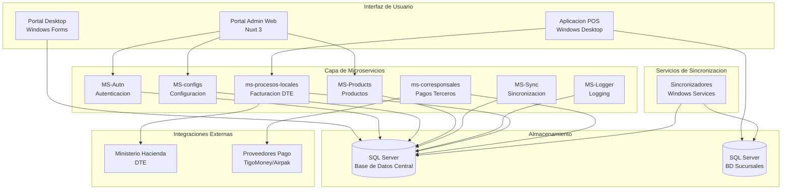

# Po1nt - Documentacion Tecnica

Documentacion tecnica completa de la plataforma Po1nt, un sistema empresarial de punto de venta (POS) para retail y supermercados.

## Descripcion del Sistema

**Po1nt** es una plataforma empresarial integral de punto de venta (POS) desarrollada para cadenas de supermercados y retail en El Salvador. El sistema gestiona todo el ciclo de vida de operaciones comerciales: desde la venta en caja, sincronizacion de productos y precios, hasta la emision de documentos tributarios electronicos (DTE) y el procesamiento de pagos a terceros.

La plataforma esta construida sobre una arquitectura de microservicios en .NET Core 7.0 para el backend, con aplicaciones de escritorio Windows para los puntos de venta (VB.NET/.NET Framework) y un portal administrativo web moderno (Nuxt 3/Vue 3). El sistema soporta operaciones distribuidas en multiples sucursales con sincronizacion en tiempo real hacia un servidor central.

Po1nt integra servicios financieros de terceros como remesas internacionales (Airpak, Cuscatlan), dinero movil (TigoMoney), recargas telefonicas y pago de servicios (PuntoXpress), posicionandose como una solucion completa para corresponsales no bancarios.

## Diagrama de Arquitectura

## Capacidades Principales

| Capacidad | Descripcion |
|-----------|-------------|
| **Gestion de Ventas** | Procesamiento de transacciones en punto de venta con soporte para multiples formas de pago |
| **Facturacion Electronica** | Emision de DTE (Documentos Tributarios Electronicos) con integracion al Ministerio de Hacienda |
| **Sincronizacion Distribuida** | Replicacion de datos de productos, precios y promociones entre servidor central y sucursales |
| **Pagos a Terceros** | Procesamiento de remesas, recargas telefonicas, pagos de servicios y dinero movil |
| **Gestion de Productos** | Administracion de catalogo, categorias, marcas, precios y codigos de barras |
| **Control de Acceso** | Autenticacion JWT, autorizacion basada en roles y permisos granulares |
| **Monitoreo** | Metricas Prometheus, logging centralizado y tracking de errores con Sentry |

## Indice de Documentacion

### Documentos Principales

| Documento | Descripcion | Audiencia |
|-----------|-------------|-----------|
| [RESUMEN-EJECUTIVO.md](./RESUMEN-EJECUTIVO.md) | Vision general del sistema | Gerencia, Stakeholders |
| [ARQUITECTURA-GENERAL.md](./ARQUITECTURA-GENERAL.md) | Arquitectura, stack tecnologico, decisiones de diseno | Arquitectos, Tech Leads |
| [FLUJOS-DE-NEGOCIO.md](./FLUJOS-DE-NEGOCIO.md) | Diagramas de secuencia de flujos principales | Analistas, QA, Desarrolladores |
| [MATRIZ-DEPENDENCIAS.md](./MATRIZ-DEPENDENCIAS.md) | Dependencias entre componentes, orden de despliegue | DevOps, Arquitectos |

### Documentacion de Componentes

| Componente | Documento | Tecnologia |
|------------|-----------|------------|
| Portal Admin Web | [componentes/nuxt-front-admin.md](./componentes/nuxt-front-admin.md) | Nuxt 3 / Vue 3 |
| Aplicacion POS | [componentes/po1nt-pos.md](./componentes/po1nt-pos.md) | VB.NET / C# |
| Autenticacion | [componentes/MS-Autn.md](./componentes/MS-Autn.md) | .NET 7 |
| Configuracion | [componentes/MS-configs.md](./componentes/MS-configs.md) | .NET 7 |
| Productos | [componentes/MS-Products.md](./componentes/MS-Products.md) | .NET 7 |
| Sincronizacion | [componentes/MS-Sync.md](./componentes/MS-Sync.md) | .NET 7 |
| Procesos Locales | [componentes/ms-procesos-locales.md](./componentes/ms-procesos-locales.md) | .NET 7 |
| Pagos Terceros | [componentes/ms-corresponsales-no-bancarios.md](./componentes/ms-corresponsales-no-bancarios.md) | .NET 7 |
| Libreria Compartida | [componentes/shared-libs.md](./componentes/shared-libs.md) | .NET 7 |
| Sincronizadores | [componentes/sincronizadores.md](./componentes/sincronizadores.md) | VB.NET |
| Jobs y Migraciones | [componentes/jobs-y-migraciones.md](./componentes/jobs-y-migraciones.md) | .NET 7 / EF Core |
| Monitoreo | [componentes/po1nt-monitoring.md](./componentes/po1nt-monitoring.md) | Prometheus / Grafana |
| Otros | [componentes/otros-componentes.md](./componentes/otros-componentes.md) | Varios |

## Guia de Lectura por Rol

### Gerencia / Stakeholders
1. [RESUMEN-EJECUTIVO.md](./RESUMEN-EJECUTIVO.md)

### Arquitectos / Tech Leads
1. [RESUMEN-EJECUTIVO.md](./RESUMEN-EJECUTIVO.md)
2. [ARQUITECTURA-GENERAL.md](./ARQUITECTURA-GENERAL.md)
3. [MATRIZ-DEPENDENCIAS.md](./MATRIZ-DEPENDENCIAS.md)

### Desarrolladores Backend
1. [ARQUITECTURA-GENERAL.md](./ARQUITECTURA-GENERAL.md)
2. [componentes/shared-libs.md](./componentes/shared-libs.md)
3. Documentos de microservicios relevantes
4. [FLUJOS-DE-NEGOCIO.md](./FLUJOS-DE-NEGOCIO.md)

### Desarrolladores Frontend
1. [ARQUITECTURA-GENERAL.md](./ARQUITECTURA-GENERAL.md)
2. [componentes/nuxt-front-admin.md](./componentes/nuxt-front-admin.md)

### DevOps / SRE
1. [ARQUITECTURA-GENERAL.md](./ARQUITECTURA-GENERAL.md)
2. [componentes/po1nt-monitoring.md](./componentes/po1nt-monitoring.md)
3. [MATRIZ-DEPENDENCIAS.md](./MATRIZ-DEPENDENCIAS.md)

### QA / Analistas
1. [RESUMEN-EJECUTIVO.md](./RESUMEN-EJECUTIVO.md)
2. [FLUJOS-DE-NEGOCIO.md](./FLUJOS-DE-NEGOCIO.md)

## Repositorios del Sistema

| # | Repositorio | Tipo | Tecnologia |
|---|-------------|------|------------|
| 1 | nuxt-front-admin | Frontend Web | Nuxt 3 / Vue 3 |
| 2 | po1nt-pos | Desktop App | VB.NET / C# |
| 3 | portaladministrativo-desktop | Desktop App | C# WinForms |
| 4 | MS-Autn | Microservicio | .NET 7 |
| 5 | MS-configs | Microservicio | .NET 7 |
| 6 | MS-Products | Microservicio | .NET 7 |
| 7 | MS-Sync | Microservicio | .NET 7 |
| 8 | MS-Logger | Microservicio | .NET 7 |
| 9 | ms-procesos-locales | Microservicio | .NET 7 |
| 10 | ms-corresponsales-no-bancarios | Microservicio | .NET 7 |
| 11 | shared-libs | Libreria | .NET 7 |
| 12 | epdPo1nt_Syncronizador | Windows Service | VB.NET |
| 13 | WS-SincronizadorSalas | Windows Service | VB.NET |
| 14 | WS-SincronizacionBascula | Windows Service | VB.NET |
| 15 | sincronizacion-sala | Windows App | VB.NET |
| 16 | ws-reenviodte | Windows Service | VB.NET |
| 17 | cron-jobs | Console App | .NET 7 |
| 18 | JOB-Migrations | Migraciones | .NET 7 / EF Core |
| 19 | job-corresponsales-no-bancarios-migrations | Migraciones | .NET 7 / EF Core |
| 20 | po1nt-monitoring | Infraestructura | Batch / Helm |
| 21 | po1nt-carga-apps | Desktop App | C# WinForms |
| 22 | po1nt-pos-version-updater | Scripts | Batch |

---

*Documentacion generada automaticamente - Febrero 2026*

*Total de repositorios documentados: 22*
