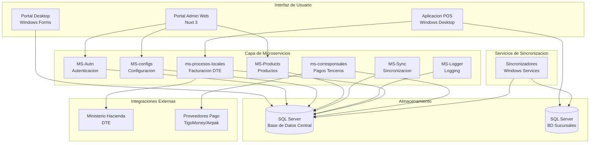

# Resumen Ejecutivo - Plataforma Po1nt

## Descripcion del Sistema

**Po1nt** es una plataforma empresarial integral de punto de venta (POS) desarrollada para cadenas de supermercados y retail en El Salvador. El sistema gestiona todo el ciclo de vida de operaciones comerciales: desde la venta en caja, sincronizacion de productos y precios, hasta la emision de documentos tributarios electronicos (DTE) y el procesamiento de pagos a terceros.

La plataforma esta construida sobre una arquitectura de microservicios en .NET Core 7.0 para el backend, con aplicaciones de escritorio Windows para los puntos de venta (VB.NET/.NET Framework) y un portal administrativo web moderno (Nuxt 3/Vue 3). El sistema soporta operaciones distribuidas en multiples sucursales con sincronizacion en tiempo real hacia un servidor central.

Po1nt integra servicios financieros de terceros como remesas internacionales (Airpak, Cuscatlan), dinero movil (TigoMoney), recargas telefonicas y pago de servicios (PuntoXpress), posicionandose como una solucion completa para corresponsales no bancarios.

## Diagrama de Arquitectura de Alto Nivel

## Capacidades Principales del Sistema

| Capacidad | Descripcion |
|-----------|-------------|
| **Gestion de Ventas** | Procesamiento de transacciones en punto de venta con soporte para multiples formas de pago |
| **Facturacion Electronica** | Emision de DTE (Documentos Tributarios Electronicos) con integracion al Ministerio de Hacienda |
| **Sincronizacion Distribuida** | Replicacion de datos de productos, precios y promociones entre servidor central y sucursales |
| **Pagos a Terceros** | Procesamiento de remesas, recargas telefonicas, pagos de servicios y dinero movil |
| **Gestion de Productos** | Administracion de catalogo, categorias, marcas, precios y codigos de barras |
| **Control de Acceso** | Autenticacion JWT, autorizacion basada en roles y permisos granulares |
| **Monitoreo** | Metricas Prometheus, logging centralizado y tracking de errores con Sentry |
| **Administracion Central** | Portal web para configuracion de parametros, usuarios, terminales y reportes |

## Componentes Principales

| Componente | Descripcion |
|------------|-------------|
| **nuxt-front-admin** | Portal administrativo web con Nuxt 3 y Vue 3 para gestion centralizada |
| **po1nt-pos** | Aplicacion de punto de venta Windows con 16 modulos integrados |
| **MS-Autn** | Microservicio de autenticacion con JWT y control de acceso RBAC |
| **MS-configs** | Microservicio de configuracion centralizada del sistema |
| **MS-Products** | Microservicio de gestion de catalogo de productos |
| **MS-Sync** | Microservicio de orquestacion de sincronizaciones |
| **ms-procesos-locales** | Microservicio de facturacion electronica y procesos de negocio |
| **ms-corresponsales-no-bancarios** | Microservicio agregador de servicios financieros |
| **shared-libs** | Libreria compartida con utilidades comunes para microservicios |
| **Sincronizadores** | Servicios Windows para sincronizacion automatica de datos |
| **po1nt-monitoring** | Sistema de observabilidad con Prometheus, Grafana y Tempo |

---

*Documento generado automaticamente - Febrero 2026*
