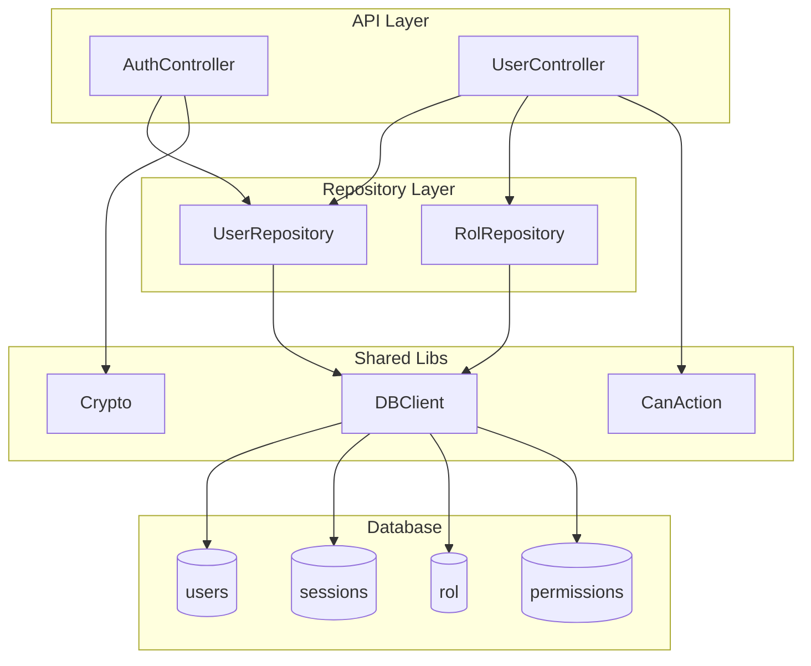

# MS-Autn - Microservicio de Autenticacion

## Proposito y Responsabilidades

Microservicio de autenticacion y gestion de usuarios para el ecosistema Po1nt. Proporciona:
- Inicio de sesion con validacion de credenciales
- Gestion de sesiones con tokens JWT encriptados
- Control de acceso basado en roles (RBAC)
- Verificacion de permisos por accion

## Diagrama de Arquitectura Interna



## Estructura de Carpetas

```
MS-Autn/
├── Controllers/
│   ├── AuthController.cs      # Login, cambio de password
│   └── UserController.cs      # Registro, permisos
├── Models/
│   ├── UserLogin.cs           # DTO login
│   ├── UserRegister.cs        # DTO registro
│   └── Rol.cs                 # Modelo rol
├── Repositories/
│   ├── UserRepository.cs      # CRUD usuarios y sesiones
│   └── RolRepository.cs       # Permisos por rol
├── Properties/
│   └── launchSettings.json
├── Program.cs
├── MS-auth.csproj
└── MS-auth.sln
```

## Tecnologias y Dependencias

| Dependencia | Version | Proposito |
|-------------|---------|-----------|
| .NET | 7.0 | Framework |
| BCrypt.Net-Next | 4.0.3 | Hashing de passwords |
| Swashbuckle.AspNetCore | 6.5.0 | Swagger/OpenAPI |
| shared-libs | Local | DBClient, Crypto, AuthMiddleware |

## APIs Expuestas

### POST /api/Auth
Login de usuario

**Request Body:**
```json
{
  "username": "string",
  "password": "string"
}
```

**Response 200:**
```json
{
  "token": "string (JWT encriptado)",
  "type": "Bearer",
  "duration": 20
}
```

### GET /api/User/me
Obtiene informacion del usuario autenticado

**Headers:** `Authorization: Bearer {token}`

**Response 200:** Objeto User

### GET /api/User/permissions
Obtiene permisos del rol del usuario

**Response 200:** Array de strings con nombres de permisos

### POST /api/User/{id?}
Registrar o actualizar usuario

**Requiere permiso:** `create user`

## APIs Consumidas

| Servicio | Endpoint | Proposito |
|----------|----------|-----------|
| SQL Server | Via DBClient | Consultas a tablas users, sessions, rol |

## Modelos de Datos Principales

### User
```csharp
public class User {
    public int id { get; set; }
    public string name { get; set; }
    public string last_name { get; set; }
    public string email { get; set; }
    public int rol_id { get; set; }
    public int session_id { get; set; }
    public int terminal { get; set; }
    public int place { get; set; }
}
```

### Session
```csharp
// Tabla sessions
- id / session_id
- user_id
- token
- user_agent
- ip
- last_connection
```

## Configuracion Requerida

| Variable | Tipo | Descripcion |
|----------|------|-------------|
| DEFAULT_CONNECTION | string | Connection string SQL Server |
| ENCRYPTION_KEY | base64 | Clave AES para encriptar tokens |
| ENABLE_METRICS | 0/1 | Habilitar Prometheus |

## Como Ejecutar Localmente

```bash
# Configurar variables de entorno
export DEFAULT_CONNECTION="Server=localhost;Database=po1nt;..."
export ENCRYPTION_KEY="base64-key-here"

# Ejecutar
cd MS-Autn
dotnet run

# Swagger disponible en
# http://localhost:5017/swagger
```

---
