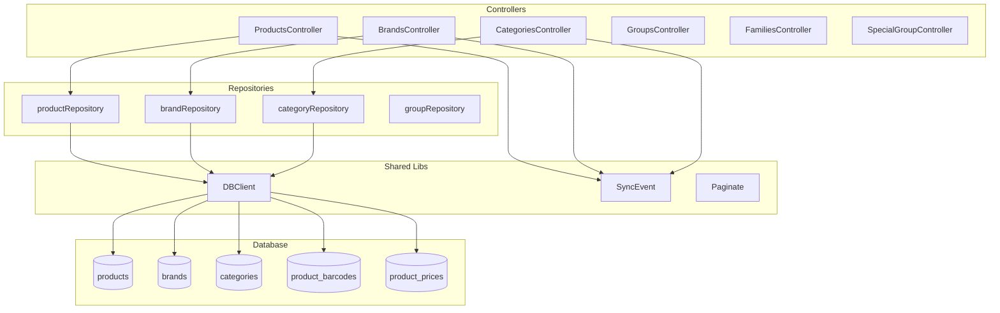

# MS-Products - Microservicio de Productos

## Proposito y Responsabilidades

Gestion centralizada del catalogo de productos:
- CRUD de productos, categorias, marcas
- Gestion de grupos, familias y grupos especiales
- Codigos de barras asociados a productos
- Precios por punto de venta
- Sincronizacion de cambios a terminales

## Diagrama de Arquitectura Interna



## Estructura de Carpetas

```
MS-Products/
├── Controllers/
│   ├── ProductsController.cs
│   ├── BrandsController.cs
│   ├── CategoriesController.cs
│   ├── GroupsController.cs
│   ├── FamiliesController.cs
│   └── SpecialGroupController.cs
├── Modelos/
│   ├── Producto/
│   ├── Brand/
│   ├── Categoria/
│   └── ...
├── Repositorio/
│   ├── productRepository.cs
│   ├── brandRepository.cs
│   └── ...
├── Program.cs
└── MS-Products.csproj
```

## Tecnologias y Dependencias

| Dependencia | Version | Proposito |
|-------------|---------|-----------|
| .NET | 7.0 | Framework |
| Dapper | via shared-libs | ORM |
| Sentry.AspNetCore | 2.1.8 | Error tracking |
| shared-libs | Local | DBClient, SyncEvent, Paginate |

## APIs Expuestas

### Productos
| Metodo | Ruta | Descripcion | Permiso |
|--------|------|-------------|---------|
| GET | /api/products | Listar productos | list product |
| GET | /api/products/{id} | Obtener producto | list product |
| POST | /api/products/{id?} | Crear/actualizar | create/update product |
| DELETE | /api/products | Eliminar | delete product |

### Marcas
| Metodo | Ruta | Descripcion |
|--------|------|-------------|
| GET | /api/brands | Listar marcas |
| POST | /api/brands/{id?} | Crear/actualizar |
| DELETE | /api/brands | Eliminar |

### Categorias, Grupos, Familias
Endpoints similares con patron `/api/{entidad}`

## Modelos de Datos

### Product
```csharp
- id, name, description
- category_id, brand_id
- barcode, price
- create_at, update_at, delete_at
```

### ProductBarcode
```csharp
- product_id, barcode
```

### ProductPrice
```csharp
- product_id, place_id, price
```

## Eventos de Sincronizacion

| Evento | Trigger |
|--------|---------|
| create-product | Nuevo producto |
| update-product | Actualizacion |
| delete-product | Eliminacion |
| create-brand | Nueva marca |
| create-category | Nueva categoria |

---
