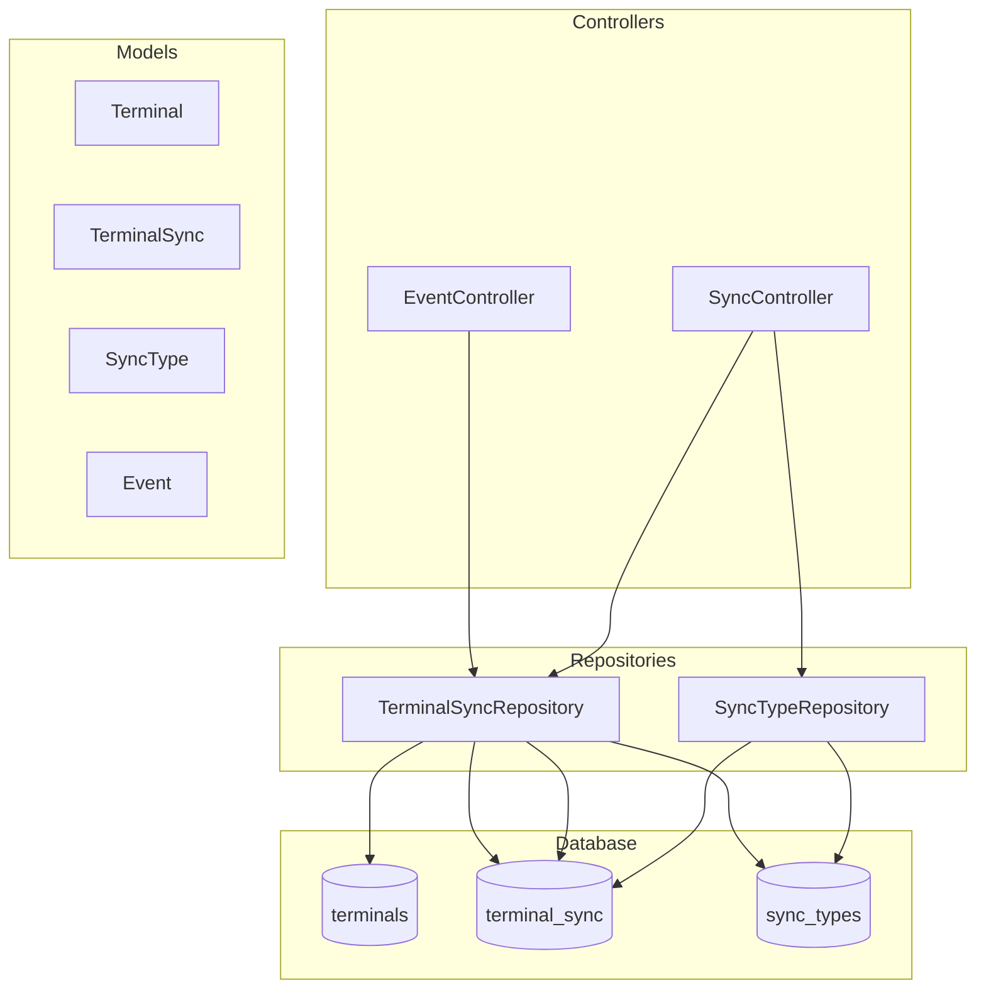
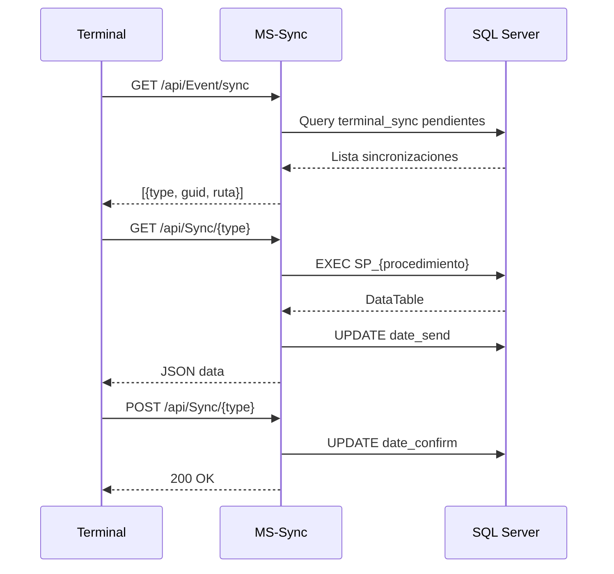

# MS-Sync - Microservicio de Sincronizacion

## Proposito y Responsabilidades

Orquestador de sincronizacion de datos entre plataforma central y terminales POS:
- Gestionar sincronizaciones pendientes por terminal
- Ejecutar stored procedures dinamicos por tipo de sync
- Confirmar recepcion de sincronizaciones
- Recibir transacciones desde terminales

## Diagrama de Arquitectura Interna



## Estructura de Carpetas

```
MS-Sync/
├── Controllers/
│   ├── EventController.cs     # GET /api/Event/sync
│   └── SyncController.cs      # GET/POST /api/Sync/{type}
├── Models/
│   ├── Event.cs
│   ├── SyncType.cs
│   ├── Terminal.cs
│   └── TerminalSync.cs
├── Repositories/
│   ├── TerminalSyncRepository.cs
│   └── SyncTypeRepository.cs
├── Program.cs
└── MS-Sync.csproj
```

## APIs Expuestas

### GET /api/Event/sync
Obtiene sincronizaciones pendientes para una terminal

**Headers:** `token: {terminal_token}`

**Response:**
```json
[
  {
    "ruta": "/api/Sync/{type}",
    "tipo": "products",
    "procedimiento": "SP_Sync_Products",
    "guid": "abc-123"
  }
]
```

### GET /api/Sync/{type}
Obtiene datos de sincronizacion ejecutando SP dinamico

**Headers:**
- `token: {terminal_token}`
- `sync_Guid_Central: {guid}`

### POST /api/Sync/{type}
Confirma recepcion de sincronizacion

### POST /api/Sync/transactions
Recibe transacciones desde terminal (XML)

## Flujo de Sincronizacion



## Configuracion Requerida

| Variable | Tipo | Descripcion |
|----------|------|-------------|
| DEFAULT_CONNECTION | string | SQL Server |
| ENCRYPTION_KEY | base64 | Decrypt tokens |
| ENABLE_METRICS | 0/1 | Prometheus |

## Tablas Principales

### terminal_sync
```sql
- id
- terminal_id
- sync_type_id
- date_pending
- date_send
- date_confirm
- sync_guid
- processData
```

### sync_types
```sql
- id
- name
- dll
- procedureName
- procedureParams
```

---
