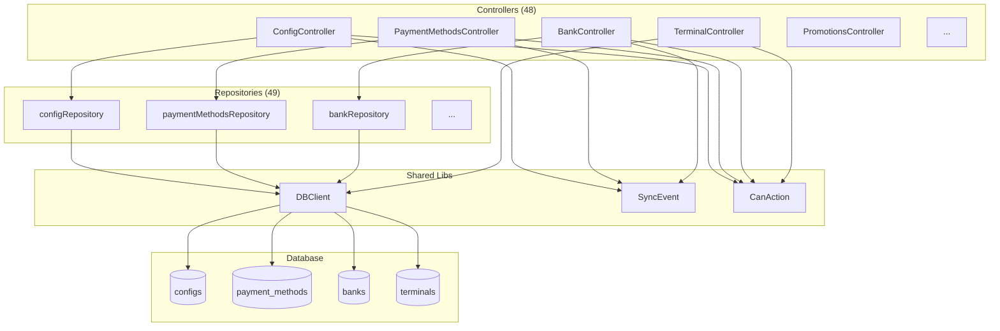

# MS-configs - Microservicio de Configuracion

## Proposito y Responsabilidades

Centro de configuracion centralizada para el ecosistema Po1nt:
- Gestion de configuraciones generales del sistema
- Metodos de pago y tipos de impresoras
- Parametros de sistema (POS, colectores)
- Datos geograficos (paises, departamentos, municipios)
- Gestion de bancos, promociones y terminales
- Sincronizacion de cambios a otros microservicios

## Diagrama de Arquitectura Interna



## Estructura de Carpetas

```
MS-configs/
├── Controllers/           # 48 controladores REST
│   ├── ConfigController.cs
│   ├── PaymentMethodsController.cs
│   ├── BankController.cs
│   ├── TerminalController.cs
│   └── ...
├── Models/
│   ├── bank/
│   ├── Config/
│   ├── Payment/
│   ├── Terminal/
│   └── ...
├── Repositories/          # 49 repositorios
│   ├── configRepository.cs
│   ├── paymentMethodsRepository.cs
│   └── ...
├── Properties/
├── Program.cs
├── ms-configs.csproj
└── Release.dockerfile
```

## Tecnologias y Dependencias

| Dependencia | Version | Proposito |
|-------------|---------|-----------|
| .NET | 7.0 | Framework |
| Swashbuckle.AspNetCore | 6.5.0 | Swagger |
| RestSharp | 110.2.0 | HTTP Client |
| Sentry.AspNetCore | 2.1.8 | Error tracking |
| shared-libs | Local | DBClient, SyncEvent |

## APIs Expuestas (Ejemplos)

### GET /api/config
Lista configuraciones con paginacion

### POST /api/config/{id?}
Crear o actualizar configuracion

### GET /api/paymentmethods
Lista metodos de pago

### GET /api/terminals
Lista terminales

### GET /api/banks
Lista bancos configurados

## Entidades Gestionadas

| Entidad | Tabla | Descripcion |
|---------|-------|-------------|
| Config | configs | Configuraciones generales |
| PaymentMethod | payment_methods | Metodos de pago |
| Bank | bank | Bancos |
| Terminal | terminals | Terminales POS |
| Place | places | Sucursales |
| Promotion | SatellitePOS_Promotion | Promociones |
| Country | countries | Paises |
| Department | departments | Departamentos |
| Municipality | municipalities | Municipios |

## Configuracion Requerida

| Variable | Tipo | Descripcion |
|----------|------|-------------|
| DEFAULT_CONNECTION | string | Connection string SQL Server |
| ENABLE_METRICS | 0/1 | Prometheus |
| ENCRYPTION_KEY | base64 | Encriptacion |

## Eventos de Sincronizacion

El microservicio dispara eventos SyncEvent para propagar cambios:

| Evento | Trigger |
|--------|---------|
| create-config | POST /api/config |
| update-config | POST /api/config/{id} |
| delete-config | DELETE /api/config |
| create-paymentMethods | POST /api/paymentmethods |

---
