# CI/CD — GitHub Actions con Self-Hosted Runner

## Resumen

El pipeline de CI/CD automatiza el build y deploy de microservicios .NET 7 a produccion utilizando GitHub Actions con un self-hosted runner instalado directamente en el servidor de produccion (srvpointapp01).

## Arquitectura del Pipeline

```mermaid
flowchart LR
    DEV[Developer] -->|push| PROD_BRANCH[branch production]
    PROD_BRANCH -->|trigger| GHA[GitHub Actions]
    GHA -->|runs-on| RUNNER[Self-Hosted Runner<br>srvpointapp01]
    RUNNER -->|dotnet build| BUILD[Build .NET]
    BUILD -->|docker build| DOCKER[Imagen Docker]
    DOCKER -->|docker push| REGISTRY[Registry<br>192.168.15.105:5000]
    REGISTRY -->|kubectl set image| K8S[MicroK8s<br>namespace po1nt]
```



## Flujo de branches

```mermaid
gitgraph
    commit id: "feature"
    branch feat/nueva-funcionalidad
    commit id: "cambios"
    checkout main
    merge feat/nueva-funcionalidad id: "PR merge a main"
    branch production
    commit id: "PR merge a production"
    commit id: "auto-deploy a K8s" type: HIGHLIGHT
```

- **`main`**: branch principal de desarrollo. Requiere PR con 1 aprobacion.
- **`production`**: branch de produccion. Requiere PR con 1 aprobacion. El push a esta branch dispara el deploy automatico.
- **`feat/*`, `fix/*`**: branches de trabajo que se mergean a `main` via PR.

## Componentes

### Self-Hosted Runner

| Atributo | Valor |
|---|---|
| Servidor | srvpointapp01 (192.168.15.105) |
| Usuario | github-runner |
| Labels | self-hosted, linux, x64, po1nt-prod |
| Servicio | actions.runner.po1nt-dev.srvpointapp01.service |

El runner tiene acceso directo a Docker, .NET SDK 7 y `microk8s kubectl`, lo que permite ejecutar todo el pipeline sin dependencias externas.

### Workflow Reutilizable

**Repositorio**: `po1nt-dev/.github`
**Archivo**: `.github/workflows/build-deploy-dotnet.yml`

Acepta 3 parametros obligatorios:

| Parametro | Descripcion | Ejemplo |
|---|---|---|
| `csproj_name` | Nombre del .csproj (sin extension) | `MS-Logger` |
| `image_name` | Nombre de la imagen Docker | `selectos/logger` |
| `deployment_name` | Nombre del deployment en K8s | `logger` |

### Invocacion por Microservicio

Cada microservicio tiene un archivo `.github/workflows/deploy.yml` que invoca el workflow reutilizable:

```yaml
name: Deploy

on:
  push:
    branches: [production]
  workflow_dispatch:

jobs:
  deploy:
    uses: po1nt-dev/.github/.github/workflows/build-deploy-dotnet.yml@main
    with:
      csproj_name: MS-Logger
      image_name: selectos/logger
      deployment_name: logger
    secrets: inherit
```

## Mapeo de Servicios

| Repositorio | csproj_name | image_name | deployment_name |
|---|---|---|---|
| MS-Logger | MS-Logger | selectos/logger | logger |
| MS-Autn | MS-auth | selectos/auth | auth |
| MS-configs | ms-configs | selectos/config | config |
| MS-Products | MS-Products | selectos/products | products |
| MS-Sync | MS-Sync | selectos/sync | sync |
| ms-procesos-locales | ms-procesos-locales | selectos/ms-procesos-locales | procesos-locales |
| ms-corresponsales-no-bancarios | ms-corresponsales-no-bancarios | selectos/ms-corresponsales-no-bancarios | ms-corresponsales-no-bancarios |

## Secrets de Organizacion

Los secrets estan configurados a nivel de la organizacion `po1nt-dev` con visibilidad para todos los repos:

| Secret | Proposito |
|---|---|
| REGISTRY_HOST | Host del registry privado |
| REGISTRY_USERNAME | Credenciales del registry |
| REGISTRY_PASSWORD | Credenciales del registry |
| KUBE_NAMESPACE | Namespace de K8s (po1nt) |
| SHARED_LIBS_TOKEN | PAT para clonar shared-libs |

## Dockerfile Estandar

Todos los microservicios .NET usan el mismo Dockerfile:

```dockerfile
FROM bitnamilegacy/aspnet-core:7
ARG PROJECT_NAME="example"
WORKDIR /opt/app
COPY ./build .
RUN echo -e  "#!/bin/bash\ndotnet ./$PROJECT_NAME.dll" > ./build-net && chmod +x ./build-net
CMD [ "./build-net" ]
```

La variable `PROJECT_NAME` se pasa como build-arg durante `docker build`.

## Rollback

Para hacer rollback a una version anterior:

```bash
# Ver tags disponibles en el registry
curl -s -u <user>:<pass> http://192.168.15.105:5000/v2/selectos/<servicio>/tags/list

# Rollback al tag anterior
microk8s kubectl set image deployment/<deployment> \
  <deployment>=192.168.15.105:5000/selectos/<servicio>:<TAG_ANTERIOR> \
  -n po1nt
```

El pipeline mantiene las ultimas 5 imagenes de cada servicio en el servidor para permitir rollback rapido.

## Deploy Manual

Ademas del deploy automatico, se puede disparar manualmente desde la UI de GitHub:
1. Ir al repositorio en GitHub
2. Pestaña **Actions**
3. Seleccionar el workflow **Deploy**
4. Click en **Run workflow** (desde cualquier branch, pero se recomienda usar `production`)
