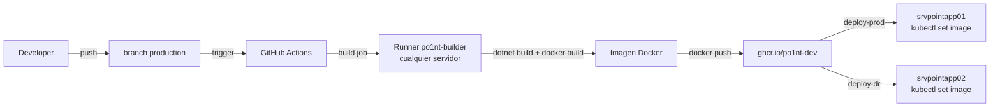

# CI/CD — GitHub Actions con Self-Hosted Runners y ghcr.io

## Resumen

El pipeline de CI/CD automatiza el build y deploy de microservicios .NET 7 a produccion utilizando GitHub Actions con self-hosted runners en ambos servidores. Las imagenes se almacenan en GitHub Container Registry (ghcr.io) como registry centralizado.

## Arquitectura del Pipeline



## Flujo de branches

```mermaid
gitgraph
    commit id: "feature"
    branch feat/nueva-funcionalidad
    commit id: "cambios"
    checkout main
    merge feat/nueva-funcionalidad id: "PR merge a main"
    branch production
    commit id: "PR merge a production"
    commit id: "auto-deploy a ambos servidores" type: HIGHLIGHT
```

- **`main`**: branch principal de desarrollo. Requiere PR con 1 aprobacion.
- **`production`**: branch de produccion. Requiere PR con 1 aprobacion. El push a esta branch dispara el deploy automatico a ambos servidores.
- **`feat/*`, `fix/*`**: branches de trabajo que se mergean a `main` via PR.

## Self-Hosted Runners

| Atributo | srvpointapp01 (principal) | srvpointapp02 (DR) |
|---|---|---|
| Nombre | srvpointapp01 | srvpointapp02 |
| IP | 192.168.15.105 | 192.168.15.121 |
| Labels | self-hosted, po1nt-prod, po1nt-builder | self-hosted, po1nt-dr, po1nt-builder |
| Servicio | actions.runner.po1nt-dev.srvpointapp01 | actions.runner.po1nt-dev.srvpointapp02 |

El label `po1nt-builder` esta en ambos runners. El job de build corre en el primero que este disponible (fallback automatico).

## Container Registry

**Registry centralizado:** `ghcr.io/po1nt-dev`

Las imagenes se pushean a ghcr.io y ambos servidores hacen pull de la misma imagen exacta, garantizando que ambos clusters corren codigo identico.

Para ver las imagenes: https://github.com/orgs/po1nt-dev/packages

Los registries locales (192.168.15.105:5000 y 192.168.15.121:5000) siguen funcionando como cache pero el pipeline principal usa ghcr.io.

## Workflow Reutilizable

**Repositorio**: `po1nt-dev/.github`
**Archivo**: `.github/workflows/build-deploy-dotnet.yml`

### Jobs del pipeline

| Job | Runner | Funcion |
|---|---|---|
| **build** | po1nt-builder (cualquier servidor) | Checkout, dotnet build, docker build, push a ghcr.io |
| **deploy-prod** | po1nt-prod (srvpointapp01) | Pull desde ghcr.io, kubectl set image |
| **deploy-dr** | po1nt-dr (srvpointapp02) | Pull desde ghcr.io, kubectl set image |

Los jobs deploy-prod y deploy-dr corren **en paralelo** e **independientes** — si uno falla, el otro continua. Ambos usan el mismo tag generado por el job build.

### Parametros

| Parametro | Descripcion | Ejemplo |
|---|---|---|
| `csproj_name` | Nombre del .csproj (sin extension) | `MS-Logger` |
| `image_name` | Nombre de la imagen Docker | `selectos/logger` |
| `deployment_name` | Nombre del deployment en K8s | `logger` |

### Invocacion por Microservicio

Cada microservicio tiene un archivo `.github/workflows/deploy.yml`:

```yaml
name: Deploy

on:
  push:
    branches: [production]
  workflow_dispatch:

jobs:
  deploy:
    uses: po1nt-dev/.github/.github/workflows/build-deploy-dotnet.yml@main
    with:
      csproj_name: MS-Logger
      image_name: selectos/logger
      deployment_name: logger
    secrets: inherit
```

## Mapeo de Servicios

| Repositorio | csproj_name | image_name | deployment_name |
|---|---|---|---|
| MS-Logger | MS-Logger | selectos/logger | logger |
| MS-Autn | MS-auth | selectos/auth | auth |
| MS-configs | ms-configs | selectos/config | config |
| MS-Products | MS-Products | selectos/products | products |
| MS-Sync | MS-Sync | selectos/sync | sync |
| ms-procesos-locales | ms-procesos-locales | selectos/ms-procesos-locales | procesos-locales |
| ms-corresponsales-no-bancarios | ms-corresponsales-no-bancarios | selectos/ms-corresponsales-no-bancarios | ms-corresponsales-no-bancarios |

## Secrets de Organizacion

Configurados a nivel de la organizacion `po1nt-dev`:

| Secret | Proposito |
|---|---|
| GHCR_TOKEN | PAT para push/pull en ghcr.io |
| GHCR_USERNAME | Usuario para ghcr.io (po1nt-dev) |
| KUBE_NAMESPACE | Namespace de K8s (po1nt) |
| SHARED_LIBS_TOKEN | PAT para clonar shared-libs (cross-repo) |

## Dockerfile Estandar

Todos los microservicios .NET usan el mismo Dockerfile:

```dockerfile
FROM bitnamilegacy/aspnet-core:7
ARG PROJECT_NAME="example"
WORKDIR /opt/app
COPY ./build .
RUN echo -e  "#!/bin/bash\ndotnet ./$PROJECT_NAME.dll" > ./build-net && chmod +x ./build-net
CMD [ "./build-net" ]
```

## Rollback

Para hacer rollback a una version anterior:

```bash
# Ver imagenes disponibles en ghcr.io
# UI: https://github.com/orgs/po1nt-dev/packages

# Rollback en un servidor
microk8s kubectl set image deployment/<deployment> \
  <deployment>=ghcr.io/po1nt-dev/selectos/<servicio>:<TAG_ANTERIOR> \
  -n po1nt
```

El pipeline mantiene las ultimas 5 imagenes de cada servicio en el servidor local.

## Deploy Manual

Ademas del deploy automatico, se puede disparar manualmente desde la UI de GitHub:
1. Ir al repositorio en GitHub
2. Pestana **Actions**
3. Seleccionar el workflow **Deploy**
4. Click en **Run workflow**

## Gestion de Secrets

Los secrets de produccion (connection strings, API keys, credenciales de corresponsales) se gestionan de forma centralizada en **Infisical**.

| Atributo | Valor |
|---|---|
| URL | http://192.168.15.88:8080 |
| Servidor | DeveloperTools (VM en host ESXi 192.168.15.253) |
| Proyecto | po1nt-prod |
| Environment | prod (29 secrets) |

Ver [gestion-secrets.md](gestion-secrets.md) para mas detalles.
