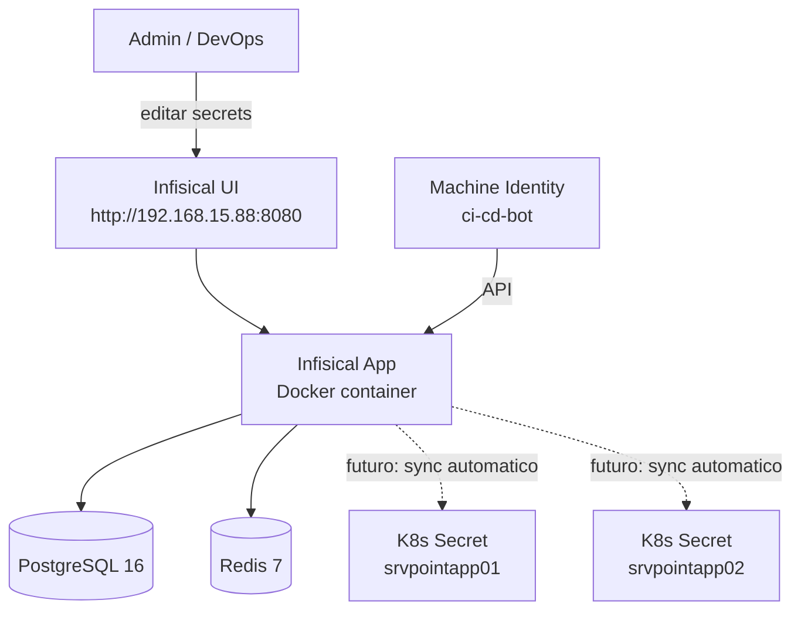

# Gestion de Secrets — Infisical

## Resumen

Los secrets de produccion de la plataforma Po1nt se gestionan de forma centralizada en Infisical, instalado en el servidor DeveloperTools (192.168.15.88). Infisical permite ver y editar secrets en plain text desde una UI web, con control de acceso y auditoria.

## Acceso

| Atributo | Valor |
|---|---|
| **URL** | http://192.168.15.88:8080 (requiere VPN) |
| **Servidor** | DeveloperTools (VM en host ESXi 192.168.15.253) |
| **Proyecto** | po1nt-prod |
| **Environment** | prod |
| **Total secrets** | 29 |

## Arquitectura



Infisical corre como Docker Compose con 3 contenedores:
- `infisical`: aplicacion principal (puerto 8080)
- `infisical-db`: PostgreSQL 16 (datos persistentes en volume)
- `infisical-redis`: Redis 7 (cache)

Directorio: `/opt/infisical/docker-compose.yml`

## Secrets almacenados

### Connection Strings (8)
| Key | Descripcion |
|---|---|
| DEFAULT_CONNECTION | BD principal po1nt_pos |
| DEFAULT_CONNECTION_LOGS | BD de logs |
| DEFAULT_CONNECTION_CORRESPONSALES | BD PagosExternos |
| CONNECTION_SERVERPO1NT | BD po1nt_pos (alias) |
| CNN_INTERFACES | BD SelectosInterfaces |
| CNN_INTERFACES_PROD | BD SelectosInterfaces (prod) |
| CNN_GIFTCARD | BD ProyectX2_APPS |
| CNN_LEGACY_LS | BD HEADOFFICE (Navision) |

### Seguridad (1)
| Key | Descripcion |
|---|---|
| ENCRYPTION_KEY | Clave AES-256 para JWT |

### Configuracion (3)
| Key | Descripcion |
|---|---|
| ASPNETCORE_ENVIRONMENT | Production |
| ASPNETCORE_URLS | http://0.0.0.0:5000 |
| ENABLE_METRICS | 1 (Prometheus) |

### Corresponsales (17)
| Key | Descripcion |
|---|---|
| SettingsAirPak_DEV / _PROD | Remesas AirPak |
| SettingsClaro | Recargas Claro |
| SettingsCuscatlan_DEV / _PROD | Pagos Cuscatlan/Transnetwork |
| SettingsDigicel_DEV / _PROD | Recargas Digicel |
| SettingsMovistar_DEV / _PROD | Recargas Movistar/Telefonica |
| SettingsN1co_DEV / _PROD | Cash-in N1co |
| SettingsPx_DEV / _PROD | PuntoXpress |
| SettingsTigoMoney_DEV / _PROD | TigoMoney pagos |
| SettingsTigo_DEV / _PROD | Tigo recargas |

## Machine Identity para automatizacion

| Atributo | Valor |
|---|---|
| Nombre | ci-cd-bot |
| Auth method | Universal Auth |

Se utiliza para leer/escribir secrets via API desde scripts y pipelines.

## Proceso para cambiar un secret

1. Abrir Infisical: http://192.168.15.88:8080
2. Ir al proyecto **po1nt-prod** → environment **prod**
3. Editar el valor del secret
4. Aplicar el cambio a los clusters de K8s (manual por ahora):

```bash
# En cada servidor (105 y 121):
microk8s kubectl edit secret shared-config -n po1nt
# Editar el valor en base64, o:
# Exportar de Infisical y aplicar con kubectl apply

# Reiniciar pods para que tomen el nuevo valor:
microk8s kubectl rollout restart deployment/<nombre> -n po1nt
```

## Proceso para agregar un secret nuevo

1. Crear el secret en Infisical (proyecto po1nt-prod, environment prod)
2. Aplicar en ambos clusters:
```bash
microk8s kubectl patch secret shared-config -n po1nt \
  -p '{"stringData":{"NUEVO_KEY":"nuevo_valor"}}'
```
3. Si el deployment necesita la nueva variable, agregarlo al `envFrom` del deployment

## Ubicacion de secrets en Kubernetes

Los secrets se consumen en K8s de dos formas:

1. **Secret `shared-config`** (namespace po1nt): connection strings, API keys, encryption key
2. **ConfigMap `shared-config`** (namespace po1nt): ASPNETCORE_ENVIRONMENT, ASPNETCORE_URLS, ENABLE_METRICS

Los deployments los inyectan via `envFrom`:
```yaml
envFrom:
  - secretRef:
      name: shared-config
  - configMapRef:
      name: shared-config
```

## Backup

Los datos de Infisical se almacenan en PostgreSQL (volume Docker `postgres_data`). Para backup:

```bash
# En el servidor DeveloperTools (192.168.15.88):
docker exec infisical-db pg_dump -U infisical infisical > /opt/infisical/backup-$(date +%Y%m%d).sql
```
