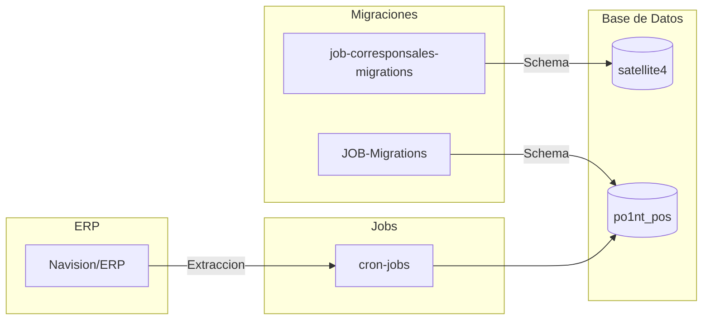

# Jobs y Migraciones

## Vision General

Componentes para tareas programadas y gestion de esquemas de base de datos.

---

## cron-jobs

**Proposito**: Sincronizar productos desde ERP hacia SQL Server

| Caracteristica | Valor |
|----------------|-------|
| Framework | .NET 7.0 |
| Lenguaje | C# |
| Tipo | Console Application |

### Ejecucion

```bash
dotnet run -- Products
```

### Flujo

1. `Sync_ProductsCatalog()` - SP_ExtractERP_Product
2. `Sync_ProductsCodBar()` - SP_ExtractERP_ProductCodbar
3. `Sync_ProductsPrices()` - SP_ExtractERP_ProductPricePlaceType

### Configuracion

| Variable | Descripcion |
|----------|-------------|
| DEFAULT_CONNECTION | Connection string SQL Server |

---

## JOB-Migrations

**Proposito**: Migraciones EF Core para esquema principal

| Caracteristica | Valor |
|----------------|-------|
| Framework | .NET 7.0 |
| Lenguaje | C# |
| ORM | Entity Framework Core 7.0.9 |
| Base de datos | satellite4 |

### Migraciones

- 139 archivos de migracion
- Primera: 20230719 - ScriptInicial
- Ultima: 20240212 - changeSyncPlace

### Tablas principales

| Tabla | Proposito |
|-------|-----------|
| products | Catalogo de productos |
| product_barcodes | Codigos de barras |
| product_prices | Precios por lugar |
| terminals | Terminales POS |
| places | Sucursales |
| sync_types | Tipos de sincronizacion |
| payment_methods | Metodos de pago |

### Comandos

```bash
# Instalar herramientas EF
dotnet tool install --global dotnet-ef

# Crear migracion
dotnet ef migrations add NombreMigracion

# Ejecutar migraciones
dotnet ef database update

# Revertir ultima
dotnet ef migrations remove --force
```

---

## job-corresponsales-no-bancarios-migrations

**Proposito**: Migraciones para sistema Punto Xpress

| Caracteristica | Valor |
|----------------|-------|
| Framework | .NET 7.0 |
| Lenguaje | C# |
| ORM | Entity Framework Core 7.0.9 |
| Base de datos | satellite4 |

### Tablas

| Tabla | Proposito |
|-------|-----------|
| PxClasifications | Clasificaciones de servicios |
| PxCategories | Categorias bajo clasificaciones |
| PxCatalogs | Catalogos con config JSON |
| PxCatalogStatus | Estados de catalogo |
| PxTransactions | Transacciones procesadas |

### Stored Procedures

| SP | Proposito |
|----|-----------|
| SP_PX_SaveTransaction | Guardar transaccion |
| SP_PX_GetCatalog | Obtener catalogos |
| SP_PX_GetFieldsService | Campos por servicio |
| SP_PX_UpdateTransaction | Actualizar transaccion |

### Migraciones

8 migraciones (Nov 2023):
- createtablePxClasifications
- createtablePxCategories
- createtablePxCatalogs
- createtablePxCatalogStatus
- createtablePxTransactions
- createStoredProcedures
- insertDataPxClasifications
- createStoredProcedureCatalog

---

## Diagrama de Relacion



---
