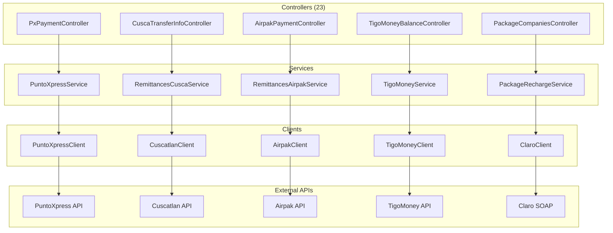

# ms-corresponsales-no-bancarios - Microservicio de Pagos a Terceros

## Proposito y Responsabilidades

Agregador de servicios financieros no bancarios:
- Pago de servicios y colectores (PuntoXpress)
- Remesas internacionales (Cuscatlan, Airpak)
- Dinero movil (TigoMoney)
- Recargas y paquetes telefonicos (Claro, Tigo, Movistar, Digicel)

## Diagrama de Arquitectura Interna



## Estructura de Carpetas

```
ms-corresponsales-no-bancarios/
├── Controllers/              # 23 controladores
│   ├── PxPaymentController.cs
│   ├── CuscaTransferInfoController.cs
│   ├── AirpakPaymentRemittanceController.cs
│   ├── TigoMoneyBalanceController.cs
│   └── ...
├── Service/
│   ├── PuntoXpressService.cs
│   ├── RemittancesCuscaService.cs
│   └── ...
├── Client/
│   ├── PuntoXpressClient.cs      # 56KB
│   ├── TigoMoneyClient.cs        # 50KB
│   ├── CuscatlanClient.cs        # 44KB
│   └── ...
├── DTO/
├── Repositories/
├── Utilities/
└── Connected Services/        # SOAP proxies
```

## Proveedores Integrados

| Proveedor | Servicios | Protocolo |
|-----------|-----------|-----------|
| PuntoXpress | Pago de servicios, colectores | REST |
| Cuscatlan | Remesas internacionales | REST |
| Airpak | Remesas internacionales | REST |
| TigoMoney | Cash in/out, consulta saldo | REST |
| Claro | Recargas, paquetes | SOAP/WCF |
| Tigo | Recargas, paquetes | REST |
| Movistar | Recargas | REST |
| Digicel | Recargas | REST |

## APIs Expuestas

### PuntoXpress
| Metodo | Ruta | Descripcion |
|--------|------|-------------|
| POST | /api/PxPayment | Realizar pago |
| POST | /api/PxBalanceClientManual | Consulta saldo |
| POST | /api/PxAnulation | Anulacion |
| GET | /api/PxCatalogs | Catalogos |

### Remesas Cuscatlan
| Metodo | Ruta | Descripcion |
|--------|------|-------------|
| POST | /api/CuscaTransferInfo | Info de remesa |
| POST | /api/CuscaLookupPerson | Buscar beneficiario |
| POST | /api/CuscaConfirmSimplifiedPayment | Confirmar pago |

### TigoMoney
| Metodo | Ruta | Descripcion |
|--------|------|-------------|
| POST | /api/TigoMoneyBalance | Consultar saldo |
| POST | /api/TigoMoneyPayment | Realizar pago |
| POST | /api/TigoMoneyCash | Cash in/out |

## Configuracion Requerida

| Variable | Tipo | Descripcion |
|----------|------|-------------|
| DEFAULT_CONNECTION | string | BD principal |
| DEFAULT_CONNECTION_CORRESPONSALES | string | BD corresponsales |
| SettingsPx_PROD | JSON | Config PuntoXpress |
| SettingsCuscatlan_PROD | JSON | Config Cuscatlan |
| SettingsTigoMoney_PROD | JSON | Config TigoMoney |

## Codigos de Respuesta

| Codigo | Significado |
|--------|-------------|
| 200 | Exito |
| 202 | Error de validacion |
| 203 | Servicio deshabilitado |
| 204 | Error procesando datos |
| 205 | Excepcion inesperada |
| 9999 | Reintentar operacion |

---
