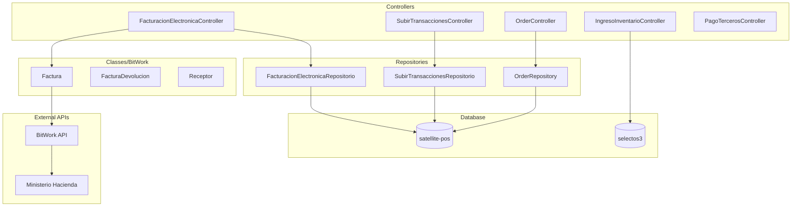

# ms-procesos-locales - Microservicio de Procesos Locales

## Proposito y Responsabilidades

Procesamiento de transacciones y facturacion electronica:
- Facturacion electronica (DTE) con Ministerio de Hacienda
- Procesamiento de transacciones POS
- Gestion de ordenes
- Procesamiento de pagos a terceros
- Control de inventario y sincronizacion de caja

## Diagrama de Arquitectura Interna



## Estructura de Carpetas

```
ms-procesos-locales/
├── Controllers/
│   ├── FacturacionElectronicaController.cs  # 81KB
│   ├── SubirTransaccionesController.cs
│   ├── OrderController.cs
│   ├── IngresoInventarioController.cs
│   └── PagoTerceros*Controller.cs
├── Classes/
│   ├── BitWork/                # Facturacion electronica
│   │   ├── Factura.cs
│   │   ├── Receptor.cs
│   │   └── ...
│   ├── Cupones/
│   └── Telco/
├── Models/
├── Repositories/
├── Program.cs
└── dockerfile
```

## Tecnologias y Dependencias

| Dependencia | Version | Proposito |
|-------------|---------|-----------|
| .NET | 7.0 | Framework |
| Newtonsoft.Json | 13.0.3 | JSON |
| Sentry.AspNetCore | 2.1.8 | Error tracking |
| shared-libs | Local | DBClient |

## APIs Expuestas

### Facturacion Electronica
| Metodo | Ruta | Descripcion |
|--------|------|-------------|
| POST | /api/FacturacionElectronica/sendFact | Enviar factura |

### Transacciones
| Metodo | Ruta | Descripcion |
|--------|------|-------------|
| POST | /api/SubirTransacciones/sendFact | Subir transacciones |
| POST | /api/SubirTransacciones/sendCortes | Subir cortes de caja |

### Ordenes
| Metodo | Ruta | Descripcion |
|--------|------|-------------|
| POST | /api/Order/Order | Consultar orden |
| POST | /api/Order/OrderDetails | Detalles de orden |
| POST | /api/Order/CambiarEtapaOrden | Cambiar estado |

## Integraciones Externas

| Servicio | Proposito |
|----------|-----------|
| BitWork | Procesamiento de facturas electronicas |
| Ministerio de Hacienda | Envio y validacion de DTEs |
| Digicel | Activacion de bundles |

## Configuracion Requerida

| Variable | Tipo | Descripcion |
|----------|------|-------------|
| DEFAULT_CONNECTION | string | BD satellite-pos |
| DEFAULT_CONNECTION2 | string | BD selectos3 |
| ENCRYPTION_KEY | base64 | Encriptacion |

---
