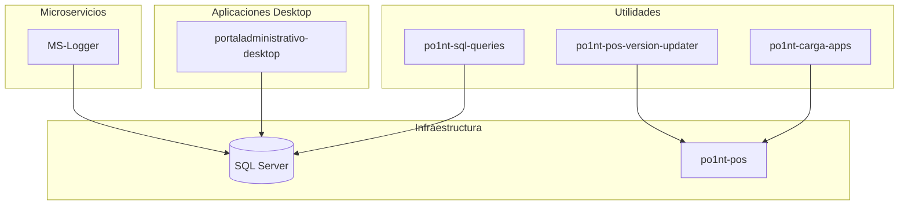

# Otros Componentes

## MS-Logger

**Proposito**: Microservicio de logging centralizado

| Caracteristica | Valor |
|----------------|-------|
| Framework | .NET 7.0 |
| Lenguaje | C# |
| Tipo | REST API |

### APIs

| Metodo | Ruta | Descripcion |
|--------|------|-------------|
| POST | /api/log | Guardar log de accion |
| POST | /api/transaction | Guardar transaccion completa |

### Tablas

- logs (action_name, status, uuid, terminal, place, detail)
- transactions
- transactions_details
- transactions_pays

---

## po1nt-carga-apps

**Proposito**: Launcher/Splash Screen para aplicacion POS

| Caracteristica | Valor |
|----------------|-------|
| Framework | .NET Framework 4.5.2 |
| Lenguaje | C# + VB.NET |
| Tipo | Windows Forms |

### Funcionalidad

1. Muestra splash screen
2. Inicia SatelitePOS.exe en escritorio seguro
3. Usa WinLockDll.dll para aislamiento

---

## po1nt-pos-version-updater

**Proposito**: Scripts de deployment para POS

| Caracteristica | Valor |
|----------------|-------|
| Lenguaje | Batch (CMD) |
| Herramientas | robocopy, PsExec |

### Scripts

| Script | Descripcion |
|--------|-------------|
| copy_po1nt_files.bat | Copia archivos POS |
| deploy_copy_script.bat | Deploy a maquina unica |
| deploy_copy_script_multiple.bat | Deploy batch desde CSV |
| check_satelitepos_dates.bat | Validar versiones |

### Uso

```batch
set ADMIN_PASSWORD=password
deploy_copy_script_multiple.bat cj1877 data/instances.csv
```

---

## po1nt-sql-queries

**Proposito**: Queries SQL para auditoria

| Caracteristica | Valor |
|----------------|-------|
| Lenguaje | T-SQL |
| Base de datos | po1nt_pos |
| Queries | 18 archivos |

### Categorias

| Query | Proposito |
|-------|-----------|
| A_facturacion_tienda_online | Facturacion DTE |
| B_descuentos_empleados | Descuentos EMP |
| C_cambios_precio | Cambios manuales |
| D_ofertas | Promociones |
| E_devoluciones | Devoluciones |
| G_remesas | Remesas |
| H_medios_pago | Formas de pago |
| M_documentos_tributarios | DTEs |
| R_tigomoney | TigoMoney |

---

## portaladministrativo-desktop

**Proposito**: Portal administrativo Windows

| Caracteristica | Valor |
|----------------|-------|
| Framework | .NET Framework 4.5.2 |
| Lenguaje | C# |
| Tipo | Windows Forms |

### Funcionalidades

- Gestion de promociones
- Sincronizacion de cajas
- Reportes de ventas
- Gestion de clientes
- Configuracion de terminales

### Dependencias

| Dependencia | Proposito |
|-------------|-----------|
| Newtonsoft.Json | JSON |
| RestSharp | HTTP Client |
| BCrypt.Net-Next | Seguridad |
| iTextSharp | PDF |
| CefSharp | Web browser |
| Excel Interop | Reportes |

---

## Diagrama General



---
