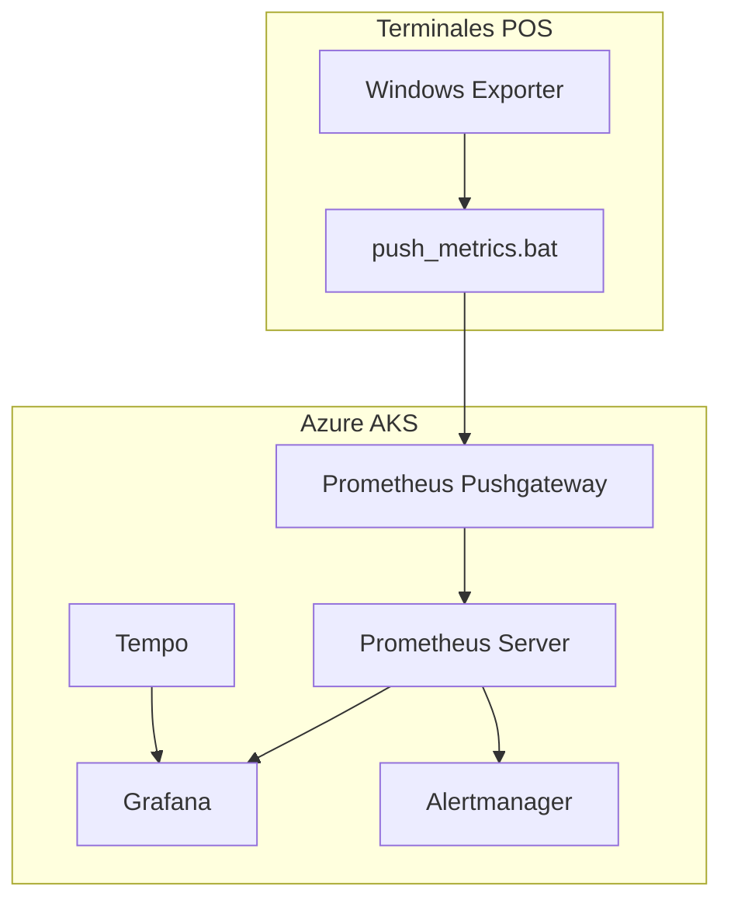

# po1nt-monitoring - Sistema de Monitoreo

## Proposito y Responsabilidades

Sistema de observabilidad empresarial para monitoreo de terminales POS:
- Recoleccion de metricas de sistema Windows
- Almacenamiento en Prometheus TSDB
- Visualizacion en Grafana
- Trazas distribuidas con Tempo
- Alertas con Alertmanager

## Diagrama de Arquitectura



## Componentes

### Windows Exporter (Agente)

| Caracteristica | Valor |
|----------------|-------|
| Version | 0.22.0 |
| Lenguaje | Go (compilado) |
| Instalacion | MSI |

**Metricas recolectadas**:
- cs (Computer System)
- cpu (Uso de CPU)
- memory (Uso de memoria)
- logical_disk (Uso de disco)
- process (Procesos)
- net (Red)
- mssql (SQL Server)

### Scripts Batch

| Script | Proposito |
|--------|-----------|
| install.bat | Instalacion individual |
| install_multiple.bat | Instalacion desde CSV |
| push_metrics.bat | Envio de metricas |
| clean_metrics.bat | Limpieza de metricas |
| update_multiple.bat | Actualizacion batch |

### Servidor (Azure AKS)

| Componente | Proposito |
|------------|-----------|
| Prometheus | TSDB de metricas |
| Pushgateway | Receptor de metricas push |
| Grafana | Dashboards |
| Tempo | Backend de trazas |
| Alertmanager | Gestion de alertas |

## Estructura de Carpetas

```
po1nt-monitoring/
├── monitoring-server/
│   ├── instructions.md        # Guia instalacion AKS
│   └── helm-values/
│       └── tempo-values.yaml
├── win-pos-apm-exporter/
│   ├── config.bat
│   ├── install.bat
│   ├── install_multiple.bat
│   ├── update_multiple.bat
│   ├── assets/
│   │   ├── windows_exporter-0.22.0-amd64.msi
│   │   ├── nssm.exe
│   │   └── curl.zip
│   ├── data/
│   │   └── instances.csv
│   └── scripts/
│       ├── push_metrics.bat
│       └── clean_metrics.bat
└── README.md
```

## Configuracion

### Variables (config.bat)

| Variable | Valor Default |
|----------|---------------|
| PUSHGATEWAY_ENDPOINT | http://po1nt-apm-gtw.n1co.net:9091 |
| LOCAL_DOMAIN | calleja.local |
| PUSH_INTERVAL | 60 segundos |
| PROMETHEUS_JOB | windows |

### Instances CSV

```csv
ComputerName,StoreID,StoreName
CJ1840,S0001,GIGANTE
CJ1841,S0001,GIGANTE
```

## Instalacion

### Terminal Individual

```batch
set ADMIN_PASSWORD=password
install.bat COMPUTER_NAME [STORE_NAME] [STORE_ID]
```

### Multiples Terminales

```batch
set ADMIN_PASSWORD=password
install_multiple.bat data/instances.csv
```

## Endpoints

| Servicio | URL |
|----------|-----|
| Pushgateway | http://po1nt-apm-gtw.n1co.net:9091 |
| Grafana | http://po1nt-monitoring.n1co.net |
| Tempo | Puertos 4317, 4318 |

## Infraestructura Azure

| Recurso | Valor |
|---------|-------|
| Resource Group | po1nt-monitoring |
| Cluster Name | po1nt-monitoring-aks |
| Region | centralus |
| Kubernetes | 1.30.9 |
| Node Pool | 1x Standard_D4s_v3 |

---
