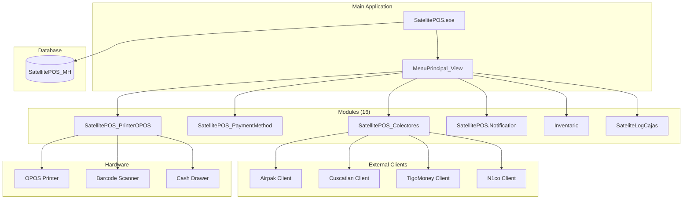

# po1nt-pos - Aplicacion Punto de Venta

## Proposito y Responsabilidades

Aplicacion de escritorio Windows para operaciones de punto de venta:
- Procesamiento de transacciones de venta
- Gestion de inventario
- Multiples formas de pago (efectivo, tarjeta, electronico)
- Impresion de recibos (OPOS)
- Integracion con remesas y servicios de pago
- Facturacion electronica
- Reportes de caja

## Diagrama de Arquitectura Interna



## Estructura de Carpetas

```
po1nt-pos/
├── SatelitePOS/                    # Aplicacion principal
│   ├── 01-ControlCajas/
│   ├── 02-FormasDePago/
│   ├── 07-Promociones/
│   ├── Autorizacion/
│   ├── Cajeros/
│   ├── Cierres/
│   ├── Devoluciones/
│   ├── Factura/
│   ├── Inventario/
│   └── ...
├── SatellitePOS_Colectores/        # Pagos terceros
│   ├── Client/
│   ├── RemesasAirpak/
│   ├── RemesasCusca/
│   └── TigoMoney/
├── SatellitePOS_PaymentMethod/     # Formas de pago
├── SatellitePOS_PrinterOPOS/       # Impresion
├── SatellitePOS.Notification/      # Notificaciones
├── Inventario/                     # Gestion inventario
├── Librerias/                      # DLLs externas
└── .github/workflows/              # CI/CD
```

## Tecnologias

| Tecnologia | Version | Uso |
|------------|---------|-----|
| VB.NET | - | Aplicacion principal |
| C# | - | Librerias y plugins |
| .NET Framework | 4.6.2 | Runtime |
| Windows Forms | - | UI |
| ADO.NET/DataSets | - | Acceso datos |
| OPOS | - | Hardware POS |

## Dependencias Externas

| Dependencia | Proposito |
|-------------|-----------|
| Newtonsoft.Json | Serializacion JSON |
| RestSharp | HTTP Client |
| SharpRaven | Sentry |
| OpenTelemetry | Observabilidad |
| iTextSharp | PDF |
| BarcodeLib | Codigos de barras |
| BouncyCastle | Criptografia |

## Integraciones

| Servicio | Tipo | Proposito |
|----------|------|-----------|
| ms-procesos-locales | REST | Facturacion DTE |
| Airpak | REST | Remesas |
| Cuscatlan | REST | Remesas |
| TigoMoney | REST | Dinero movil |
| Sentry | SDK | Error tracking |
| OpenTelemetry | SDK | Trazas |

## Base de Datos

- **Motor**: SQL Server
- **BD Principal**: SatellitePOS_MH
- **Acceso**: DataSets tipados (XSD)

## Modulos Principales

| Modulo | Proyecto | Descripcion |
|--------|----------|-------------|
| Colectores | SatellitePOS_Colectores | Integracion pagos terceros |
| Pagos | SatellitePOS_PaymentMethod | Formas de pago |
| Impresion | SatellitePOS_PrinterOPOS | Recibos OPOS/PDF |
| Notificaciones | SatellitePOS.Notification | Alertas desktop |
| Inventario | Inventario | Gestion stock |

## Build y Deployment

```yaml
# GitHub Actions: build-and-package.yml
- MSBuild para compilacion
- Configuraciones: Debug, Release
- Plataformas: Mixed Platforms (x86/AnyCPU)
- Artefactos retenidos 30 dias
```

---
