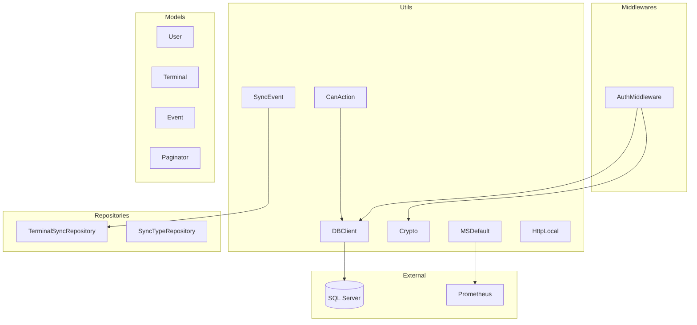

# shared-libs - Libreria Compartida

## Proposito y Responsabilidades

Libreria centralizada de componentes reutilizables para microservicios:
- Cliente de base de datos SQL Server (DBClient)
- Middleware de autenticacion (AuthMiddleware)
- Utilidades criptograficas (Crypto)
- Gestion de eventos de sincronizacion (SyncEvent)
- Validacion de permisos (CanAction)
- Inicializacion de microservicios (MSDefault)

## Diagrama de Arquitectura Interna



## Estructura de Carpetas

```
shared-libs/
├── shared-libs/
│   ├── Models/
│   │   ├── User.cs
│   │   ├── Terminal.cs
│   │   ├── TerminalSync.cs
│   │   ├── SyncType.cs
│   │   └── Event.cs
│   ├── Utils/
│   │   ├── DBClient.cs
│   │   ├── Crypto.cs
│   │   ├── CanAction.cs
│   │   ├── SyncEvent.cs
│   │   ├── MSDefault.cs
│   │   └── HttpLocal.cs
│   ├── Middlewares/
│   │   └── AuthMiddleware.cs
│   ├── Repositories/
│   │   ├── TerminalSyncRepository.cs
│   │   └── SyncTypeRepository.cs
│   └── shared-libs.csproj
└── shared-libs.sln
```

## Componentes Principales

### DBClient
Cliente SQL Server con Dapper:

```csharp
// Metodos disponibles
GetConnection(): SqlConnection
First<T>(query, model): T
Query<T>(query, model): IEnumerable<T>
Paginate<T>(query, model, paginator): Paginate<T>
Insert<T>(query, model): int
UpdateOrDelete(query, model): bool
```

### Crypto
Encriptacion AES-256:

```csharp
Encrypt(plaintext): string  // Encripta con IV aleatorio
Decrypt(ciphertext): string // Desencripta
```

### AuthMiddleware
Middleware de autenticacion JWT:

```csharp
// Rutas excluidas
"/Auth", "/swagger", "/metrics", "/Event", "/Sync", "/"

// Valida token, gestiona sesiones, verifica timeout (20 min)
```

### CanAction
Validacion de permisos RBAC:

```csharp
Can(context, "create user"): User  // Retorna null si no tiene permiso
```

### SyncEvent
Gestor de eventos de sincronizacion:

```csharp
save(Event event): bool  // Crea registros en terminal_sync
```

### MSDefault
Inicializador de microservicios:

```csharp
init(app, "ms-name"): void
// Configura CORS, metricas Prometheus, AuthMiddleware
```

## Dependencias

| Dependencia | Version | Proposito |
|-------------|---------|-----------|
| .NET | 7.0 | Framework |
| Microsoft.Data.SqlClient | 5.1.1 | SQL Server |
| Dapper | 2.0.143 | ORM |
| prometheus-net | 8.0.1 | Metricas |
| RestSharp | 110.2.0 | HTTP Client |
| Sentry | 1.2.0 | Error tracking |

## Variables de Entorno

| Variable | Tipo | Descripcion |
|----------|------|-------------|
| DEFAULT_CONNECTION | string | SQL Server connection string |
| ENCRYPTION_KEY | base64 | Clave AES-256 |
| ENABLE_METRICS | 0/1 | Habilitar Prometheus |

## Uso en Microservicios

```csharp
// En Program.cs
using shared_libs.Utils;

var app = builder.Build();
MSDefault.init(app, "ms-nombre");
```

```csharp
// En Controller
using shared_libs.Utils;

[HttpGet]
public IActionResult Get() {
    var user = CanAction.Can(HttpContext, "list products");
    if (user == null) return Forbid();

    var products = DBClient.Query<Product>("SELECT * FROM products");
    return Ok(products);
}
```

---
