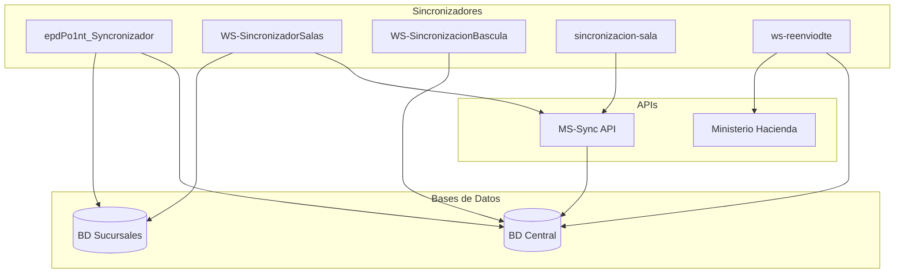

# Sincronizadores - Windows Services

## Vision General

Conjunto de servicios Windows que gestionan la sincronizacion de datos entre el servidor central y las sucursales/terminales. Todos estan desarrollados en VB.NET sobre .NET Framework 4.5-4.7.

## Componentes

### epdPo1nt_Syncronizador
**Proposito**: Sincronizacion bidireccional de transacciones

| Caracteristica | Valor |
|----------------|-------|
| Framework | .NET Framework 2.0 |
| Lenguaje | VB.NET |
| Tipo | Windows Service |

**Timers principales**:
- TimerCortesCaja (15 min)
- TimerCajeros (5 min)
- TimerSubirClientes (5 min)
- TimerSubirPagosTerceros (2 min)
- TimerTransaccionesNew (1 min)

**Conexiones BD**: 4 SQL Server (Sala, POS, Server Dev, Server Prod)

---

### WS-SincronizadorSalas
**Proposito**: Sincronizar productos, precios y promociones a terminales

| Caracteristica | Valor |
|----------------|-------|
| Framework | .NET Framework 4.5 |
| Lenguaje | VB.NET |
| Tipo | Windows Service |

**Timers**:
- TimerProductosBajarServer (5 min): Descarga cambios de API central
- TimerProductosEnviarTerminales (7 min): Distribuye a sucursales

**API consumida**: `http://po1nt-sync.selectos.com/api/Event/sync`

**Tipos de sincronizacion**:
- PRODUCT / CREATE-PRODUCT / UPDATE-PRODUCT
- BARCODE / CREATE-BARCODES
- PRODUCT-PRICE
- PROMOTION / PROMOTION-PRODUCTS

---

### WS-SincronizacionBascula
**Proposito**: Sincronizar precios a basculas de pesaje

| Caracteristica | Valor |
|----------------|-------|
| Framework | .NET Framework 4.5 |
| Lenguaje | VB.NET |
| Tipo | Windows Service |

**Timer**: Cada 45 minutos (configurable)

**Stored Procedures**:
- prc_Envios_SELECTOS_Po1nt_insertarProductos
- prc_Envios_SELECTOS_ActualizarPrecios
- prc_Envios_SELECTOS_Po1nt_Basculas

---

### sincronizacion-sala
**Proposito**: Sincronizar datos de sala de ventas a terminales

| Caracteristica | Valor |
|----------------|-------|
| Framework | .NET Framework 4.7 |
| Lenguaje | VB.NET |
| Tipo | Windows Forms |

**Configuracion**: Registry Windows `HKEY_LOCAL_MACHINE\Software\WinPOSLocal\Sincronizacion`

**API consumida**: `http://po1nt-sync.selectos.com/api/Sync/device`

---

### ws-reenviodte
**Proposito**: Reenvio automatico de DTEs fallidos

| Caracteristica | Valor |
|----------------|-------|
| Framework | .NET Framework 4.5 |
| Lenguaje | VB.NET |
| Tipo | Windows Service |

**Horario operacion**: 1:00 AM - 6:00 AM

**Timers**:
- TimerEnvioDTEServer (30 min): Reenvio de DTEs
- TimerLimpiezaBaseDatos (24 hrs): Limpieza registros antiguos

## Diagrama de Interaccion

## Configuracion Comun

Todos los sincronizadores usan Registry de Windows para configuracion:

**Ruta base**: `HKEY_LOCAL_MACHINE\Software\epdsoft\Po1nt_ServiceServer`

| Clave | Descripcion |
|-------|-------------|
| ConexionBDSala | Connection string BD central |
| ConexionBDPOS | Connection string BD POS local |
| Intervalo_*_Minute | Intervalos de timers |

## Logs

Todos generan logs en: `C:\epdsoft\Services_Server\Log\`

Formato de nombres:
- `ServiceSyncSend_Log_{fecha}.txt`
- `LOGDTE_{fecha}.txt`
- `Sincronizaciones_{mes}/{tipo}_{fecha}.txt`

---
