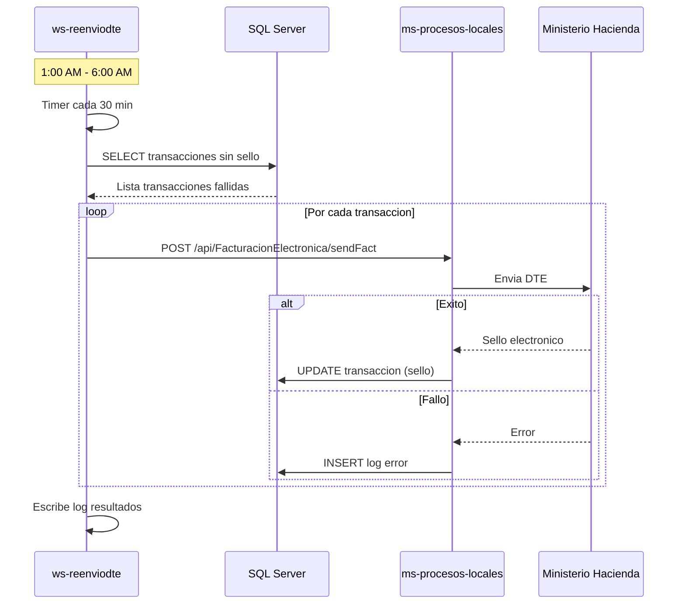

# Diagramas - Plataforma Po1nt

Coleccion completa de diagramas de arquitectura y flujos del sistema Po1nt.

---

## Tabla de Contenidos

1. [Diagramas de Arquitectura](#diagramas-de-arquitectura)
   - [Arquitectura de Alto Nivel](#1-arquitectura-de-alto-nivel)
   - [Componentes con Tecnologias](#2-componentes-con-tecnologias)
   - [Flujo de Datos Principal](#3-flujo-de-datos-principal)
   - [Diagrama de Dependencias](#4-diagrama-de-dependencias)
2. [Diagramas de Componentes](#diagramas-de-componentes)
   - [MS-Sync Arquitectura Interna](#5-ms-sync---arquitectura-interna)
   - [Sincronizadores Interaccion](#6-sincronizadores---interaccion)
3. [Diagramas de Flujo (Secuencia)](#diagramas-de-flujo-secuencia)
   - [Flujo de Autenticacion](#7-flujo-de-autenticacion)
   - [Flujo de Sincronizacion de Productos](#8-flujo-de-sincronizacion-de-productos)
   - [Flujo de Venta en POS](#9-flujo-de-venta-en-pos)
   - [Flujo de Pago de Remesa](#10-flujo-de-pago-de-remesa)
   - [Flujo de Recarga Telefonica](#11-flujo-de-recarga-telefonica)
   - [Flujo de Sincronizacion Batch](#12-flujo-de-sincronizacion-batch)
   - [Flujo de Reenvio DTE](#13-flujo-de-reenvio-dte)
   - [Flujo de Sincronizacion MS-Sync](#14-flujo-de-sincronizacion-ms-sync)

---

# Diagramas de Arquitectura

## 1. Arquitectura de Alto Nivel

Vista general del sistema Po1nt mostrando las capas principales.

---

## 2. Componentes con Tecnologias

Diagrama detallado mostrando cada componente con su stack tecnologico.

---

## 3. Flujo de Datos Principal

Flujo de datos desde el origen hasta la salida.

---

## 4. Diagrama de Dependencias

Dependencias entre componentes del sistema.

---

# Diagramas de Componentes

## 5. MS-Sync - Arquitectura Interna

Estructura interna del microservicio de sincronizacion.

---

## 6. Sincronizadores - Interaccion

Interaccion entre los diferentes sincronizadores Windows.

---

# Diagramas de Flujo (Secuencia)

## 7. Flujo de Autenticacion

Proceso de login de usuario en el portal administrativo.

---

## 8. Flujo de Sincronizacion de Productos

Proceso de crear un producto y sincronizarlo a las terminales.

---

## 9. Flujo de Venta en POS

Proceso completo de una venta con facturacion electronica.

---

## 10. Flujo de Pago de Remesa

Proceso de pago de remesa internacional.

---

## 11. Flujo de Recarga Telefonica

Proceso de recarga de saldo telefonico.

---

## 12. Flujo de Sincronizacion Batch

Sincronizacion periodica via Windows Services.

---

## 13. Flujo de Reenvio DTE

Reenvio automatico de facturas electronicas fallidas.

---

## 14. Flujo de Sincronizacion MS-Sync

Detalle del proceso de sincronizacion en el microservicio.

---

*Documentacion de Diagramas - Plataforma Po1nt*
*Total de diagramas: 14*
*Formato: Mermaid*
