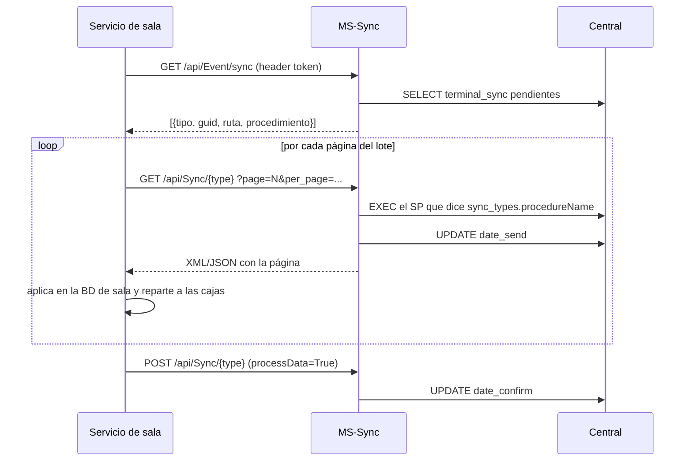

# Los tres canales de sincronización

En Po1nt no hay *un* mecanismo de sincronización: hay **tres**, con tecnologías y modos de
fallo distintos. Casi toda la confusión operativa viene de atribuirle a uno el
comportamiento de otro.

| # | Canal | Transporte | Quién lo mueve | Qué viaja por aquí |
|---|-------|-----------|----------------|--------------------|
| 1 | Cola `terminal_sync` | HTTP contra MS-Sync | Servicios de sala (polling) | Productos, barcodes, precios, promociones, clientes legado |
| 2 | SQL directo | TDS (1433) entre servidores | `epdPo1nt_Syncronizador` | Ventas, cortes, cajeros, pagos de terceros, clientes (subida), réplica V2 |
| 3 | Colas locales de reintento | HTTP a un microservicio local | Servicios en el NAV de sala | DTE fallidos |

---

## Canal 1 — La cola `terminal_sync` (vía MS-Sync)

Es el canal "oficial" de bajada. **Nadie empuja nada**: central deja trabajo encolado y
los servicios de sala lo drenan.

### Cómo se llena la cola

Cuando MS-Products o MS-configs guardan un cambio, llaman a `SyncEvent.save()` de
`shared-libs`, que inserta **una fila pendiente en `terminal_sync` por cada terminal**.
Ese es el fan-out. El job `cron-jobs` hace lo mismo desde el lado del ERP.

### Cómo se drena — el protocolo de tres pasos

### El punto crítico: el watermark

El corte del siguiente ciclo es `MAX(confirm)`
(`MS-Sync/Repositories/SyncTypeRepository.cs:27`), y `confirm = GETDATE()` en el momento
del POST (`TerminalSyncRepository.cs:94`).

**Consecuencia:** si un servicio confirma antes de haber aplicado todas las páginas del
lote, lo que quedó fuera **se pierde de forma permanente** — el watermark ya avanzó y ese
registro nunca vuelve a aparecer en un lote. Este es el mecanismo exacto de la fuga de
códigos de barra documentada en [`objetos/productos-precios-promociones.md`](objetos/productos-precios-promociones.md).

### La caja de referencia

El lote **no se baja por cada caja**: se baja **una vez por sala**, autenticándose con el
token de una sola terminal.

- `WS-SincronizadorSalas` la elige por BD:
  `select top 1 * from ConexionesSQL where IS_active = 1 and idServidor_fk is not null order by 1`
  (`ConnectionData.vb:78`). **Si esa caja no responde al ping, la sala entera no baja nada.**
- `sincronizacion-sala` usa simplemente **la primera terminal** que devuelve
  `/api/Sync/device`, sin ningún criterio, y corta con un `Exit For`
  (`Sincronizacion.vb:188,338`).

Por eso en `terminal_sync` sólo **una** terminal por sala tiene `date_send`, mientras que
`date_confirm` sí aparece en varias. No es un error: es el diseño.

---

## Canal 2 — SQL directo entre servidores

`epdPo1nt_Syncronizador` no usa HTTP para los datos: abre conexiones SQL contra la BD de
sala y contra central, y **ejecuta stored procedures remotos**. Sube ventas, cortes,
cajeros, pagos de terceros y clientes.

La réplica V2 de clientes (caja↔caja dentro de una sala) también viaja por aquí, con su
propio outbox y sus propios timers.

Modo de fallo típico: si el servidor de sala está caído o el servicio detenido, **nada se
acumula en una cola visible desde central** — las cajas simplemente quedan con
`Transmitir=0` y el backlog crece en silencio en cada caja.

---

## Canal 3 — Colas locales de reintento (DTE)

Cada caja encola en `DTE_ColaEnvio` (`SatellitePOS_MH`) los DTE que no logró enviar. Un
servicio instalado **en el servidor NAV de la sala** drena esa cola contra
`ms-procesos-locales`, que es quien habla con el Ministerio de Hacienda.

Es el único canal donde el destino final es un tercero externo con ventana horaria y
requisitos fiscales. Ver [`objetos/dte.md`](objetos/dte.md).

---

## Quién corre dónde

| Componente | Máquina | Tipo |
|------------|---------|------|
| MS-Sync | Kubernetes (central) | API REST .NET 7 |
| `epdPo1nt_Syncronizador` | Servidor de sala / NAV | Windows Service |
| `WS-SincronizadorSalas` (`epdPo1nt_SyncronizadorProductos`) | Servidor de sala / NAV | Windows Service |
| `sincronizacion-sala` (`SatellitePOS_SincronizacionSala`) | Equipo de sala | **App de escritorio — debe quedar abierta** |
| `po1nt-dte-reproceso` | Servidor de sala / NAV | Windows Service |
| `WS-SincronizacionBascula` | Servidor de sala | Windows Service |
| `portaladministrativo-desktop` (`epdServerSala_Po1nt`) | Equipo del operador de sala | App de escritorio |
| `cron-jobs` | Central | Consola, tarea programada |

> **Trampa operativa recurrente:** `sincronizacion-sala` es una aplicación WinForms, no un
> servicio. Si nadie la deja abierta en el NAV, la bajada de clientes de esa sala se
> detiene sin ninguna alerta. Hay salas que llevan meses así.

---

## El camino que se salta todos los canales

`portaladministrativo-desktop` incluye pantallas que **escriben directamente en la BD de
la caja**, sin pasar por `terminal_sync`:

| Módulo | Escribe en |
|--------|-----------|
| `EnviarCambioPrecioManual` | `Po1nt_ProductPriceInterface` |
| `FormSubirPromosPrecioXML` (`CagarXML`) | `SatellitePOS_Promotion*`, precios |
| `FormSincronizarCajaNueva` | barcodes, clientes, promociones, precios |

Es el escape manual del que dependen las salas cuando el canal automático falla. Explica
que una caja tenga un dato que las demás de la sala no tienen, y que central no registre
nada de ese cambio.

`FormListaSincronizacionClientes`, en cambio, **sí** usa `terminal_sync`.
