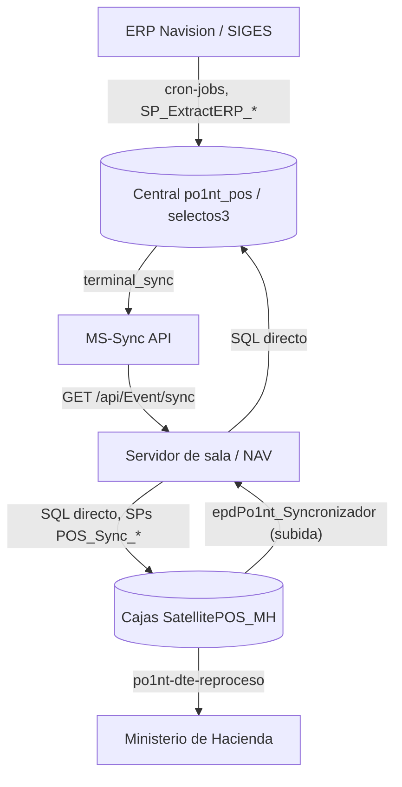

# Sincronizaciones de Po1nt

Esta sección documenta **cómo fluye la información** entre el ERP, el servidor central,
los servidores de sala y las cajas, objeto por objeto.

Existe porque la documentación por componente (`componentes/`) describe *qué es* cada
servicio, pero no responde la pregunta que surge en cada incidente: *"este dato, ¿por
dónde viaja, quién lo aplica y dónde se puede perder?"*.

> **Regla de esta sección:** todo lo que se afirma aquí está verificado contra el código
> o contra la base de datos, y se cita `archivo:línea` cuando el hallazgo es concreto.
> Donde el código y el README de un repo se contradicen, manda el código y se anota la
> contradicción. Si algo no está verificado, se dice explícitamente.

## Cómo leer esta sección

| Documento | Para qué sirve |
|-----------|----------------|
| [`01-canales.md`](01-canales.md) | Los tres mecanismos de sincronización que existen y quién corre dónde. **Empezar aquí.** |
| [`objetos/`](objetos/) | Un documento por objeto sincronizado: origen, canal, SPs, destino y fallos conocidos |
| [`estado-entrega.md`](estado-entrega.md) | Qué cambios están escritos pero **no mergeados**, y qué está mergeado pero **no desplegado** |

## Objetos sincronizados

| Objeto | Canal | Documento |
|--------|-------|-----------|
| Productos, códigos de barra, precios, promociones | Cola `terminal_sync` → servicio de sala → cajas | [`objetos/productos-precios-promociones.md`](objetos/productos-precios-promociones.md) |
| Clientes | Bidireccional; legado por `No_` y V2 por llave compuesta | [`objetos/clientes.md`](objetos/clientes.md) |
| Empleados | Igual que clientes, más el feed del ERP | [`objetos/empleados.md`](objetos/empleados.md) |
| Transacciones, cortes, cajeros, pagos de terceros | Caja → sala → central, por SQL directo | [`objetos/transacciones-cortes-cajeros.md`](objetos/transacciones-cortes-cajeros.md) |
| DTE (documentos tributarios) | Cola local en cada sala, reintento contra Hacienda | [`objetos/dte.md`](objetos/dte.md) |
| Precios a básculas | Central → básculas de sala | [`objetos/basculas.md`](objetos/basculas.md) |
| SKUs de cashback N1Co | Excel → central → cajas, manual | [`objetos/skus-cashback.md`](objetos/skus-cashback.md) |

## El mapa en una página

## Advertencia sobre los README de los repos

Los `README.md` y `CLAUDE.md` de varios repos de sincronización fueron generados a partir
de una **plantilla común** y contienen afirmaciones que el código desmiente (rutas de
registro equivocadas, "instalar como servicio" en proyectos que no lo son, logging a
disco donde no hay escritura a disco). Esos archivos se corrigieron en la misma tanda de
trabajo que creó esta sección; si se encuentra una discrepancia nueva, **el código manda**
y hay que corregir el README, no adaptar esta documentación.
