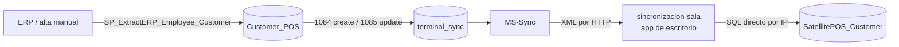

# Sincronización de Clientes

> **Lo esencial:** hoy conviven **dos mundos**. La mayor parte de la flota sigue en el
> flujo *legado*, que identifica al cliente por `No_`; unas ~197 cajas de ~19 salas ya
> están en el *módulo nuevo*, que lo identifica por la llave compuesta
> `IdTipoDocumento + NumeroDocumento`. **Una caja nueva no sincroniza clientes con una
> caja legado**: el payload legado se descarta a propósito.

## Tablas por capa

| Capa | Tabla | Llave |
|------|-------|-------|
| Central (legado, activa) | `po1nt_pos.Customer_POS` | `No_` |
| Central (nueva, en espera) | `po1nt_pos.Customer_POS_Depurada` | `IdTipoDocumento + NumeroDocumento` |
| Central (espejo de detalles) | `po1nt_pos.Customer_POS_Details` | `CustomerDetailCode` |
| Sala | `SatellitePOS_Customer` (BD de sala) | — *sin actualizar desde 2025-02-17* |
| Caja legado | `SatellitePOS_MH.SatellitePOS_Customer` | `No_` |
| Caja nueva | `SatellitePOS_MH.SatellitePOS_Customer` + `_Details` | llave compuesta |

---

## Bajada legado (central → caja)

| Paso | Objeto concreto |
|------|-----------------|
| Tipos de sync | `1084` = create-Customers, `1085` = update-Customers |
| SP que genera el lote | `SP_Sync_CreateCustomers` / `SP_Sync_UpdateCustomers` |
| Quién lo aplica | `sincronizacion-sala` (`Sincronizacion.vb:172-340`) |
| SP que aplica en la caja | `POS_Sync_CreateCustomers` / `POS_Sync_UpdateCustomers` (MERGE por `No_`) |

Existe `sync_types` **1086 = delete-Customers**, pero **su SP no existe**: las bajas no
tienen camino por este canal.

### Por qué una caja nueva ignora este payload

`01_harden_sync_sps.sql` detecta el esquema nuevo con `COL_LENGTH` y responde `'OK'` **sin
escribir nada**, para no romper la PK compuesta. Lo omitido se registra en
`Sync_Customer_OmitidosLegacy`.

> ⚠️ Esa tabla de blindaje causó un incidente: guardaba el XML del lote completo por cada
> cliente y llenó las BD de La Sultana hasta el tope de 10 GB. El SP fue parchado y
> purgado; verificar que la caja tenga la versión corregida antes de migrar una sala.

La bajada real de una caja nueva es `08_sync_central_a_caja.ps1` (TRUNCATE + SqlBulkCopy)
o el delta del ERP (`22c_xml_delta_para_cajas.sql` → `POS_Sync_ApplyCustomerV2`).

---

## Subida (caja → central)

No usa HTTP: ejecuta SPs contra la BD remota.

| Paso | Objeto concreto |
|------|-----------------|
| Origen | `SatellitePOS_Customer WHERE Transmitir = 0` |
| SP que arma el XML | `SP_Sync_CustomerPOS_Servicio` — **`SELECT TOP 1`, un cliente por ciclo** |
| Quién lo mueve | `epdPo1nt_Syncronizador`, `TimerSubirClientes` (registro `Intervalo_SubirClientes_Minute`, ~5 min) |
| Función VB | `POS_Subir_SERVER_TransaccionesClientes` (`epdPo1nt_Syncronizador.vb:609`) |
| SP en sala | `Sync_Aplicar_CustomerSala_Manual_Service` |
| SP en central | `Sync_Aplicar_Customer_Manual_Service` — upsert en `Customer_POS` **por `No_`** |
| Marcado | `Migracion_ACtualizarEstadoClientes_Servicio` (`Transmitir=1`) |

**`TOP 1` por ciclo** es el techo de throughput: ~288 clientes/día/caja. Una caja con
backlog no se pone al día nunca.

### Fan-out desde la sala

El SP de sala encola en `Sync_CustomerSala_Aplicate` una tarea por caja activa;
`TimerSubirClientesSala` las aplica con `POS_Sync_UpdateCustomers` (MERGE por `No_`).
El SP de central hace además fan-out a otras salas por `terminal_sync` (1084/1085),
excluyendo el place de origen: **484 tareas por cada cliente subido**.

---

## Réplica V2 (sólo entre cajas nuevas)

| Pieza | Objeto |
|-------|--------|
| Outbox | `Sync_CustomerV2_Outbox`, llenado por triggers en `Customer` / `_Details` |
| Supresión | `SET CONTEXT_INFO 0x53594E43` — evita que la propia réplica se re-encole |
| Lectura | `SP_Sync_CustomerV2_Pendientes` (lotes de 20, header + details anidados) |
| Aplicación | `POS_Sync_ApplyCustomerV2` (upsert por llave compuesta / `CustomerDetailCode`) |
| Timer | `TimerSubirClientesV2`, 2 min |
| Fuente | `epdPo1nt_Syncronizador/sql/clientes-v2/` |

La réplica nace con `Transmitir=1` / `IsSend=1`: **sólo el origen sube al flujo legado**.

> **Regla de oro:** cualquier `UPDATE` masivo sobre `SatellitePOS_Customer` o `_Details`
> debe empezar con `SET CONTEXT_INFO 0x53594E43`, **antes** de tocar las tablas. Omitirlo
> encola cientos de miles de filas de migración en el outbox.

**Gap conocido:** V2 no hace catch-up. Una caja que se agrega al mesh *después* no recibe
las altas de app ya existentes en las demás; hay que copiárselas.

---

## La llave, y por qué importa

| Mundo | Llave de upsert |
|-------|-----------------|
| Legado | **sólo `No_`** (varchar(20), formato `{CodCaja}SS#######`) |
| Nuevo | `IdTipoDocumento + NumeroDocumento` |

Catálogo `SatellitePOS_TipoDocumento`: 1 DUI, 2 NIT, 3 PASAPORTE, 4 EMPLEADO CRÉDITO
(inactivo desde 2026-07-28), 5 CARNET DIPLOMÁTICO (agregado 2026-09-21).
**No confundir** con el catálogo `document_types` de remesas, que numera distinto
(1=DUI, 2=PASAPORTE).

Problemas que genera la llave legado:

- Nadie compara por DUI/NIT salvo `SatellitePOS_Customer_Insert` en la caja, con igualdad
  exacta — derrotable por el formato con/sin guion (325K con guion vs 829K sin guion en
  una sola caja).
- Duplicidad en central: 2.027 grupos con DUI duplicado; un DUI con 14 altas en 14 cajas.
- El MERGE por `No_` pisa ambos registros cuando un DUI y un NIT comparten `No_`.

Desde 2026-09-18, en cajas nuevas, `SatellitePOS_Customer_Insert` / `_Update` validan
duplicado **sólo** por la llave compuesta (`20_sp_customer_insert_update_validacion_por_llave.sql`):
comparar contra DUI/NIT sueltos producía falsos `-2`.

---

## El eco de replicación

`SatellitePOS_Customer.Transmitir` tiene `DEFAULT (0)` y el MERGE de bajada **no lo setea**
→ toda caja re-sube lo que acaba de bajar.

- **98,6 %** de los upserts diarios en central son eco.
- Cada upsert genera 484 tareas `terminal_sync`; se midieron 4,9 M de tareas vivas.
- El fix es de una línea y **sigue pendiente en el flujo legado**, que es el grueso de la
  flota. Sólo V2 lo corrige, poniendo `Transmitir=1` explícito.

`Deactivate` pone `Transmitir=1`: **la baja nunca viaja** por el flujo legado.

---

## Campos que se pierden en el camino

| Pérdida | Detalle |
|---------|---------|
| Atributos NULL | `FOR XML RAW` los omite; el `#temp NOT NULL` del destino revienta. Un `Address` NULL atasca el `TOP 1` para siempre. Parcheado con `ISNULL` en `01_harden_sync_sps.sql`; **no confirmado en la flota legado** |
| Apóstrofes | `Sincronizacion.vb:281` los reemplaza por espacio en los nombres |
| `City` | Texto libre (~167K filas), no se migra a `Customer_Details`: no hay columna destino |
| Columnas del universo LS | `ID_Employee`, `Municipio`, `Carnet`, `Pais` quedan NULL |
| Altas locales | Cada recarga `TRUNCATE` + bulk copy se come las altas de caja no subidas (82 detalles huérfanos en cj1845) |

---

## Salas que nunca confirman

Las salas 39, 55, 246, 235, 7, 6 y 67 no confirman tareas: la réplica no llega y los
clientes se vuelven a dar de alta localmente. Es consecuencia directa de que
`sincronizacion-sala` sea una app de escritorio que alguien debe dejar abierta.

---

## Estado de despliegue

- Módulo nuevo: ~197 cajas / ~19 salas al 2026-09-21, de una flota de ~500+ cajas / 56 salas.
- `epdPo1nt_Syncronizador`: PRs #2 a #8 mergeados; es lo que está desplegado por sala.
- `po1nt-pos`: A46 en `main`, instalado caja por caja tras validar la BD.
- **Sin mergear:** `fix/devolucion-cliente-por-no-fallback` (PR #61) — sin él, devolver una
  venta anterior al módulo pierde el cliente y la nota de crédito sale a consumidor final.

> ⚠️ El archivo `04_SatellitePOS_Customer_List_new.sql` que circuló por correo el
> 2026-09-18 es una **versión regresiva** (`@CustomerDetailCode INT` en vez de `BIGINT`, sin
> `@No_`). No usarlo; el canónico vive en
> `po1nt-sql-queries/scripts/migraciones/customer/modulo-clientes/`.
