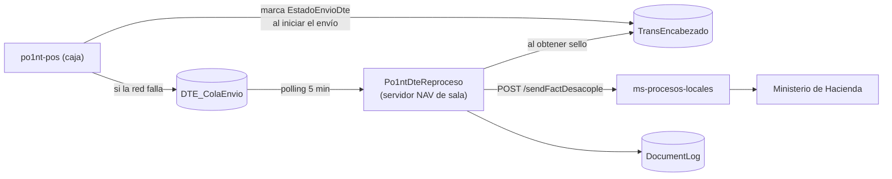

# Sincronización de DTE (Documentos Tributarios Electrónicos)

> **Lo esencial:** el reintento de DTE ya **no** lo hace `ws-reenviodte`. Desde el cutover
> del 2026-05-08 ese servicio está detenido y deshabilitado, y la lógica vive en
> `po1nt-dte-reproceso` (`Po1ntDteReproceso`), que drena la cola `DTE_ColaEnvio` de cada
> caja desde el servidor NAV de la sala.

## Flujo actual (V2, desacople)

## `po1nt-dte-reproceso` — el servicio vigente

| Aspecto | Valor real (código) |
|---------|---------------------|
| Ejecutable | `Po1ntDteReproceso.exe` |
| `ServiceName` | `Po1ntDteReproceso` (`ServicioReproceso.cs:25`) |
| Instalación | `sc create Po1ntDteReproceso ...` — **no usa `installutil`**, no hay `ProjectInstaller` |
| Framework | .NET Framework **4.5**, a propósito: el NAV ya corre otros servicios en 4.5 |
| Modo consola | `Po1ntDteReproceso.exe --console` (o `-c`) |
| Dónde corre | Servidor NAV de **cada sucursal** |
| Intervalo | `Polling.IntervaloMinutos` en `appsettings.json` (valor 5), default 5 (`Config.cs:61`) |
| Endpoint | `POST {ProcesosLocales.Url}/api/FacturacionElectronica/sendFactDesacople` (`ClienteProcesosLocales.cs:37`), host `http://po1nt-procesos-locales.selectos.com`, Bearer fijo en config |

### Descubrimiento de cajas

**No se listan a mano en `appsettings.json`**, pese a lo que dice el `README.md`: se
descubren desde la BD por la IP del servidor, consultando `places` / `terminals`
(`DescubridorCajas.cs:63,83`).

### Stored procedures de la cola

| SP | Función |
|----|---------|
| `Po1nt_DteCola_ObtenerYBloquearLote` | Toma el lote y lo bloquea (`CajaRepositorio.cs:77`) |
| `Po1nt_FacturacionElectronica_update` | Escribe el sello en `TransEncabezado` (línea 145) |
| `Po1nt_DocumentLog_ActualizarSello` | Actualiza `DocumentLog` (línea 165) |
| `Po1nt_DteCola_MarcarCompletado` / `_ActualizarReintento` / `_MarcarMaxReintentos` | Gestión de estado |
| `Po1nt_DteCola_LiberarLocksHuerfanos` / `_LimpiarCompletados` | Mantenimiento |

### Trampa de despliegue: la unidad de disco

El `appsettings.json` versionado apunta a `D:\epdsoft\Log\DTE-Reproceso`, pero el default
del código (`Config.cs:71`) y el crash-log hardcodeado (`ServicioReproceso.cs:154`) usan
`C:\`. El script de despliegue lo corrige solo: `Deploy-Po1ntDteReproceso.ps1:92-94` hace
auto-patch `D:` → `C:` si la máquina destino no tiene unidad `D:`.

---

## `ws-reenviodte` — legado, deprecado

| Hecho | Detalle |
|-------|---------|
| Binario | `epdPo1nt_SyncronizadorEnvioDTE.exe` |
| Decisión | **Deprecado el 2026-05-27** (`docs/plan-anti-duplicidad.md:77`) |
| Cutover | 2026-05-08: detenido y deshabilitado en **49 NAVs** |
| Cobertura V2 | **55 NAVs** con `Po1ntDteReproceso` instalado |
| Ventana histórica | 1:00–6:00 AM, timer de reenvío cada 30 min |

### Por qué no se pudo simplemente reactivarlo

Tres bloqueadores verificados:

1. **La columna `EstadoEnvioDte` no existe en la BD del NAV** — aunque las cajas la marquen,
   el sync caja→NAV la descarta, así que no hay forma de discriminar legacy de V2.
2. **Los binarios desplegados son del 2025-12-09**, anteriores a los commits que agregaron
   el filtro `EstadoEnvioDte IS NULL` (`b6565e9`, `7d867ba`, `849031a`).
3. **Llama a `/sendFact`, no a `/sendFactDesacople`** (`epdPo1nt_SyncronizadorEnvioDTE.vb:382,387`),
   por lo que se salta el reuso de `codigoGeneracion` y **genera duplicados en el MH** si el
   reintento ya se había facturado sin que llegara la respuesta.

La función de drenar transacciones legacy huérfanas la reemplaza el comando
`po1nt-cli dte reenviar-contingencia`.

---

## Fallos conocidos

| Caso | Detalle |
|------|---------|
| **Notas de crédito sin DTE** | `dev_FechaEmision` toma `MH_FechaRecepcion`: si viene vacía → HTTP 500; si viene desfasada → rechazo del MH. El 54 % de las NC de CCF falla. El correctivo está en `fix/sincronizar-sin-placeholder-sello` (**sin PR**) |
| **Contingencia sin encolar** | `fix/encolar-contingencia-mh` (PR #47, abierto) persiste `codigoGeneracion` para idempotencia |
| **Colisión de envíos** | `ws-reenviodte` y `DteServiceLocal` pueden competir; `feature/desacople-dtes` (PR #3) filtra por `EstadoEnvioDte` |

Ver [`../estado-entrega.md`](../estado-entrega.md).
