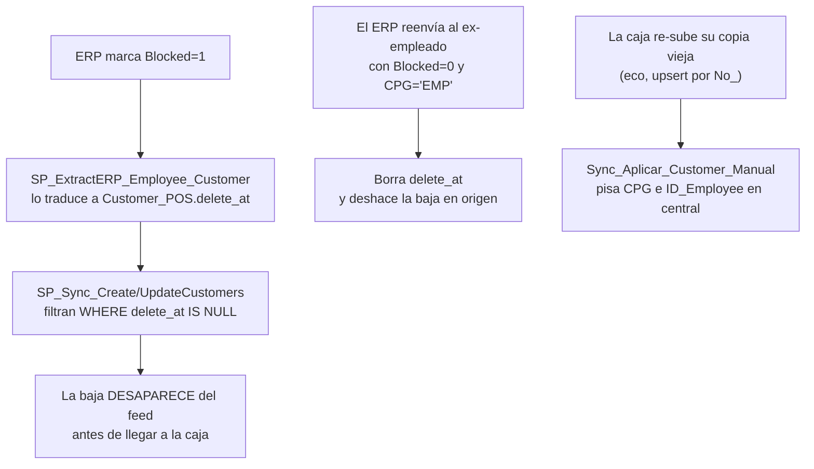

# Sincronización de Empleados

> **Lo esencial:** un empleado es un cliente con `Customer Posting Group = 'EMP'` — no hay
> tabla aparte, y `ID_Employee` **nunca viene del ERP**. Viaja por los mismos canales que
> [los clientes](clientes.md), más un feed propio desde el ERP. Hoy hay **dos universos
> desincronizados**: el legado, que recibe el feed, y el módulo nuevo, que nació de una
> foto de RRHH y hasta el 2026-09-21 no recibía nada.

## De dónde sale el dato

Dos fuentes que **no** se alimentan entre sí:

| Fuente | Destino | Estado |
|--------|---------|--------|
| ERP Navision/SIGES → `SelectosInterfaces.Po1nt_Employee_Customer_POS` (histórico en `_bkp`, ~38.038 filas) | `Customer_POS` (legado), vía `SP_ExtractERP_Employee_Customer` | Activo, cada 30 min (:10 y :40) + lote diario 02:10 |
| Foto estática de RRHH `Po1nt_Employee_Customer_POS_TEMP` (2026-06-10, 7.925 filas) | `Customer_POS_Depurada` (nuevo), vía script `09` | **Congelada** en la fecha de la foto |

Detalles que importan:

- El proceso que alimenta la tabla del ERP corre **del lado de Selectos** (login `interfaz`).
  No hay job en el servidor de Po1nt, y **no existe automatización ERP → `Depurada`**.
- `SelectosInterfaces` vive en la misma instancia que central (192.168.15.83).
  La tabla viva tiene 0 filas; el histórico real es `_bkp`.
- La copia del SP en `SelectosInterfaces` está **obsoleta**; el vivo es
  `po1nt_pos.dbo.SP_ExtractERP_Employee_Customer`.

## Cómo llega a las cajas

| Mundo | Canal |
|-------|-------|
| Legado (66 salas) | Idéntico a clientes: `terminal_sync` 1084/1085 → `SP_Sync_Create/UpdateCustomers` (`WHERE delete_at IS NULL`) → MS-Sync → `sincronizacion-sala` → `POS_Sync_Create/UpdateCustomers` |
| Módulo nuevo (187 cajas) | El guard `EsCajaEsquemaNuevo` (`epdPo1nt_Syncronizador.vb:1605-1616`) **descarta** el payload legado. Aplicación por `POS_Sync_ApplyCustomerV2` (`sql/clientes-v2/01_cajas_nuevas_objetos_v2.sql:224-308`) |

**El hueco:** hasta el 2026-09-21 central no tenía ningún emisor hacia el canal V2. Por eso
**19 salas / 187 cajas vivían con los empleados del 10 de junio**, mientras el feed del ERP
seguía llegando sólo al legado.

---

## Por qué las bajas no llegan

Tres causas independientes; **cualquiera basta sola** para que un empleado dado de baja
siga vendiendo con descuento:

1. **`delete_at` oculta el registro**: la baja se convierte en invisibilidad, no en un
   evento que viaje.
2. **El ERP reenvía al ex-empleado como activo**: 18 de 22 bajas analizadas volvieron con
   `Blocked=0` y CPG `EMP`.
3. **El eco de subida pisa la baja**: una caja desactualizada revierte en central lo que
   ya se había corregido.

Agravante: `sync_types` **1086 = delete-Customers existe pero su SP no**. Y un trigger
`trg_ValidacionInsert` en `terminal_sync` limita los lotes 1084/1085 a uno cada 3 minutos.

---

## Qué se aplicó el 2026-09-21

Delta puntual, ejecutado con GO explícito, en horario de operación:

| Paso | Herramienta | Resultado |
|------|-------------|-----------|
| Central | `22_delta_empleados_erp_a_depurada.sql` (corrida `20260921_150020`) | 611 UPDATE (562 bajas → TICKET, 34 recontratados, 15 gemelos) + 294 INSERT |
| Cajas | `22c_xml_delta_para_cajas.sql` → `POS_Sync_ApplyCustomerV2`, repartido con `Generar-DeltaERP-Cajas.ps1` + `Apply-SqlToCajas.ps1` | 187 producción + 6 laboratorio, **verificado 193/193** |
| SP de tipo diplomático | Script `23` | 186/187 + 6 lab + cj1845 |

Reglas que quedaron fijadas:

- Las bajas van a **CPG `TICKET`** (el ERP las manda como `FISCO`).
- Una persona puede traer dos códigos de empleado (alta con uno, baja con otro): se
  resuelve **por DUI**, gana el evento más reciente, **excluyendo CR** (el prefijo 77
  comparte DUI a propósito).
- El empleado gana sobre el cliente existente y el `No_` pasa a ser el código de empleado.
- Los `CustomerDetailCode` insertados desde central usan **prefijo 1001**
  (1000 = migración, `{idCaja}` = altas de app; no existe terminal 1001).

**Pendiente:** CJ2090 quedó sin el script 23 (estaba apagada). Aplicar con
`Apply-SqlToCajas -Cajas 192.168.141.31` cuando encienda.

---

## Lo que falta: plan F1–F4

| Fase | Qué |
|------|-----|
| **F1** | SP de ingesta ERP → `Depurada` con watermark, llamado desde `SP_ExtractERP_Employee_Customer` (dual-write) |
| **F2** | Canal central → cajas nuevas: outbox central + `SP_Sync_CustomerV2_Pendientes_Central(@place_id)` + timer nuevo en `epdPo1nt_Syncronizador`, más regla anti-eco en `Sync_Aplicar_Customer_Manual_Service` |
| **F3** | Reconciliación legado → `Depurada` |
| **F4** | Rename / vista al final |

**Sin F1 y F2, el delta del 21-sep es una foto puntual** que hay que volver a correr
manualmente en cada ventana de migración.

> **El rename `Depurada` → `Customer_POS` es NO por ahora:** los SPs del ERP y de subida
> insertan sin llave compuesta, y 66 salas legado siguen consumiendo 1084/1085 con MERGE
> por `No_`.

---

## Casos conocidos

| Caso | Estado |
|------|--------|
| Búsqueda de cliente crédito por tarjeta | **Corregido** — script `21`, aplicado 2026-09-18 (36 cajas + 6 lab), de fábrica en `modulo-clientes/04` |
| Falso `-2` por validación heredada DUI/NIT | **Corregido** — script `20`, valida sólo por llave compuesta |
| Gemelos DUI de personas jurídicas (rechazo de CCF en Hacienda) | **Sin resolver** — el reporte existe (`19_reporte_aparentes_duplicados_nit.sql`); la limpieza depende de que Selectos confirme cuáles quedan como jurídica-NIT. Mitigación actual: indicar al cajero que busque por NIT |
| Mantenimiento centralizado de empleados | **No existe** — pantalla "en construcción". Sin ella, ninguna corrección central llega a las salas legado |

## Datos pedidos a Selectos

- Foto fresca y completa de RRHH: **2.211 de las 14.288 filas EMP** de la Depurada no las
  respalda RRHH (vienen del merge de La Sultana).
- Confirmación de la categoría de baja (FISCO vs TICKET).
- Tratamiento de las bajas con prefijo 77 (crédito).
