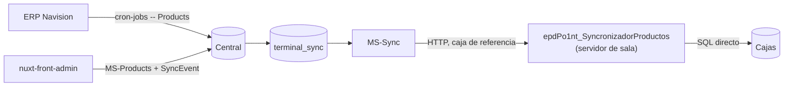

# Sincronización de Productos, Códigos de Barra, Precios y Promociones

Los cuatro viajan juntos, por el mismo canal y el mismo servicio. Van en un documento
único porque comparten mecanismo, watermark y modos de fallo.

## Cadena completa



### Paso 1 — ERP a central

`cron-jobs` (consola .NET 7, `dotnet run -- Products`) ejecuta tres SPs del lado ERP:

| SP | Qué trae |
|----|----------|
| `SP_ExtractERP_Product` | Catálogo de productos |
| `SP_ExtractERP_ProductCodbar` | Códigos de barra |
| `SP_ExtractERP_ProductPricePlaceType` | Precios por lugar — inserta también los tipos `1072`/`1073` y `24`/`25` en `terminal_sync`, para `terminals where delete_at is null` |

El alta manual desde el portal web sigue el otro camino: MS-Products guarda y llama a
`SyncEvent.save()`, que encola una fila por terminal.

#### ⚠️ Discrepancia de argumento en el manifiesto versionado

`Program.cs:6` compara `if (args[0] == "Products")` (inglés), pero el CronJob versionado en
`docker-builds/ci-cd/cron-job/cronjob.yml:26` pasa `Productos` (español). La comparación es
exacta y sensible a mayúsculas: con ese argumento **el proceso no ejecuta ninguna
sincronización y termina con código 0** — un éxito falso.

Alcance: ese manifiesto es del namespace **`selectos-dev`**, con `schedule: "*/5 * * * *"`.
**No está verificado qué argumento recibe el CronJob de producción**, y los productos sí
fluyen a central en producción, de modo que el despliegue productivo debe estar pasando
`Products` o usar otro mecanismo. Conviene comprobarlo en el clúster antes de sacar
conclusiones.

Además, el `README.md` del repo documenta comandos `dotnet run -- CodBar` y
`dotnet run -- Prices` que **no existen**: sólo hay una rama `Products`, que encadena
internamente los tres pasos (`Program.cs:11-44`).

### Paso 2 — central a sala

Lo hace **`WS-SincronizadorSalas`**, cuyo ensamblado real es
`epdPo1nt_SyncronizadorProductos`.

| Aspecto | Valor real (código) |
|---------|---------------------|
| Host | `http://po1nt-sync.selectos.com/api/Event/sync` (`epdPo1nt_SyncronizadorProductos.vb:20`) |
| Paginación | `?page=N&per_page=10000` (`.vb:346`) |
| Headers | `token`, `sync_Guid_Central`, `processData` (`.vb:355-357`) |
| `TimerProductosBajarServer` | **5 min, hardcodeado** en `OnStart` (`.vb:38`) |
| `TimerProductosEnviarTerminales` | **7 min, hardcodeado** (`.vb:39`) |
| Conexión | Registro `HKLM\Software\epdsoft\Po1nt_ServiceServer\ConexionBDSala` (`.vb:33`) |

Tipos que maneja: `PRODUCT` / `CREATE-PRODUCT` / `UPDATE-PRODUCT`, `BARCODE` /
`CREATE-BARCODES`, `PRODUCT-PRICE`, `PROMOTION` / `PROMOTION-PRODUCTS`.

Aplica en la BD de sala con SPs `Micracion_Cargar*` (sic, con la errata en el nombre):
`Micracion_CargarProductos`, `Micracion_CargarCodigoBarras`, `Micracion_CargarPrecios`,
`Micracion_CargarPromotion`, `Micracion_CargarPromotion_Products`,
`Micracion_CargarPromotion_MixAndMatch` (`.vb:112-122`).

### Paso 3 — sala a cajas

Por SQL directo, con los SPs `Micracion_CargarProductos`, `Micracion_CargarCodigoBarras`,
`POS_Sync_CreateProductPrice`, `POS_Sync_CreateOffersHeader`,
`POS_Sync_CreateOffersDetail`, `POS_Sync_CreatePromotionMixAndMatch` (`.vb:226-241`).

Estado en `Migraciones_Data_Terminales_Aplicate` (`dateProcess` / `dateConfirmado`).

---

## ⚠️ La fuga de códigos de barra

**El fallo estructural más costoso de esta cadena.**

`GetDataSincronization` pedía la página 1 con `RegistrosPorPagina = 1000`, la aplicaba,
**confirmaba y hacía `Exit While` sin pedir la página 2**. Como el watermark del siguiente
ciclo es `MAX(confirm)` y `confirm = GETDATE()` en el POST, todo lo que quedaba fuera de la
primera página **se perdía de forma permanente**.

**Impacto medido (2026-09-17, una caja por sala, 83 salas):**

| Métrica | Valor |
|---------|-------|
| Salas con huecos | 80 de 83 |
| Códigos únicos perdidos | 831 |
| Productos afectados | 763 |
| Huecos sala × código | 2.875 |
| Desde | diciembre 2024 |

**Cómo se ve en la sala:** el producto existe en `Productos` pero no hay fila en
`SatellitePOS_ProductBarCode`. El SP `SP_ObtenerProductosXCodigoBarras` hace
`select top 1 @CodBar = Barcode where ID_Product = @ID`; si no hay fila, `@CodBar`
**conserva el correlativo tecleado** → la pantalla muestra "código de barras = correlativo"
y el escaneo del EAN no encuentra nada.

**Estado del arreglo:** el fix existe en la rama `fix/sync-paginacion-lotes`
(PR #2, commit `8f5107d`) y **no está en `main` ni en los binarios de la flota**. Ver
[`../estado-entrega.md`](../estado-entrega.md).

**Correctivo mientras tanto**, por el canal oficial y **en tandas de menos de 1000
registros**:

```sql
UPDATE product_barcodes SET update_at = GETDATE() WHERE id IN (...);

INSERT INTO terminal_sync (terminal_id, sync_type_id, date_pending)
SELECT id, 51, GETDATE() FROM terminals WHERE delete_at IS NULL;
-- 51 = update-barcodes → SP_Sync_updateBarcodes, MERGE idempotente en destino
```

---

## Otros puntos frágiles

- **La caja de referencia es un único punto de fallo**: si no responde al ping, la sala
  entera no baja nada (`ConnectionData.vb:78`, `.vb:133`).
- **Una sola página por lote de precios**: el servicio de precios usa `per_page=10000` con
  el mismo patrón; el riesgo existe aunque no se ha medido.
- **`date_send` sólo se marca en la terminal de referencia**; `confirm` se marca por cada
  caja. Un tablero que espere `date_send` en todas las terminales leerá mal el estado.
- **Timers muertos**: `TimerOfertasYPromociones` nunca se habilita (`.Enabled`/`.Start()`
  comentados, `.vb:44,47`) y `TimerPreciosProductos` está declarado sin handler `Elapsed`.
  Las promociones llegan por el timer de productos, no por el suyo.
- **Nombre del servicio instalado**: `epdPo1nt_SyncronizadorProductosUpd`, con sufijo `Upd`
  (`ProjectInstaller.Designer.vb:35`) — distinto del `ServiceName` interno y del `.exe`.
  Buscarlo por el nombre del repo no da resultados.

## El precio en la caja

Vive en `SatellitePOS_MH.dbo.Po1nt_ProductPriceInterface`
(`price_id` = `product_prices.id` de central; `product_id_fk` = `products.crm_id` =
`IDProducto`). El vigente es el `TOP 1` con vigencia que cubre hoy,
`ORDER BY StartingDate DESC` (`SP_ObtenerProductosXCodigoBarras`).

Camino manual que **salta** `terminal_sync`: el portal de sala
(`EnviarCambioPrecioManual`, `CagarXML`, `SincronizarCajaNueva`) escribe directo en la
interfaz de la caja. Ver [`../01-canales.md`](../01-canales.md).
